# Советы и важные вещи

Ключевая страница wiki: правила, собранные из реальных правок и фидбэка по
проектам. Многих из этих вещей нет в общих гайдах по estimating — это локальная
память команды.

## Rim Board

| Wrong | Correct |
| --- | --- |
| `1-3/4 LVL Rim` when not specified | `11-7/8" Rim` or product marked as assumed |
| Splitting rim into 16' pieces | Keep rim in LFT with 1.05 factor |

- If LSL is called out, write `11-7/8" LSL Rim`.
- `1-3/4 LVL Rim` is used only when something attaches to it for strength,
  such as deck or corridor frame.
- Rim is needed at roof TJI too, not only at floors.

## Blocking

- Walls 10' and above need two rows of blocking.
- Blocking stays in LFT unless the output specifically needs pieces.
- Use 10% waste for framing elements such as drywall blocking, rim, and upper
  walls.
- For top chord bearing trusses, do not add 2x4 ribbon board; use blocking
  between trusses, often `(2) 2x6`.

## FRT

| Element | Rule |
| --- | --- |
| Exterior blocking | FRT if exterior wall material is FRT |
| Parapets | FRT if exterior walls are FRT |
| Subfloor perimeter | Check 2' or 4' FRT perimeter notes |
| Demising shear wall sheathing | Regular sheathing unless schedule says FRT |
| Stair / CMU two-hour walls | Often FRT; verify details |

## DHU / DGU vs ITS

- DHU/DGU only where joists hang over firewall conditions at stairs, elevators,
  or shafts.
- Regular demising conditions where gypsum stops under the floor usually use ITS.
- DHU can cost several times more than ITS, so verify details before listing.
- Mark Stair / Elevator / Shaft hangers separately so review is clear.

## Studs

| Spacing | Factor | Waste |
| --- | ---: | ---: |
| 16" o.c. | 1:1 | 10% |
| 24" o.c. | 0.5 | 25% |

- Use exact heights on large COM jobs: `9'0-3/8"`, `9'1-1/8"`, etc.
- Example math: `11'1" wall - 22" truss - 3/4" subfloor = 9'2" stud`.
- Corridor 2x4 staggered means two rows at 16" o.c.; plates should be 2x6.
- Bearing walls on lower floors may require double studs by structural notes.

## Sheathing

- `19/32"` equals `5/8"`, not `1/2"`.
- Exterior sheathing follows Arch / energy / Zip notes unless Structural gives
  stronger non-Zip requirement.
- Interior sheathing follows Structural.
- Zip sheathing on exterior walls supersedes structural sheathing notes, but keep
  a note.
- Optional walls may need full-height sheathing while loose/box sheathing stays
  box only.

## Commonly Missed Items

- `1/2" plywood underlayment` per floor assembly.
- Piggy truss sleepers: often 2x6 between upper truss parts.
- `1/4" Densedeck` or glass mat cover board at flat roofs.
- Additional rigid XPS layer.
- Drywall ledger: 2x4 at demising walls both sides and exterior walls one side
  where parallel with framing.
- Chute shaft wall A201/A806, wall type 7A.
- A35 clips at shearwall connections.
- Jamb blocking for all windows and interior doors.
- Kitchen and bath blocking.
- Holdowns per S-details.

## Doors

- Unit entry doors from corridors are fire rated.
- Use labels such as `3070 Entry`, `2670 FCW`, or `3070 HM C-lbl`.
- Door hardware numbers usually do not belong in the takeoff list.
- Interior door jamb trim can use casing divided by 2 where that is the local
  estimating method.

## Interior Trims

- Room schedule: include only wood base / `Wd`; exclude tile base.
- Corridors, lobbies, and other common areas should be listed separately because
  trim type can differ from units.
- Crowns should be included when interior trim scope is active.
- If trims are not specified, write that they are not specified instead of
  inventing a trim type.

## Client Metal Rule

| Include metal | Exclude / by others |
| --- | --- |
| WM | EBS |
| Timberline | Probuild |
| Littleton | Triangle |
|  | Interstate |
|  | Bliffert |

When excluded, still note metal locations as `by others`.

## Formatting and Output

- Do not combine floors even if they are the same; copy data separately.
- Add a note when a floor frame is identical to another floor.
- Stair treads: list `2x12 Tread` and add `1x8 Riser`.
- Do not count nails; list bolts and Simpson screws where required.
- Do not leave copied detail labels uncorrected.

<!-- confluence-context:start -->
## Confluence Context

Эта секция показывает, какие Confluence-страницы питают эту wiki-страницу и какие соседние темы связаны с ней через исходники.

| Source | Role here | Images | Raw MD |
| --- | --- | ---: | --- |
| [---](https://ewood.atlassian.net/wiki/spaces/work/pages/11796656/---) | images | 19 | `imports/live-sources/confluence-work-images/pages/01-11796656-page.md` |
| [Need to sort](https://ewood.atlassian.net/wiki/spaces/work/pages/229638146/Need+to+sort) | images | 4 | `imports/live-sources/confluence-work-images/pages/01-229638146-need-to-sort.md` |
<!-- confluence-context:end -->

<!-- confluence-gallery:start -->
## Confluence Images

Изображения из Confluence размещены на этой странице по исходной теме.
Подпись сохраняет группу-источник, чтобы можно было быстро проверить контекст.

| Source group | Images | Confluence |
| --- | ---: | --- |
| --- | 19 | [source](https://ewood.atlassian.net/wiki/spaces/work/pages/11796656/---) |
| Need to sort | 4 | [source](https://ewood.atlassian.net/wiki/spaces/work/pages/229638146/Need+to+sort) |

  <a class="kb-gallery__item" href="../../assets/images/confluence/confluence-011.png" title="image-20250224-003901.png">
    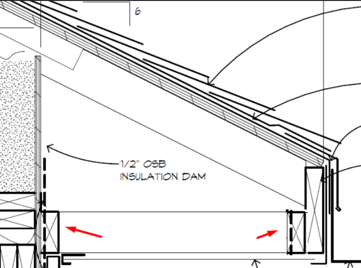
    
unsorted field rule/reference 01 (image, 168 KB raw)

  </a>
  <a class="kb-gallery__item" href="../../assets/images/confluence/confluence-012.png" title="image-20250224-003844.png">
    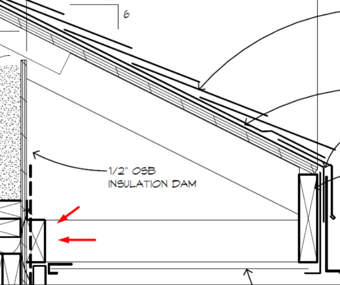
    
unsorted field rule/reference 02 (image, 158 KB raw)

  </a>
  <a class="kb-gallery__item" href="../../assets/images/confluence/confluence-013.png" title="image-20250224-003828.png">
    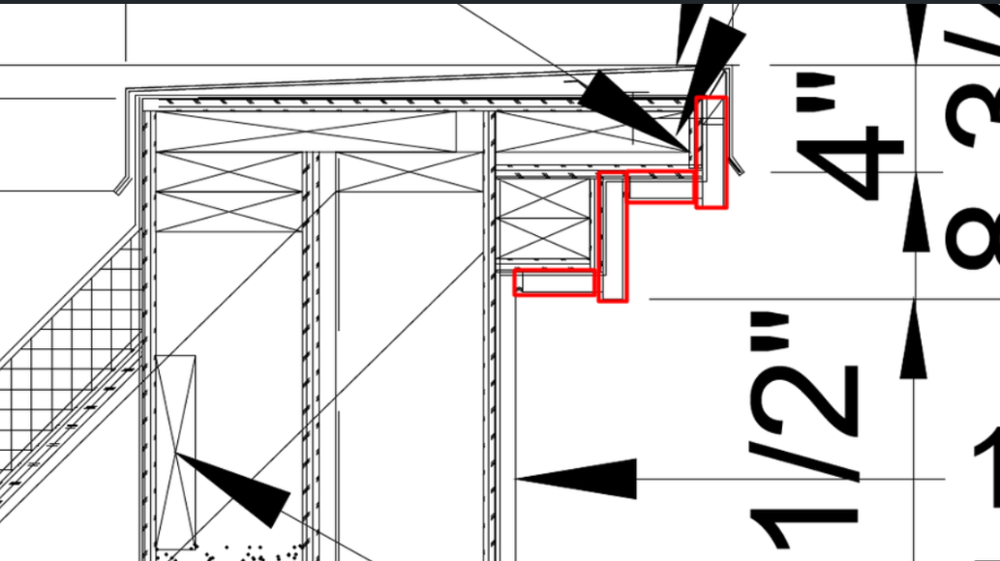
    
unsorted field rule/reference 03 (image, 223 KB raw)

  </a>
  <a class="kb-gallery__item" href="../../assets/images/confluence/confluence-014.png" title="image-20250224-003817.png">
    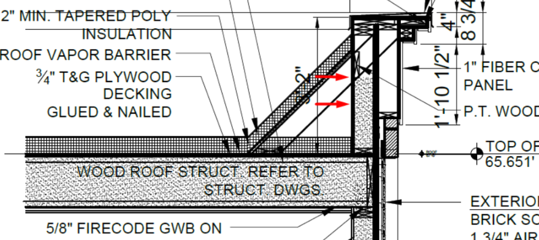
    
unsorted field rule/reference 04 (image, 290 KB raw)

  </a>
  <a class="kb-gallery__item" href="../../assets/images/confluence/confluence-015.png" title="image-20250224-003802.png">
    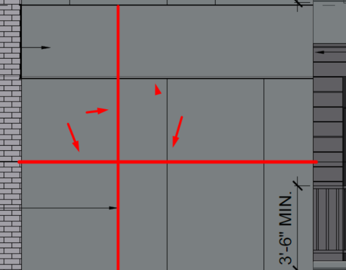
    
unsorted field rule/reference 05 (image, 36 KB raw)

  </a>
  <a class="kb-gallery__item" href="../../assets/images/confluence/confluence-016.png" title="image-20250224-003754.png">
    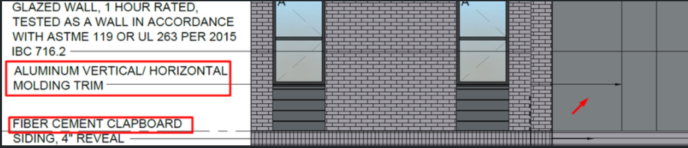
    
unsorted field rule/reference 06 (image, 218 KB raw)

  </a>
  <a class="kb-gallery__item" href="../../assets/images/confluence/confluence-017.png" title="image-20250224-003754.png">
    
    
unsorted field rule/reference 07 (image, 218 KB raw)

  </a>
  <a class="kb-gallery__item" href="../../assets/images/confluence/confluence-018.png" title="image-20250224-003743.png">
    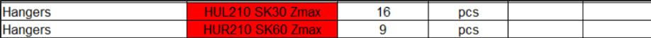
    
unsorted field rule/reference 08 (image, 16 KB raw)

  </a>
  <a class="kb-gallery__item" href="../../assets/images/confluence/confluence-019.png" title="image-20250224-003657.png">
    
    
unsorted field rule/reference 09 (image, 16 KB raw)

  </a>
  <a class="kb-gallery__item" href="../../assets/images/confluence/confluence-020.png" title="image-20250224-003439.png">
    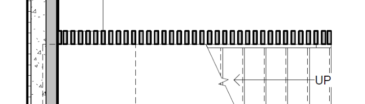
    
unsorted field rule/reference 10 (image, 16 KB raw)

  </a>
  <a class="kb-gallery__item" href="../../assets/images/confluence/confluence-021.png" title="image-20250224-003424.png">
    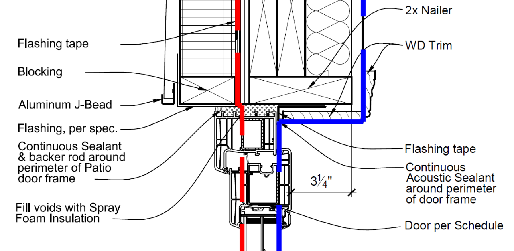
    
unsorted field rule/reference 11 (image, 205 KB raw)

  </a>
  <a class="kb-gallery__item" href="../../assets/images/confluence/confluence-022.png" title="image-20250224-003400.png">
    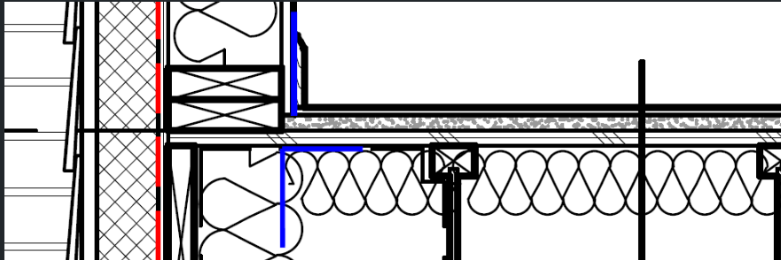
    
unsorted field rule/reference 12 (image, 94 KB raw)

  </a>
  <a class="kb-gallery__item" href="../../assets/images/confluence/confluence-023.png" title="image-20250224-002726.png">
    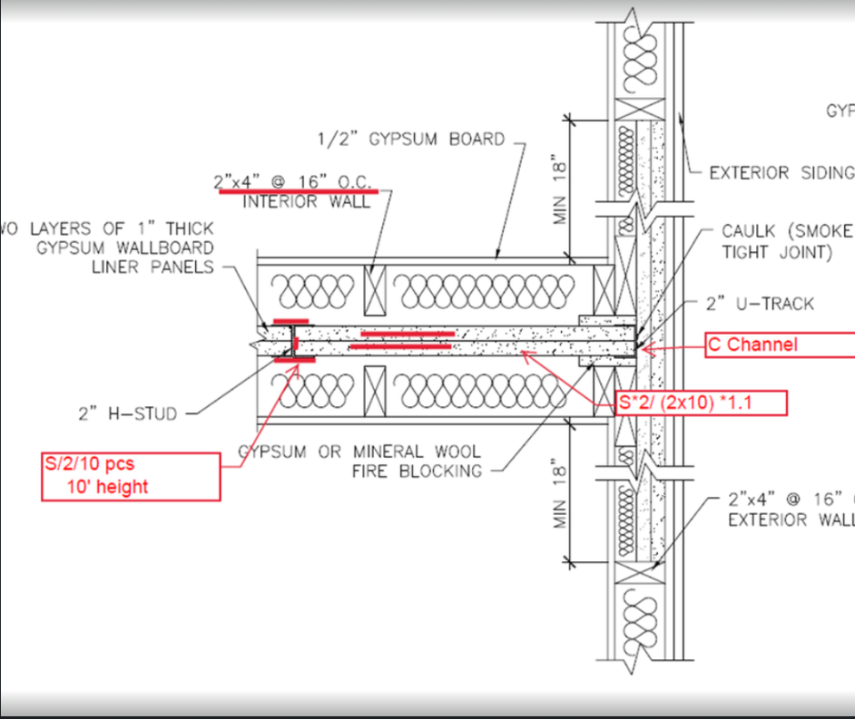
    
unsorted field rule/reference 13 (image, 254 KB raw)

  </a>
  <a class="kb-gallery__item" href="../../assets/images/confluence/confluence-024.png" title="image-20250224-002706.png">
    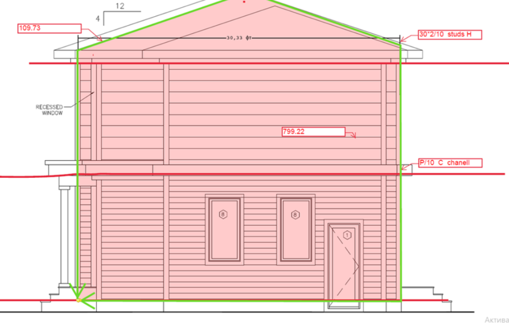
    
unsorted field rule/reference 14 (image, 157 KB raw)

  </a>
  <a class="kb-gallery__item" href="../../assets/images/confluence/confluence-025.png" title="image-20250224-002653.png">
    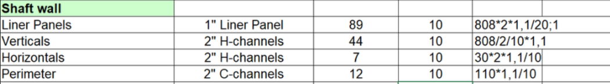
    
unsorted field rule/reference 15 (image, 81 KB raw)

  </a>
  <a class="kb-gallery__item" href="../../assets/images/confluence/confluence-026.png" title="image-20250224-002632.png">
    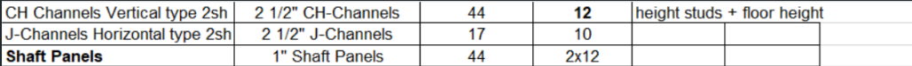
    
unsorted field rule/reference 16 (image, 42 KB raw)

  </a>
  <a class="kb-gallery__item" href="../../assets/images/confluence/confluence-027.png" title="image-20250224-002609.png">
    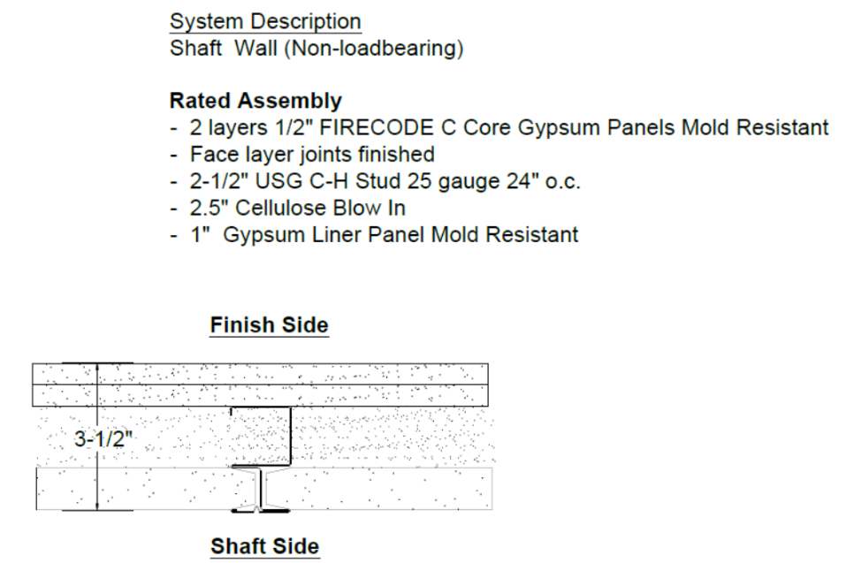
    
unsorted field rule/reference 17 (image, 155 KB raw)

  </a>
  <a class="kb-gallery__item" href="../../assets/images/confluence/confluence-028.png" title="image-20250224-002542.png">
    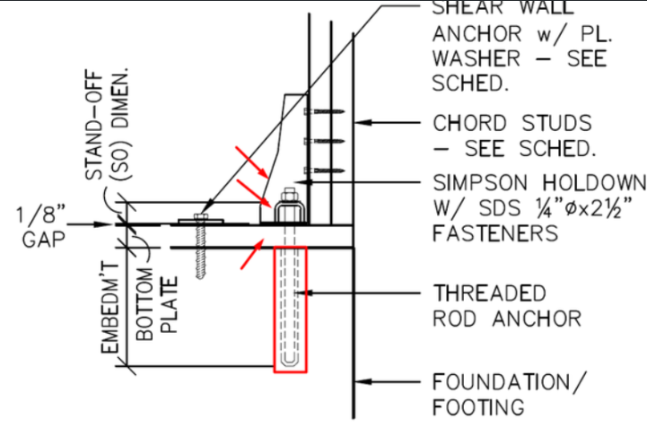
    
unsorted field rule/reference 18 (image, 139 KB raw)

  </a>
  <a class="kb-gallery__item" href="../../assets/images/confluence/confluence-029.png" title="image-20250224-002525.png">
    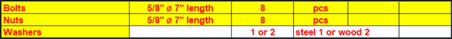
    
unsorted field rule/reference 19 (image, 18 KB raw)

  </a>
  <a class="kb-gallery__item" href="../../assets/images/confluence/confluence-049.png" title="image-20250214-155931.png">
    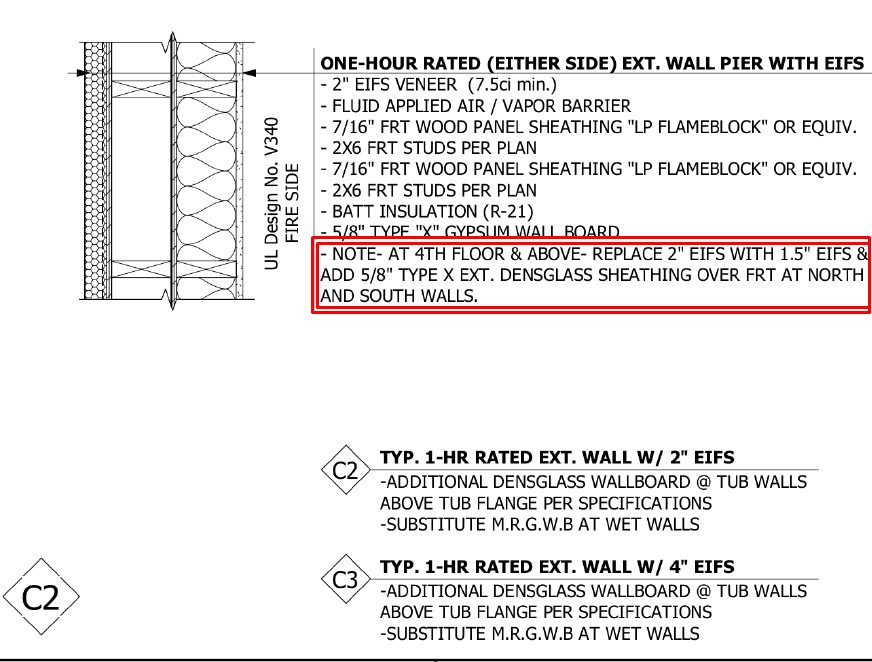
    
unsorted field rule/reference 01 (image, 133 KB raw)

  </a>
  <a class="kb-gallery__item" href="../../assets/images/confluence/confluence-050.png" title="image-20250214-155410.png">
    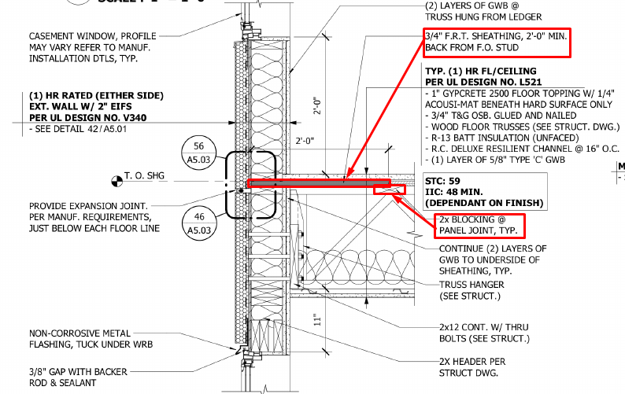
    
unsorted field rule/reference 02 (image, 173 KB raw)

  </a>
  <a class="kb-gallery__item" href="../../assets/images/confluence/confluence-051.png" title="image-20250214-150802.png">
    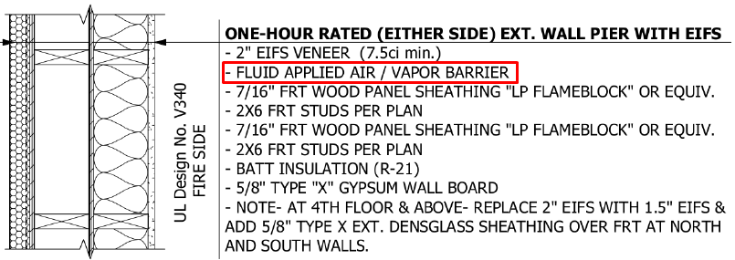
    
unsorted field rule/reference 03 (image, 87 KB raw)

  </a>
  <a class="kb-gallery__item" href="../../assets/images/confluence/confluence-052.png" title="image-20250224-004123.png">
    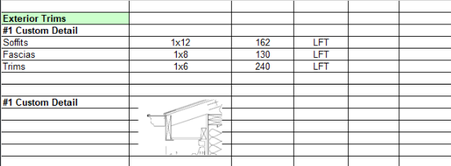
    
unsorted field rule/reference 04 (image, 22 KB raw)

  </a>

<!-- confluence-gallery:end -->
