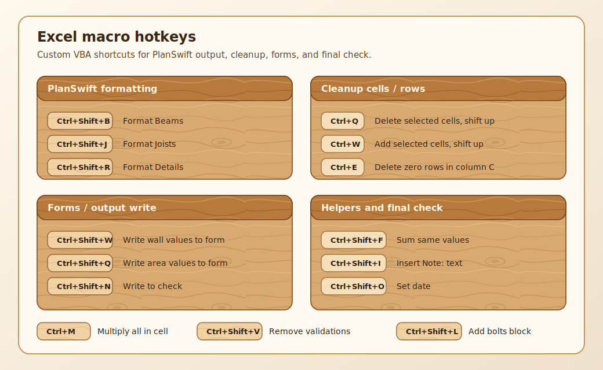

# Excel hotkeys

Эта страница - короткая шпаргалка по Excel for Windows для output, QA и ручного
cleanup. Не надо учить всё сразу: сначала держи под рукой навигацию,
редактирование ячеек, paste values, filters и проверку formulas.

<figure markdown>
  
  <figcaption>Excel hotkeys - зоны клавиатуры для быстрого output и проверки.</figcaption>
</figure>

!!! note "Версия"
    Ниже - Windows desktop Excel / Microsoft 365. В Excel for the web часть
    shortcuts может конфликтовать с browser shortcuts. Полный официальный список:
    [Microsoft Support - Keyboard shortcuts in Excel](https://support.microsoft.com/en-gb/office/keyboard-shortcuts-in-excel-1798d9d5-842a-42b8-9c99-9b7213f0040f).

## Самые нужные

| Клавиши | Что делает | Когда использовать |
| --- | --- | --- |
| ++ctrl+s++ | Save | После каждого крупного блока output. |
| ++ctrl+z++ / ++ctrl+y++ | Undo / Redo | Если случайно вставил не туда или удалил rows. |
| ++ctrl+c++ / ++ctrl+x++ / ++ctrl+v++ | Copy / Cut / Paste | Перенос quantities, formulas, helper columns. |
| ++f2++ | Edit active cell | Править formula прямо в cell, не переписывая заново. |
| ++esc++ | Cancel edit | Выйти из cell edit без изменения. |
| ++ctrl+f++ / ++ctrl+h++ | Find / Replace | Найти material, level, sheet name, old description. |
| ++ctrl+g++ | Go To | Прыгнуть в нужную cell или named range. |
| ++ctrl+1++ | Format Cells | Units, number format, borders, alignment. |
| ++ctrl+shift+l++ | Toggle Filter | Быстро фильтровать rows перед проверкой. |
| <kbd>Alt</kbd>+<kbd>=</kbd> | AutoSum | Проверить totals по выделенному range. |

## Навигация по workbook

| Клавиши | Что делает | Рабочая подсказка |
| --- | --- | --- |
| ++ctrl+page-up++ / ++ctrl+page-down++ | Previous / next worksheet | Быстро пройти output sheets. |
| ++ctrl+home++ | В начало sheet | Вернуться к верхней левой части таблицы. |
| ++ctrl+end++ | К последней used cell | Проверить, не остались ли мусорные данные далеко справа/снизу. |
| ++ctrl+up++ / ++ctrl+down++ / ++ctrl+left++ / ++ctrl+right++ | Прыжок до края data block | Быстро найти конец списка. |
| ++ctrl+shift+up++ / ++ctrl+shift+down++ | Select block до края | Выделить весь column block для cleanup/check. |
| ++shift+space++ | Select row | Удалить или проверить целую строку. |
| ++ctrl+space++ | Select column | Форматировать или проверить весь column. |
| ++ctrl+a++ | Select current region | Выделить таблицу вокруг active cell. |

## Ввод и формулы

| Клавиши | Что делает | Когда использовать |
| --- | --- | --- |
| ++enter++ / ++shift+enter++ | Commit and move down/up | Быстрый ручной ввод rows. |
| ++tab++ / ++shift+tab++ | Commit and move right/left | Ввод по горизонтальной таблице. |
| ++ctrl+enter++ | Fill selected cells with same entry | Один label / formula в несколько selected cells. |
| ++alt+enter++ | New line inside cell | Notes внутри одной cell без разрыва row. |
| ++ctrl+d++ | Fill Down | Протянуть formula вниз. |
| ++ctrl+r++ | Fill Right | Протянуть formula вправо. |
| ++f4++ | Repeat last action / cycle absolute references in formula | Повтор format/insert или `$A$1` в formula edit. |
| ++shift+f3++ | Insert Function | Найти function, если не помнишь syntax. |
| <kbd>Ctrl</kbd>+<kbd>`</kbd> | Show formulas | Быстро увидеть formulas вместо results. |
| ++f9++ | Calculate workbook | Проверить manual calculation workbook. |
| ++shift+f9++ | Calculate active sheet | Пересчитать только текущий sheet. |

## Rows, columns, paste values

| Клавиши | Что делает | Когда использовать |
| --- | --- | --- |
| <kbd>Ctrl</kbd>+<kbd>Shift</kbd>+<kbd>=</kbd> | Insert cells / rows / columns | После выделения row/column вставляет новый row/column. |
| <kbd>Ctrl</kbd>+<kbd>-</kbd> | Delete cells / rows / columns | Удалить selected rows/columns. |
| ++ctrl+9++ | Hide selected rows | Временно скрыть helper rows. |
| ++ctrl+0++ | Hide selected columns | Временно скрыть helper columns. |
| ++ctrl+shift+9++ | Unhide rows | Вернуть скрытые rows. |
| ++ctrl+shift+0++ | Unhide columns | Вернуть скрытые columns, если shortcut не занят Windows. |
| ++alt+h++, ++v++, ++v++ | Paste Values | Вставить value без formula/style. |
| ++alt+h++, ++v++, ++f++ | Paste Formulas | Перенести formulas без лишнего formatting. |
| ++alt+h++, ++o++, ++i++ | AutoFit Column Width | Быстро подогнать columns после вставки. |

## Formatting для читаемого output

| Клавиши | Что делает | Где помогает |
| --- | --- | --- |
| ++ctrl+b++ / ++ctrl+i++ / ++ctrl+u++ | Bold / Italic / Underline | Headers, warnings, section labels. |
| ++ctrl+shift+5++ | Percent format | Waste / factor checks. |
| ++ctrl+shift+4++ | Currency format | Только если workbook реально считает money. |
| ++ctrl+t++ | Create Table | Для helper tables, если workbook это допускает. |
| ++alt+h++, ++b++ | Borders menu | Очистить visual output после вставки. |
| ++alt+h++, ++a++, ++c++ | Center align | Headers and compact tables. |

## Estimating workflow

1. Перед вставкой проверь active cell и sheet name.
2. Для повторяющихся quantities используй formulas, а не только final number.
3. После вставки нажми ++ctrl+end++: если cursor улетел далеко вниз/вправо,
   в sheet есть мусорные used cells.
4. Для проверки totals выдели range и смотри status bar: Sum / Count / Average.
5. Перед отправкой включи <kbd>Ctrl</kbd>+<kbd>`</kbd> и быстро просмотри, где
   formulas отличаются от соседних rows.

## See also

- [Formulas and factors](formulas.md)
- [Quality checklist](../start/quality-checklist.md)
- [Workflow](../start/workflow.md)
