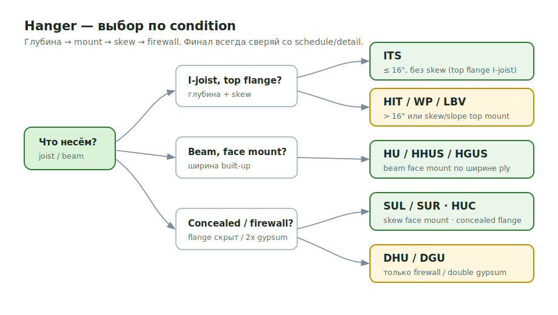
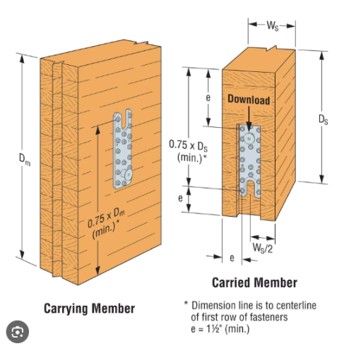
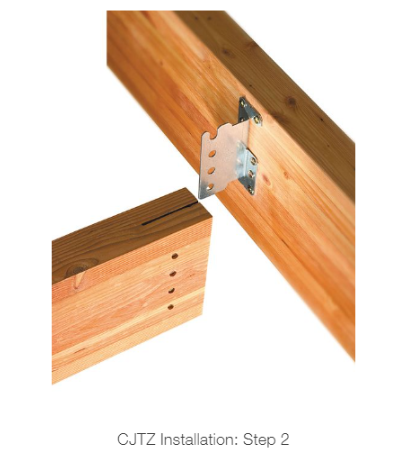
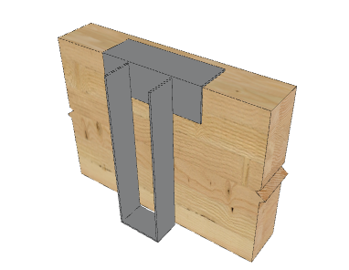

# Hangers

<figure markdown>
  
  <figcaption>Fast hanger selection: start with mount condition, then depth, skew, and firewall condition.</figcaption>
</figure>

## Core Selection Rules

- Joists 16" and below can use ITS when top-flange hanger is appropriate.
- Joists over 16" use HIT hangers such as HIT420.
- ITS cannot be skewed.
- Skewed top mount: use WP / HUTF family.
- Skewed face mount: use SUR / HSUR family.
- DHU/DGU is only for double-gypsum/firewall conditions; verify details.

## Quick Checks

| Question | Why it matters |
| --- | --- |
| Is the joist deeper than 16"? | Usually changes ITS to HIT |
| Is the hanger skewed? | ITS is not skewable; use WP/HUTF or SUR/HSUR family |
| Is it face mount or top flange? | Changes HU/HUC/IUS vs ITS/WP/GLTV |
| Is there double gypsum/firewall? | DHU/DGU only belongs at those conditions |
| Is it a beam, glulam, or Cedar member? | May require HHUS/HGUS/CBH/CJTZ special item |

## Reading ITS

`ITS2.37/11.88`

- `ITS` = I-joist top-flange hanger.
- `2.37` = joist flange width, about 2 5/16".
- `11.88` = joist height, 11 7/8".

## Beam Face Mount

| Section | Hanger |
| --- | --- |
| 1 3/4 x 9 1/2 | HU9 |
| 1 3/4 x 11 7/8 | HU11 |
| 1 3/4 x 14 | HU14 |
| 3 1/2 x 9 1/2 | HU410 |
| 3 1/2 x 11 7/8 | HU412 |
| 3 1/2 x 14 | HU414 |
| 5 1/2 x 11 7/8 | HU612 |
| 3 1/2 x 9 1/2 | HHUS410 |
| 5 1/4 x 9 1/2 | HHUS5.50/10 |
| 7 x 11 7/8 | HGUS7.25/12 |
| 1 3/4 x 11 7/8 skew left 45 | SUL1.81/11 |
| 1 3/4 x 11 7/8 skew right 45 | SUR1.81/11 |

## Beam Concealed

| Section | Hanger |
| --- | --- |
| 1 3/4 x 9 1/2 | HUCQ1.81/9 |
| 1 3/4 x 11 7/8 | HUCQ1.81/11 |
| 3 1/2 x 11 7/8 | HUCQ412 SDS |
| 5 1/2 x 9 1/2 | HUCQ610 |
| 3 1/2 x 9 1/2 | HUC410 |
| 3 1/2 x 11 7/8 | HUC412 |
| 3 1/2 x 14 | HUC414 |
| 5 1/4 x 11 7/8 | HUC612 |

## Beam Top Flange

| Section | Hanger |
| --- | --- |
| 1 3/4 x 9 1/2 | WP9 |
| 1 3/4 x 11 7/8 | WP11 |
| 1 3/4 x 14 | WP14 |
| 3 1/2 x 9 1/2 | GLTV3.59 |
| 3 1/2 x 11 7/8 | GLTV3.511 |
| 3 1/2 x 14 | GLTV3.514 |
| 5 1/2 x 11 7/8 | GLTV5.511 |
| 5 1/2 x 14 | GLTV5.5/14 |

## TJI Top Flange

| Joist | Hanger |
| --- | --- |
| 11 7/8 TJI 110 | ITS1.81/11.88 |
| 11 7/8 TJI 210 | ITS2.06/11.88 |
| 11 7/8 TJI 230 / 360 | ITS2.37/11.88 |
| 11 7/8 TJI 560 | ITS3.56/11.88 |
| (2) 11 7/8 TJI 110 | MIT3.12/11.88 |
| (2) 11 7/8 TJI 210 | MIT4.12/11.88 |
| (2) 11 7/8 TJI 360 | MIT4.75/11.88 |
| (2) 11 7/8 TJI 560 | BA412-2 |

## LPI

| Joist | Face mount | Top flange |
| --- | --- | --- |
| 9 1/2 LPI 18/20/32 | IUS2.56/9.5 | ITS2.56/9.5 |
| 11 7/8 LPI 18/20/32 | IUS2.56/11.88 | ITS2.56/11.88 |
| 14 LPI 18/20/32 | IUS2.56/14 | ITS2.56/14 |
| 11 7/8 LPI 36 | IUS2.37/11.88 | ITS2.37/11.88 |
| 11 7/8 LPI 56 | IUS3.56/11.88 | ITS3.56/11.88 |

## Special

- CJTZ for Cedar beams/posts.
- CBH2.37X9.75C-KT for glulam.
- A35 clips at shearwall connections when required by general notes.

<!-- confluence-gallery:start -->
## Confluence Images

Изображения из Confluence размещены на этой странице по исходной теме.
Подпись сохраняет группу-источник, чтобы можно было быстро проверить контекст.

| Source group | Images | Confluence |
| --- | ---: | --- |
| Hangers - Крепления | 4 | [source](https://ewood.atlassian.net/wiki/spaces/work/pages/4816897/Hangers+-) |
| Hangers and Ties Schedule | 2 | [source](https://ewood.atlassian.net/wiki/spaces/work/pages/12124257/Hangers+and+Ties+Schedule) |

  <a class="kb-gallery__item" href="../../assets/images/confluence/confluence-030.png" title="image-20250224-000530.png">
    
    
hanger schedule/detail reference 01 (image, 190 KB raw)

  </a>
  <a class="kb-gallery__item" href="../../assets/images/confluence/confluence-031.png" title="image-20250224-000451.png">
    
    
hanger schedule/detail reference 02 (image, 194 KB raw)

  </a>
  <a class="kb-gallery__item" href="../../assets/images/confluence/confluence-079.png" title="image-20250211-180817.png">
    
    
hanger schedule/detail reference 01 (image, 119 KB raw)

  </a>
  <a class="kb-gallery__item" href="../../assets/images/confluence/confluence-080.png" title="image-20250211-180929.png">
    
    
hanger schedule/detail reference 02 (image, 119 KB raw)

  </a>
  <a class="kb-gallery__item" href="../../assets/images/confluence/confluence-081.png" title="image-20250211-181023.png">
    
    
hanger schedule/detail reference 03 (image, 77 KB raw)

  </a>
  <a class="kb-gallery__item" href="../../assets/images/confluence/confluence-082.png" title="image-20250211-181056.png">
    
    
hanger schedule/detail reference 04 (image, 121 KB raw)

  </a>

<!-- confluence-gallery:end -->
