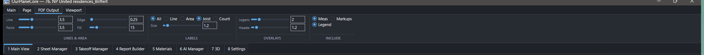
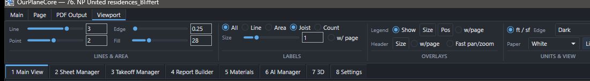
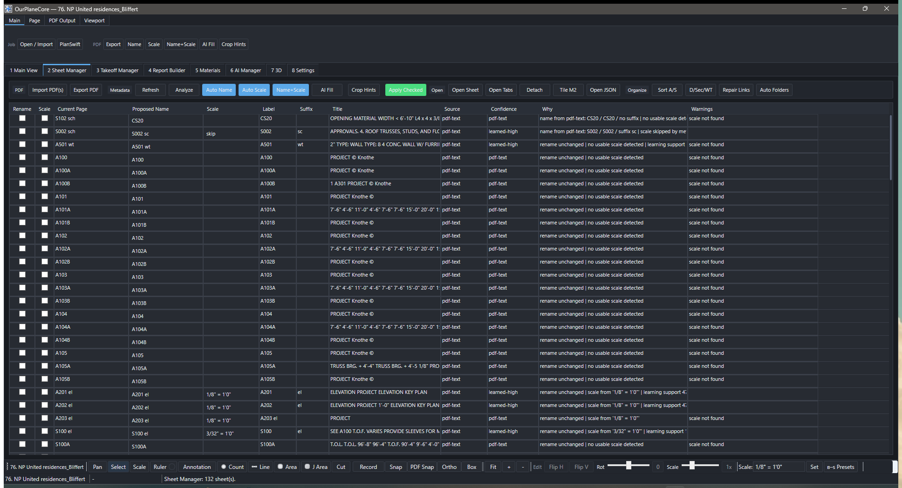
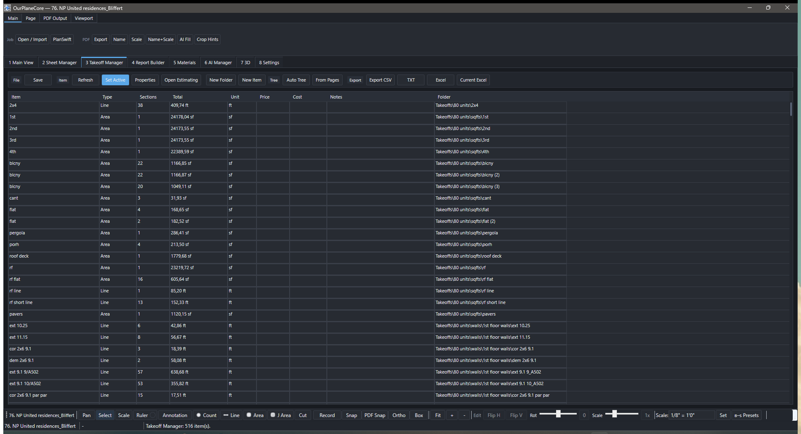
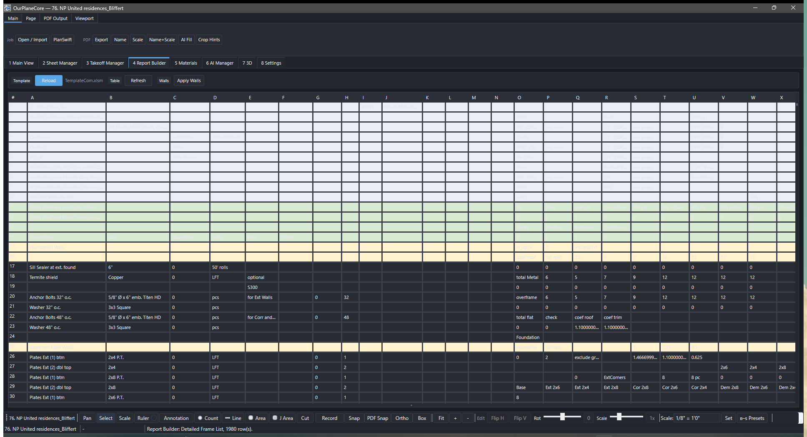
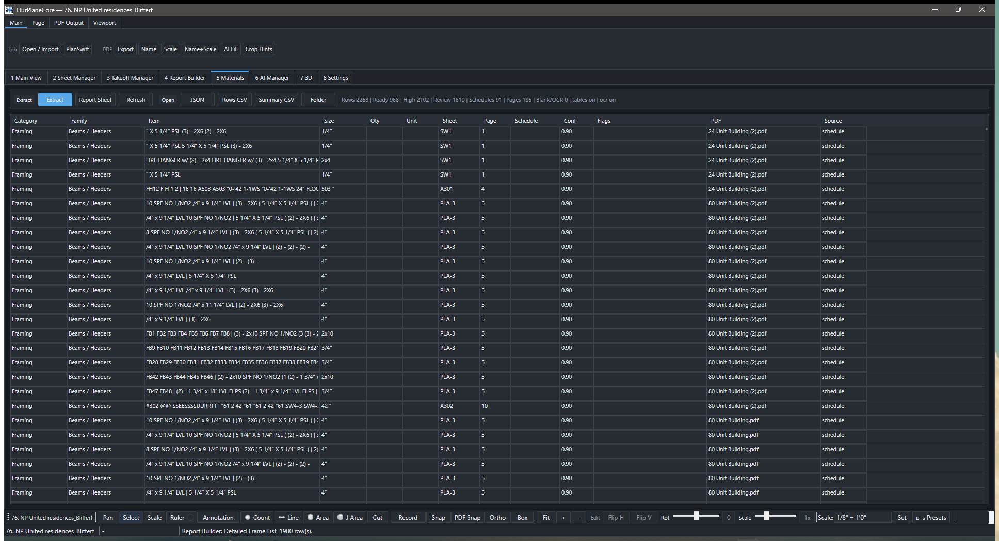

# OurPlaneCore — полный гайд

Здесь — **каждая кнопка, ползунок и таб** + рабочий процесс от и до. Краткий
обзор программы — на странице [OurPlaneCore](ourplanecore.md).

!!! tip "Как читать"
    Названия кнопок даны **как в интерфейсе** (англ.), пояснение — рус.
    Тултипы кнопок в программе совпадают с описанием здесь.

!!! abstract "Новое в программе (обновления мая 2026)"
    - **3D Roof по-новому** — таб `7 3D`: per-edge pitch вместо «Auto/Clear Roof».
      Помечаешь кромки roof base (`Select Edge`), задаёшь каждой свой pitch,
      `Generate Roof` строит ridge/hip/valley (включая вогнутые valleys),
      Revit-style envelope для U/S/L-крыш. См. [Таб 7 3D](#tab-7-3d).
    - **3D Massing — AI-черновик здания** — отдельная панель: `Build 3D Draft`,
      `3D From Takeoffs`, `AI 3D Sort`, `Review Roof`/`Review Openings`,
      `Accept 3D`. См. [3D Massing](#3d-massing).
    - **Новая модель выделения и vertex-grips** — `Ctrl` мультивыбор, `Alt`
      режим вершин, прямое перетаскивание ручек, `line cut`. См.
      [Редактирование](#editing).
    - **Page takeoff layers** — порядок (z-order) привязанных takeoff-слоёв на
      листе. **Job source selector** + переделанный `Open Job` диалог.
      См. [Прочее новое](#new-misc).

Скриншоты — фрагментами **прямо у соответствующих разделов** ниже (снято
на реальном job, рабочий вид). Полный вид главного окна:

<figure markdown>
  
  <figcaption><code>1 Main View</code>: ribbon сверху, Pages-дерево слева, PDF-вьюпорт по центру, Takeoffs-дерево справа, tool strip снизу.</figcaption>
</figure>

## От и до — рабочий процесс { .kb-section-title .kb-st--green }

1. **Создать / открыть job.** Таб `1 Main View` → `Open / Import`
   (++ctrl+o++) — открыть/создать job или импортировать PDF. Recent —
   ++ctrl+shift+o++.
2. **Импорт PDF.** `Open / Import` → добавить PDF (или таб `2 Sheet
   Manager` → `Import PDF(s)`).
3. **Метаданные листов.** Таб `2 Sheet Manager`: `Analyze` → `Auto Name` /
   `Auto Scale` / `Name+Scale` → проверить `Confidence` / `Why` /
   `Warnings` → `Apply Checked` (применяется **только** отмеченное).
   Нет данных в PDF → `AI Fill` (+ `Crop Hints` для зон номера/масштаба).
4. **Разложить листы.** `Sort A/S` → `D/Sec/WT` → `Auto Folders`.
   При сбитых связях measurements → `Repair Links`.
5. **Открыть лист.** Таб `1 Main View`, дерево `Pages` слева — выбрать
   sheet. Проверить scale (`Scale` tool) и слои (`PDF Layers`).
6. **Создать / выбрать takeoff item.** Справа дерево `Takeoffs` →
   `New Item` (или ++t++). Имя по правилам — [Как называть
   takeoffs](takeoff-naming.md).
7. **Рисовать.** Выбрать tool (`Count`/`Line`/`Area`/`J Area`), включить
   запись `Record` (++space++), обвести. `Scale` обязателен для Line/Area.
8. **Проверить.** Таб `3 Takeoff Manager` или `Open Estimating` — totals,
   sections, notes; `Current-sheet filter` — только активный лист.
9. **Экспорт.** Таб `3` → `Export CSV` / `TXT` / `Excel`, либо
   `Current Excel` — пишет в **уже открытый** workbook от активной ячейки
   (auto-save **нет**, проверка на пользователе).
10. **AI (опц.).** `AI Inbox` снизу: `+ Add` маркер/кроп → `Run AI` →
    review draft → accept. Quantity появляется **только** после accept.

## Верхние workspace-табы { .kb-section-title .kb-st--cyan }

| Таб | Назначение |
| --- | --- |
| `1 Main View` | Основное: PDF-вьюпорт, Pages слева, Takeoffs справа, AI Inbox снизу |
| `2 Sheet Manager` | Импорт/метаданные/раскладка листов, review-gated rename+scale |
| `3 Takeoff Manager` | Таблица quantities, sections, notes, экспорт |
| `4 Report Builder` | Сборка report-блоков из `TemplateCom.xlsm` (в разработке) |
| `5 Materials` | Извлечение material evidence + Materials Report sheet |
| `6 AI Manager` | AI-наблюдения, маркер-сеты, обучение, запуск/ретрай |
| `7 3D` | 3D massing: walls/roof build + 3D viewer |
| `8 Settings` | Редактируемые правила (см. ниже) |

## Лента над вьюпортом { .kb-section-title .kb-st--magenta }

### Таб `Main`

| Кнопка | Действие |
| --- | --- |
| `Open / Import` | Открыть job, сменить job-папку, создать job или импортировать PDF |
| `PlanSwift` | Отдельный конвертер PlanSwift-job |
| `Export` | Экспорт выбранных/всех листов в PDF |
| `Name` | Превью и применение PDF-имён листов |
| `Scale` | Превью и применение PDF-масштаба листов |
| `Name+Scale` | Имена и масштаб вместе |
| `AI Fill` | Очередь GPT-fallback для отсутствующих метаданных |
| `Crop Hints` | Нарисовать переиспользуемые кроп-боксы для номера листа и масштаба |

<figure markdown>
  
  <figcaption>Ribbon <code>Main</code> + строка workspace-табов под ним.</figcaption>
</figure>

### Таб `Page`

| Кнопка | Действие |
| --- | --- |
| `Add Pages` | Импорт PDF-страниц в текущий job |
| `Batch Rename` | Переименовать выбранные страницы по порядку |
| `Left` / `Right` / `180` | Повернуть активную страницу влево/вправо/на 180° |
| `Level` | Сброс вида страницы к fit + очистка временного ввода |
| `Batch Rotate` | Повернуть выбранные страницы |
| `Vertical` / `Horizontal` | Отразить активную страницу верт./гор. |
| `Invert` | Инвертировать цвета страницы |
| `Crop New Page` | Создать новую страницу из видимой области вьюпорта |
| `Copy` | Скопировать PNG активной страницы в буфер |
| `Set Origin` | Отметить центр видимой страницы как origin |
| `Offset Origin` | Сдвинуть сохранённый origin |
| `Close Page` | Закрыть вкладку активной страницы |

<figure markdown>
  
  <figcaption>Ribbon <code>Page</code>: Add Pages, Batch Rename, Rotate, Flip, Invert, Crop, Origin, Close.</figcaption>
</figure>

### Таб `PDF Output`

Настройки **экспортного рендера** PDF (как measurements/markups лягут в файл).

| Контрол | Действие |
| --- | --- |
| `Lines & Area` ползунки | Толщина/заливка линий и площадей в экспорте |
| `Labels` | Какие value-лейблы включать |
| Overlays `Legend` / `Header` | Включать легенду / заголовок масштаба |
| `Include` `Meas` / `Markups` | Включать замеры / аннотации в PDF |

<figure markdown>
  
  <figcaption>Ribbon <code>PDF Output</code>: Lines &amp; Area, Labels, Overlays, Include Meas/Markups.</figcaption>
</figure>

### Таб `Viewport`

Чекбоксы display + ползунки (см. [раздел ползунков](#polzunki)):

| Контрол | Действие |
| --- | --- |
| `All` / `Line` / `Area` / `Joist` / `Count` | Master + по типам: показывать value-лейблы measurements |
| `w/ page` (labels) | Лейблы масштабируются вместе со страницей |
| Legend: `Show` / `Size` / `Pos` / `w/page` | Показ легенды листа, размер, позиция, масштаб с страницей |
| Scale header: `Size` / `w/page` | Размер заголовка масштаба, масштаб с страницей |
| `Fast pan/zoom` | Упрощённая навигация (быстрее на тяжёлых PDF) |
| `ft / sf` | Imperial-единицы (фут/кв.фут) |
| `Viewport background` combo | Фон вьюпорта: White / Gray / Dark |
| `Page background` combo | Фон страницы: White…Black (7 вариантов) |
| `Dark` toggle | Тёмная тема |

## Панель инструментов (tool strip) { .kb-section-title .kb-st--green }

Нижняя строка под вьюпортом — основные инструменты и слайдеры выделения.

<figure markdown>
  
  <figcaption>Tool strip: Pan/Select/Scale/Ruler · Annotation · Count/Line/Area/J Area/Cut · Record · Snap/PDF Snap/Ortho/Box · Fit/+/− · Flip · Rot/Scale ползунки · Scale/Set/Presets.</figcaption>
</figure>

| Кнопка | Tag / клавиша | Действие |
| --- | --- | --- |
| `Pan` | `pan` / ++v++ | Панорамирование |
| `Select` | `select` / ++e++ | Выбор/редактирование measurements |
| `Scale` | `scale` / ++s++ | Задать/проверить масштаб листа |
| `Ruler` | `ruler` / ++r++ | Временный замер без takeoff item |
| `Ruler sheet visibility` toggle | — | Показывать ruler-замеры на листе |
| `Annotation ▾` | — | Меню типа аннотации |
| `Draw` | `drawline` / ++d++ | Линия-аннотация |
| `Arrow` | `drawarrow` | Стрелка |
| `Box` | `drawrect` / ++b++ | Прямоугольник-аннотация |
| `Cloud` | `drawcloud` | Облако (ревизия) |
| `Area` (annot) | `drawarea` | Область-аннотация |
| `Note` | `note` | Текстовая заметка |
| `Count` | `point` / ++p++ | Счётный маркер (`ea`) |
| `Count symbol ▾` | — | Символ счётного маркера по умолчанию |
| `Line` | `line` / ++l++ | Линейный замер (`lf`) |
| `Area` | `area` / ++a++ | Площадь (`sf`) |
| `J Area` | `joistarea` / ++j++ | Joist-раскладка (count + длина, direction/spacing/pitch) |
| `Cut` | `areacut` / ++x++ | Вырез из площади |
| `Snap` toggle | ++f3++ | Привязка к нарисованной геометрии |
| `PDF Snap` toggle | ++ctrl+f3++ | Привязка к vector-геометрии PDF |
| `Ortho` toggle | ++f8++ | Ограничение 90/45° |
| `Box` toggle | ++f9++ | Box-режим |
| `Fit` | ++f++ | Вписать страницу |
| `+` / `-` | ++ctrl+plus++ / ++ctrl+minus++ | Зум +/− |
| `Flip H` / `Flip V` | — | Отразить выделение гор./верт. |
| `0` (reset rotate) | — | Сбросить угол поворота выделения |
| `1x` (reset scale) | — | Сбросить масштаб выделения |
| `Set` (scale) | — | Задать масштаб листа |
| `▾ Presets` | — | Пресеты масштаба |
| `AI Settings` | — | Модель и статус ключа OpenAI |

## Ползунки (sliders) { #polzunki .kb-section-title .kb-st--cyan }

| Ползунок | Диапазон | Что делает |
| --- | --- | --- |
| `Line thickness` (`SldLineThickness`) | `0.25 – 4.0` | Толщина линий-замеров |
| `Point size` (`SldPointSize`) | `0.25 – 4.0` | Размер счётных маркеров |
| `Area edge` (`SldAreaEdge`) | `0.25 – 4.0` | Толщина границы площади |
| `Area fill` (`SldAreaFill`) | `0 – 100 %` | Прозрачность заливки площади |
| `Label scale` (`SldLabelScale`) | `0.5 – 3.0` | Размер value-лейблов |
| `Rotate selection` (`SliderRotateSelection`) | `−180 … +180°` | Поворот выделенных measurements; `0` — сброс |
| `Scale selection` (`SliderScaleSelection`) | `от 0.25×` | Масштаб выделенных measurements; `1x` — сброс |

!!! tip "Рядом с ползунком — поле ввода"
    У большинства ползунков есть текст-поле: впиши значение и `Enter` —
    точная установка без перетаскивания.

<figure markdown>
  
  <figcaption>Ползунки в ribbon <code>Viewport</code>: Line / Point / Edge / Fill + поля ввода, Labels, Legend/Header.</figcaption>
</figure>

## Левая панель — Pages { .kb-section-title .kb-st--magenta }

| Контрол | Действие |
| --- | --- |
| Collapse / Expand tree | Свернуть/развернуть дерево страниц |
| `Open Tabs` | Открыть выбранные листы вкладками вьюпорта |
| `Detach` | Открыть выбранные листы в отдельных окнах |
| `Tile M2` (+ vertical toggle) | Разложить отделённые окна на мониторе 2 |
| `Sort A/S` | `A`→Arch, `S`→Struct, trailing `-`→Others |
| `D/Sec/WT` | Details/Sections/Wall-Type внутри выбранной папки |
| `Repair Links` | Переподключить сохранённые measurements к папкам страниц |
| `Page Setup` | Параметры страницы (плавающее окно) |
| `Folder template` combo | `Auto` / `COM` / `EWP` шаблон папок |
| `New Page Folder` / `Auto Folders` | Создать папку / стандартные папки |
| Под-таб `Pages` | Дерево листов/папок |
| Под-таб `PDF Layers` | `Load`, `On`, `Off`, `Clear Hi`, `Layer Trace` toggle, `Cycle`, `Apply` |
| `Layer Trace` (viewport) toggle / `Cycle` | Трассировка PDF-слоёв прямо во вьюпорте |

<figure markdown>
  
  <figcaption>Левая панель <code>Pages</code>: Tabs/Detach/Tile M2, под-табы Pages/PDF Layers/Bookmarks, дерево листов, Page Setup.</figcaption>
</figure>

## Правая панель — Takeoffs { .kb-section-title .kb-st--green }

| Контрол | Действие |
| --- | --- |
| Collapse / Expand tree | Свернуть/развернуть дерево takeoff |
| `Record` | Вкл/выкл запись в активный item (++space++) |
| `More` | Доп. действия активного item |
| `Properties` | Свойства активного item |
| `Find` | Найти item |
| `Sheet Next` | Следующий лист активного item |
| `Next` / `Previous` | Следующий/предыдущий item |
| `New Folder` / `New Item` | Создать папку / item |
| `Roof Base` | Создать roof-base слой |
| `Export ▾` | Меню экспорта |
| `Auto Tree` | Стандартное дерево takeoff |
| `From Pages` | Создать папки/items из структуры страниц |

<figure markdown>
  
  <figcaption>Правая панель <code>Takeoffs</code>: активный item + Record, под-табы Takeoffs/Estimating/3D, дерево, New Folder/Item, Export.</figcaption>
</figure>

## AI Inbox (низ) { .kb-section-title .kb-st--blue }

| Контрол | Действие |
| --- | --- |
| `Toggle Inbox` | Свернуть/раскрыть инбокс |
| `+ Add` | Добавить ручное наблюдение/маркер-note |
| `Run AI` | Запустить AI по выбранному |
| `More` | Доп. действия |
| `Marker type` / `Marker sample` combo | Фильтры маркеров |

## Таб `2 Sheet Manager` — кнопки { .kb-section-title .kb-st--cyan }

| Кнопка | Действие |
| --- | --- |
| `Import PDF(s)` | Добавить один/много PDF в job |
| `Export PDF` | Экспорт выбранных/всех листов в PDF |
| `Refresh` | Перечитать таблицу листов из папок |
| `Analyze` | Прочитать текст/слои PDF и показать превью метаданных |
| `Auto Name` / `Auto Scale` / `Name+Scale` | Превью авто-имён / масштаба / вместе |
| `AI Fill` | GPT-fallback для отсутствующих метаданных |
| `Crop Hints` | Кроп-боксы для номера листа и масштаба |
| `Apply Checked` | Применить отмеченные строки rename/scale |
| `Open Sheet` | Открыть выбранный лист в Main View |
| `Open Tabs` | Выбранные листы вкладками |
| `Detach` / `Tile M2` | Отдельные окна / тайлинг на мониторе 2 |
| `Open JSON` | Открыть JSON метаданных PDF |
| `Sort A/S` / `D/Sec/WT` | Раскладка листов |
| `Repair Links` | Переподключить measurements |
| `Auto Folders` | Стандартные папки под выбранной |

<figure markdown>
  
  <figcaption><code>2 Sheet Manager</code>: №, Proposed Name, Scale, Confidence, Why, Warnings + Apply Checked.</figcaption>
</figure>

## Таб `3 Takeoff Manager` — кнопки { .kb-section-title .kb-st--magenta }

| Кнопка | Действие |
| --- | --- |
| `Save` | Сохранить job (++ctrl+s++) |
| `Refresh` | Перечитать таблицу |
| `Set Active` | Сделать выбранный item активной целью рисования |
| `Properties` | Свойства item |
| `Open Estimating` | Полное окно estimating-таблицы |
| `New Folder` / `New Item` | Создать папку / item |
| `Auto Tree` / `From Pages` | Стандартное дерево / из структуры страниц |
| `Export CSV` / `TXT` / `Excel` | Экспорт quantities |
| `Current Excel` | Записать выбранную папку/item в активную ячейку **открытого** workbook |

<figure markdown>
  
  <figcaption><code>3 Takeoff Manager</code>: Item / Type / Sections / Total / Unit / Notes / Folder + экспорт.</figcaption>
</figure>

## Таб `4 Report Builder` { .kb-section-title .kb-st--green }

| Кнопка | Действие |
| --- | --- |
| `Reload` | Перезагрузить `TemplateCom.xlsm` в таблицу |
| `Refresh` | Обновить вид |
| `Apply Walls` | Применить A3 wall-block правило к выбранным строкам `J:K` |

<figure markdown>
  
  <figcaption><code>4 Report Builder</code>: сборка report-блоков из <code>TemplateCom.xlsm</code> (в разработке).</figcaption>
</figure>

## Таб `5 Materials` { .kb-section-title .kb-st--cyan }

| Кнопка | Действие |
| --- | --- |
| `Extract` | Извлечь material evidence из source-PDF job |
| `Report Sheet` | Создать копируемый Materials Report sheet из страниц |
| `Refresh` | Перечитать вывод извлечения |
| `JSON` | Полный JSON извлечения |
| `Rows CSV` / `Summary CSV` | Строки evidence / сгруппированная сводка в CSV |
| `Folder` | Открыть папку вывода извлечения |

<figure markdown>
  
  <figcaption><code>5 Materials</code>: Extract / Report Sheet / JSON / Rows-Summary CSV.</figcaption>
</figure>

## Таб `6 AI Manager` { .kb-section-title .kb-st--magenta }

| Кнопка | Действие |
| --- | --- |
| `AI Settings` | Модель и статус ключа |
| `+ Add` | Ручное наблюдение/маркер |
| `Refresh` | Перечитать таблицу |
| `Open Details` | Детали выбранного |
| `Go to Page` | Перейти к source-странице |
| `Run AI` | Запустить AI по выбранному eligible |
| `Run New` / `Retry Failed` | Все новые / повтор неуспешных bookmark-запросов |
| `Create Set` / `Marker Sets` | Создать/управлять маркер-сетами |
| `Export Markers` | Экспорт проверенных маркеров |

<figure markdown>
  
  <figcaption><code>6 AI Manager</code>: наблюдения, Run AI / Run New / Retry Failed, маркер-сеты.</figcaption>
</figure>

## Таб `7 3D` { #tab-7-3d .kb-section-title .kb-st--green }

Группа `Build` сверху + группа `Viewer`. Кнопки и тултипы — как в программе.

| Кнопка | Группа | Действие |
| --- | --- | --- |
| `Auto` | Build | Авто-постройка walls + sqft slabs + RF/roof areas (если есть) |
| `Wall` | Build | Стены-призмы из выбранных **line**-takeoff |
| `Roof Base` | Build | Roof footprint из выбранных **area**-takeoff |
| `Select Edge` | Build | Выбрать кромки roof base на листе; задать **per-edge pitch** в боковой панели |
| `Generate Roof` | Build | Построить ridge/hip/valley из сохранённых per-edge pitch |
| `Fit` / `Iso` / `Top` / `Front` / `Reset` | Viewer | Виды чистой 3D-сцены |

!!! info "Per-edge roof workflow (Revit-style U/S/L крыши)"
    Старые `Auto Roof` / `Roof Edges` / `Clear Roof` заменены одним потоком:

    1. `Roof Base` — footprint из area-takeoff (RF/roof).
    2. `Select Edge` — кликаешь кромки footprint; для каждой в боковой панели
       помечаешь **defines slope** и задаёшь свой **pitch**. Кромка без slope —
       это gable/rake (вертикальный фронтон).
    3. `Generate Roof` — солвер строит точный *lower-envelope*: ridge, hips и
       **valleys** (в т.ч. вогнутые, через изломы footprint), клиппит плоскости
       по mitered slope-доменам. Крыша читается как реальное здание и движется
       как объект; результат можно **затолкнуть обратно в takeoff-дерево** как
       roof-takeoff.

<figure markdown>
  
  <figcaption><code>7 3D</code>: Build (Auto / Wall / Roof Base / Select Edge / Generate Roof) + Viewer (Fit / Iso / Top / Front / Reset).</figcaption>
</figure>

## Таб `8 Settings` — редактируемые правила { .kb-section-title .kb-st--orange }

Категории: `Page Folders`, `Auto Tree`, `From Pages`, `Sort A/S`,
`Sort D/Sec/WT`, `Auto Rename / Scale`, `Defaults`. У каждой: live-редактор,
`Reset to default`, `Save global default`, `Save as this job`, `Apply`.
Разрешение правила: **job override → global → default**. Подробно —
[OurPlaneCore → раздел «8 Settings»](ourplanecore.md).

<figure markdown>
  
  <figcaption><code>8 Settings</code>: live-редактор правила, Reset / Save global / Save as job / Apply.</figcaption>
</figure>

## 3D Massing — AI-черновик здания { #3d-massing .kb-section-title .kb-st--cyan }

Отдельная панель (под-таб `3D` справа): собирает **черновую 3D-модель здания**
из AI-маркеров или из takeoff'ов и даёт review-gated workflow до принятия.
Кнопки и тултипы — как в программе.

| Кнопка | Действие |
| --- | --- |
| `Build 3D Draft` | Собрать `AI_Context/3d_massing/model.json` из текущих AI-маркеров |
| `3D From Takeoffs` | Черновик из Line/Area замеров уровня Walls/Areas/Sqft |
| `AI 3D Sort` | Отправить метаданные takeoff в OpenAI для структурной сортировки role/level, затем детерминированно построить черновик |
| `3D Window` | Отдельное orbit-окно 3D с сохранёнными точками маркеров |
| `Auto Roof` | Поставить в очередь reviewable AI-кандидаты roof-маркеров с активного листа |
| `Review Roof` | Проверить и сохранить тип крыши, pitch, заметки и guide-точки до принятия геометрии |
| `Review Openings` | Проверить спроецированные маркеры дверей/окон/проёмов до принятия черновика |
| `Accept 3D` | Пометить текущий черновик как reviewed project context |
| `Open JSON` | Открыть `model.json` |
| `Fit` / `Iso` / `Top` / `Front` | Виды 2D-превью footprint + 3D-shell |

Внизу — список **Source markers** (Role / Type / Page / Point / Draft / Status)
с кнопками `Jump` (открыть лист маркера), `Marker JSON`, `Crop` и панелью
деталей-evidence под каждым маркером.

!!! note "Порядок"
    `Build` / `From Takeoffs` / `AI 3D Sort` → (опц.) `Auto Roof` → `Review
    Roof` → `Review Openings` → `Accept 3D`. Кнопки review/accept активны
    только когда есть что ревьюить.

## Редактирование: выделение, vertex-grips, line cut { #editing .kb-section-title .kb-st--magenta }

Новая модель выделения и прямого редактирования geometry прямо во вьюпорте
(инструмент `Select`, ++e++).

| Жест | Что делает |
| --- | --- |
| Клик по объекту | Выбрать один measurement |
| Box (рамка) | Выбрать пересечённые/охваченные measurements |
| ++ctrl++ + клик по новому объекту | Добавить в мульти-выбор (2, 3, … N) |
| ++ctrl++ + клик по уже выбранному | Выбрать **все его вершины** |
| ++shift++ + клик/box | Убрать попавшие объекты из выбора |
| ++alt++ + клик/box | Режим **вершин (handles)**: набрать/снять ручки (toggle) |
| Drag ручки | Двигать вершину(ы); ++shift++ — ортогонально |
| ++delete++ | Удалить выбранные объекты или ручки |

- **Direct vertex grips** — у выбранного measurement видны ручки; тянешь любую
  напрямую, без отдельного режима. Несколько выбранных ручек двигаются вместе.
- **Count vertex editing** — у count-маркеров точки тоже редактируются грипами.
- **Line cut** — разрез линии: линию можно разрезать на месте (как area `Cut`,
  но для line-замеров).
- **Cut regions (area)** — вырез из площади теперь можно **вставлять и за
  границей** Area, paste якорится по **верхнему-левому углу** региона.

## Прочее новое { #new-misc .kb-section-title .kb-st--orange }

- **Page takeoff layers** — порядок (z-order) привязанных takeoff-слоёв на
  листе: выбранные слои двигаются вперёд/назад относительно страницы (через
  legend/контекст листа). Полезно, когда заливки area перекрывают линии.
- **Job source selector** — видимый переключатель источника job'а (например
  read-only PlanSwift-источник виден явно).
- **Open Job — новый диалог** — переделан как ribbon-styled XAML; даты
  показываются в инвариантном английском формате (никаких «мая 13» на
  не-английской локали). Recent — ++ctrl+shift+o++.
- **Per-Monitor DPI v2** — корректный рендер вьюпорта/overlay на разных
  мониторах и масштабах.

## Горячие клавиши { .kb-section-title .kb-st--blue }

=== "Global / tools"

    | Клавиша | Действие |
    | --- | --- |
    | ++ctrl+o++ / ++ctrl+shift+o++ | Open Job / Recent |
    | ++ctrl+s++ | Save |
    | ++ctrl+shift+p++ | Command Palette |
    | ++space++ | Старт/стоп записи в активный item |
    | ++t++ | Новый takeoff item |
    | ++b++ ++k++ | Add Bookmark (последовательность) |
    | ++v++ / ++e++ / ++s++ / ++r++ | Pan / Select / Scale / Ruler |
    | ++d++ / ++b++ | Draw Line / Box annotation |
    | ++p++ / ++l++ / ++a++ / ++j++ / ++x++ | Count / Line / Area / J Area / Cut |

=== "Viewport"

    | Клавиша | Действие |
    | --- | --- |
    | ++esc++ | Отмена draw/edit/Layer Trace/3D guide |
    | ++enter++ / ++tab++ | Layer Trace: дальше / цикл режима |
    | ++t++ | Toggle Layer Trace |
    | ++c++ | Завершить Line/Area/Cut |
    | ++backspace++ | Отменить последнюю точку |
    | ++delete++ | Удалить выбранное |
    | ++f++ | Fit page |
    | ++f3++ / ++ctrl+f3++ | Snap / PDF Snap |
    | ++f8++ / ++f9++ | Ortho / Box mode |
    | ++ctrl+plus++ / ++ctrl+minus++ | Зум +/− |
    | ++ctrl+z++ | Undo |
    | ++ctrl+a++ / ++ctrl+c++ / ++ctrl+v++ | Выбрать всё / копировать / вставить |

=== "Trees / 3D guides"

    | Клавиша | Действие |
    | --- | --- |
    | ++ctrl+c++ / ++ctrl+x++ / ++ctrl+v++ / ++ctrl+d++ | Copy / Cut / Paste / Duplicate (имя сохраняется) |
    | ++ctrl+up++ / ++ctrl+down++ | Двигать узел вверх/вниз |
    | ++ctrl+enter++ | (Takeoffs) выбрать measurements секции на canvas |
    | ++f2++ / ++delete++ | Rename / Delete |
    | 3D Roof: ++r++ ++h++ ++v++ ++e++ ++k++ ++p++ | Ridge / Hip / Valley / Eave / Rake / Pitch guide |
    | 3D Roof: ++esc++ / ++backspace++ | Отмена guide / убрать точку |

## See also

- [OurPlaneCore](ourplanecore.md) — обзор, архитектура, mental model
- [Как называть takeoffs](takeoff-naming.md)
- [Workflow](../start/workflow.md) · [Структура takeoff](../start/takeoff-structure.md)
- [Excel macro hotkeys](excel-hotkeys.md) — после экспорта в Excel
