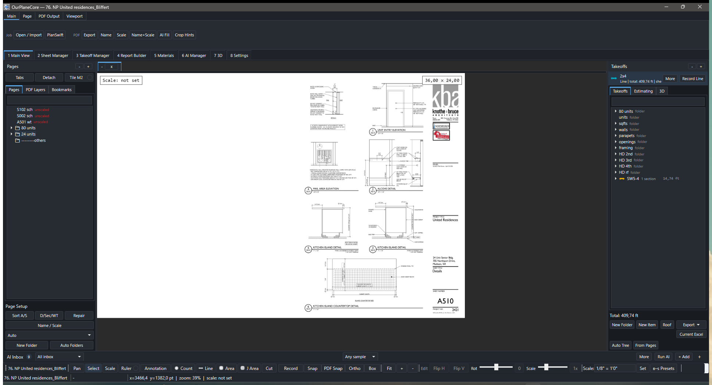
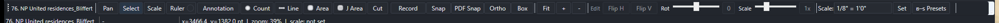
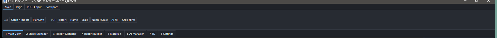
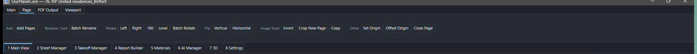
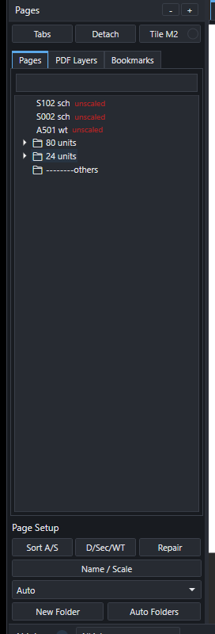
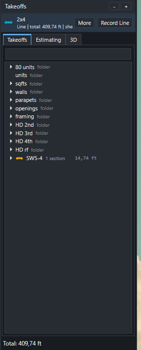
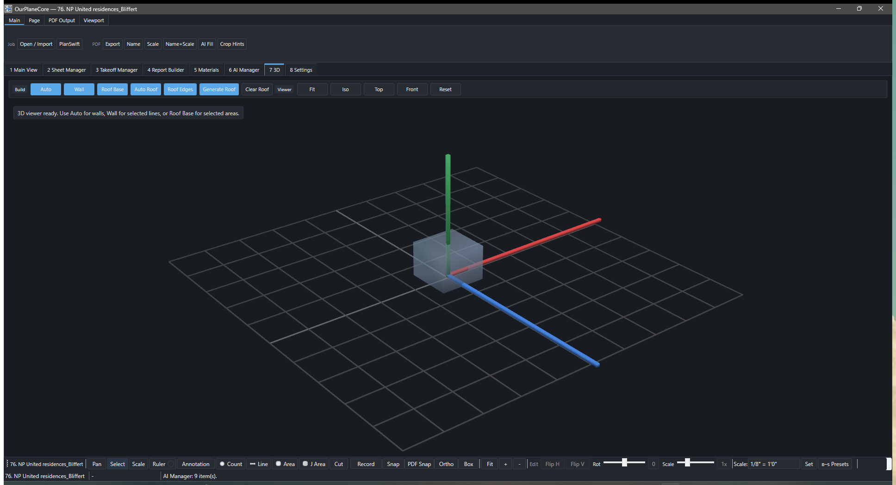
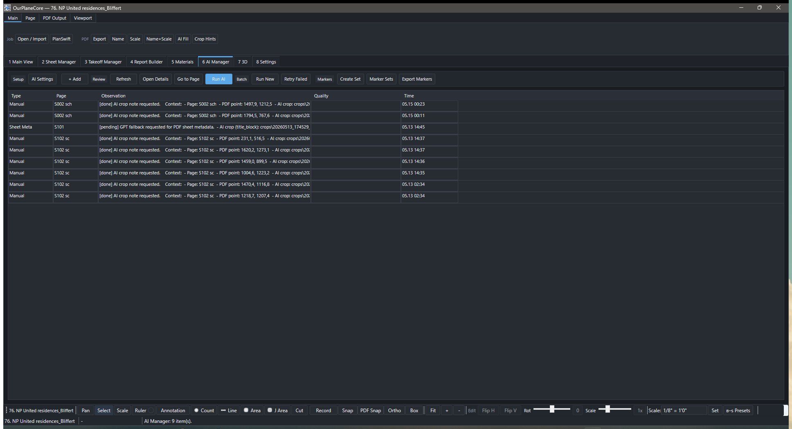
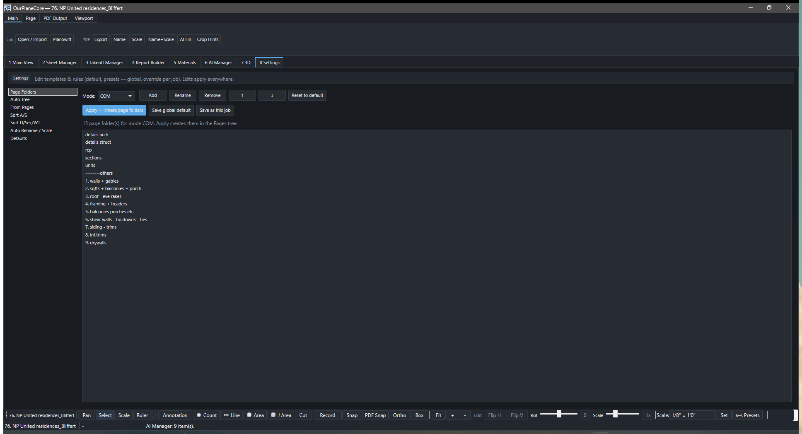

# OurPlanCore

Локальная программа для takeoff по PDF — рабочее место estimator-а: PDF-viewer,
дерево листов (Pages), дерево takeoff'ов (Takeoffs), Estimating, экспорт в Excel
и AI-review в одном окне. Близкий функциональный клон PlanSwift. Эта страница —
**гайд для пользователя**: что делает каждый инструмент, как им пользоваться,
когда применять и на что смотреть.

!!! note "Статус и обозначения"
    Внутренняя программа, не публичный SaaS. На скриншотах скрыты job names,
    sheet names и реальные takeoff names. Названия кнопок даны **как в интерфейсе**
    (англ.), пояснение — рус.; тултипы в программе совпадают с этим. Реальные
    системные пути (`%APPDATA%\OurPlaneCore\…`, `Documents\OurPlaneCore Jobs`) —
    это имена на диске, их оставляем как есть.

??? abstract "🆕 Что нового — история обновлений (нажми, чтобы раскрыть)"

    ### 06–15.06.2026 — Count Similar, multiline, стропила, надёжность v2

    **Count Similar — авто-счёт одинаковых символов** (кнопка `Similar` рядом с
    `Count`). Обводишь рамкой **один** символ (окно, дверь, розетку, hardware) →
    программа находит похожие на листе **офлайн** (без интернета):

    - **ползунок порога** + пресеты `Strict` / `Default` / `Loose`; счётчик
      «N strong, M weak» обновляется вживую;
    - цвет превью: **синие** метки = надёжные (прошли порог), **оранжевые** =
      слабые (на проверку), **серая галка** = уже посчитано в этом Count;
    - опц. галки **поворота** 90/180/270° и **зеркала** — ловит развёрнутые
      символы;
    - опц. **перепроверка AI** (галка активна только при заданном OpenAI-ключе) —
      кроп символа уходит запросом в `AI Inbox`;
    - `Add` — метки добавляются **одним undo-шагом** в активный
      `Count`/`Beam`/`Openings`-item или в новый `Similar Count`.

    :material-progress-wrench: *v1: только **текущий** лист, по чёрно-белому
    контуру; нет прохода по всем листам.*

    **Multiline — линия с авто-офсетами** (диалог `New Item`, тип `Line`, секция
    «Offset lines»; доступно и из тулбарного `Line`):

    - до **2 компаньон-линий**, у каждой своё **имя, цвет, расстояние** (фт/м) и
      **сторона** (`Left`/`Right` от направления рисования);
    - рисуешь основную линию — компаньоны строятся сами как **отдельные**
      takeoff-items (митреные параллели), редактируются независимо;
    - типовое применение: наружная/внутренняя грань стены, бровки дороги.

    *v1: офсеты считаются в момент рисования — правка/перенос основной линии их
    не пересчитывает; отдельного UI правки офсетов после создания нет.*

    **Символы `Count` — полный набор 7 шт.:** circle, cross, square + новые
    **star, triangle, diamond, ring**. Дефолтный символ — кнопкой на тулбаре
    (запоминается между сессиями); меняется у item, у выбранных строк и прямо у
    меток на холсте через `Count Display` (мульти-выделение меняет все сразу);
    символ виден одинаково на холсте, в легенде, дереве и PDF-экспорте.

    **Merge / Split — объединить / разделить замеры:**

    - `Merge` (++ctrl+m++) — переносит выделенные сегменты в **другой** takeoff
      (спрашивает целевой); при слиянии Line-сегментов касающиеся коллинеарные
      участки **сливаются в одну линию**;
    - `Split` (++ctrl+shift+m++) — выносит выделенные сегменты в **новый**
      takeoff (наследует цвет/цену/notes/символ источника);
    - также из контекст-меню замера на холсте и строки в дереве
      (`Merge Segment(s)…` / `Split Segment(s)…`); смешанные/несовместимые типы
      отклоняются с понятным статусом. *v1: для пересекающихся Area нет булева
      объединения — хранятся как отдельные сегменты.*

    **Стропила (Rafters) на 3D-крыше** (таб `7 3D`, группа `Rafters`):

    - `Pick Faces` — тыкаешь конкретные скаты в 3D-вьюере (выбранные
      **подсвечиваются** тёплым), `Whole Roof` — все скаты сразу, `Clear` —
      убрать;
    - `Spacing` `12/16/19.2/24` o.c. (дефолт 16″), `Size` `2x6…2x12` (дефолт
      2x10);
    - считает **count + суммарную LF** (с поправкой на уклон, округление по
      пиломатериалу); верх стропил лежит в плоскости ската, глубина уходит вниз,
      **стены подрезаются под низ стропил**; сводка в статус-баре.

    :material-progress-wrench: *Пока display-only, без выгрузки в takeoff-дерево.*

    **Надёжность данных (релиз v2.0.0):**

    - **атомарная запись** `Data.xml` (файл не бьётся при сбое/обрыве);
    - **переносимый job** — пути внутри (`measurements.json`, офсеты) стали
      **относительными**: копируешь/синкаешь папку job куда угодно — связи
      листов и замеров не теряются (старые абсолютные пути всё ещё читаются);
    - AI-запросы с **3 повторами** (backoff) при сетевых сбоях; **ошибки AI
      видимы** (диалог, раньше глохли молча);
    - авто-**архив** старых AI-запросов/ответов (60+ дней) в `AI_Context/archive`,
      **ротация логов** (90 дней); версия показана в заголовке окна и логе.

    **Export PDF — дерево папок.** В окне `Export` теперь **дерево листов** по
    папкам с **тристейт-галочками** (отметить/снять целую папку) и **подсветкой
    открытого** листа; плюс быстрый экспорт прямо из дерева Pages (контекст-меню
    `Export Sheet to PDF`, переиспользует прошлые настройки, без диалога).

    **Repair при переносе job.** Скопировал/перенёс job в другую папку проводником
    — `Repair Links` (под `Import PDF`) теперь сам находит листы по совпадающему
    **хвосту пути** после `\Pages\`, а не только по точному совпадению (точный
    путь, уникальный лист и legacy `Page N` тоже работают).

    **Скорость вьюпорта:**

    - **чёткий текст до зума 16×** — рендерится **видимая область** под текущий
      зум, а не растягивается картинка всего листа;
    - **prefetch** соседних листов в направлении листания + опц. прогрев **всех**
      страниц job в фоне (`8 Settings → Defaults`, по умолчанию ВЫКЛ);
    - размеры кэшей и число фоновых воркеров **подстраиваются под RAM/ядра**
      машины (на мощных — заметно плавнее);
    - фикс **зависания** при рисовании на raster-листе на зуме 600 %+.

    **Мелочи:** настраиваемый **шаг колеса зума** (`8 Settings → Defaults`,
    дефолт 2.0×); лента `Viewport` разделена, чтобы помещаться на ноутбучных
    экранах; исправлен «призрак» snap/trace на **повёрнутых листах**
    (`/Rotate ≠ 0`).

    ### Импорт проектов — детали (PlanSwift / PDF takeoffs / PDF)

    **Импорт PlanSwift** (`Open / Import → PlanSwift`, либо в текущий job через
    `Import into the current job → PlanSwift project…`):

    - исходная папка PlanSwift открывается **только на чтение**;
    - сначала жмёшь **`Scan`** — программа показывает сводку (листы, takeoff-папки,
      items, секции, area-holes, сегменты, estimate-строки, notes) и
      **предупреждения**; кнопка `Import` активна **только после успешного Scan**;
    - галка **`Convert PlanSwift page images to visible PDF sheets`** (вкл) —
      страницы-картинки PlanSwift превращаются в видимые PDF-листы;
    - галка **`Import all PlanSwift sheets and takeoff folders`** (по умолчанию
      **выкл**) — если выкл, импорт **пропускает листы без замеров**; включи,
      чтобы затянуть **все** листы и папки целиком;
    - имя нового job по умолчанию = `<имя PlanSwift> - imported` (редактируется);
    - в текущий job всё кладётся под **`Pages/01. planswift`** и
      **`Takeoffs/01. planswift`** (существующее не трогается);
    - после импорта — отчёт `Open Report` в `<job>\import_reports\`.

    **Импорт PDF takeoffs** (PDF, в котором уже есть замеры-аннотации;
    `Open / Import → Import PDF Takeoffs…`):

    - сначала **`Scan / Preview`** (показывает число PDF, листов, замеров по типам,
      куда лягут) — файлы создаются **только после подтверждения**;
    - три галочки (все по умолчанию **вкл**): **`Import PDF takeoff lines /
      areas / counts as editable takeoffs`**, **`Import PDF dimensions as Ruler
      annotations`**, **`Remove supported PDF measurement annotations from sheet
      background`** (импортируется чистая копия — размеры и линии остаются только
      как редактируемые объекты приложения; оригинал не меняется);
    - что распознаётся: `/PolyLine` и `/Polygon` → editable takeoffs, `/Circle` →
      count-метка по центру, `/Line` → Ruler-размер; цвета сохраняются как в PDF;
    - результат — в bucket **`from pdf`**, отчёт в `import_reports`.

    **Импорт обычного PDF.** Диалог `Import PDF Options` с галкой **`Build
    readable raster cache and strict black-line snap index`** (растровый кэш ~200
    DPI + snap-индекс по чёрным линиям, см. [раздел про raster](#job)). `PDF
    file(s)…` спрашивает имена листов (по строке на лист), `Folder of PDFs…` —
    **не** спрашивает (имена из файлов, рекурсивно). **Blank job** / **Blank
    sheet** (`36"×24"`, открывается **без масштаба** — задать `Scale` перед
    `Line`/`Area`).

    ### Неделя 01–05.06.2026 — производительность, raster, снап

    - **Релиз v2 + навигация takeoff-дерева.** Перетаскивание takeoff'а больше
      **не открывает случайный лист** (был баг с `a502`). Перемещение
      `section`/`count`-строки по-прежнему **прыгает на свой лист замера** (by
      design), а перенос целого takeoff'а **держит текущую страницу**. Добавлены
      **draggable page tabs**: вкладку между другими — переупорядочить, в пустое
      место — **отстегнуть в отдельное окно листа**.
    - **Viewport v4 — «молниеносно».** Одинаковые render-запросы coalesce (не
      дублируют PyMuPDF-рендер), большие **RAM-кэши**, **clipped detail-тайлы**
      для чёткого текста на **зуме 250–350 %+** (вместо мыла от upscale целого
      листа), фоновый **prefetch** соседних листов, **culling** лейблов/joist на
      быстром pan/zoom, **индексированная** синхронизация Pages↔Takeoffs.
    - **Raster-листы (scanned / image-PDF).** Cache v5 + читаемые raster-листы:
      сканы и **PlanSwift image-листы открываются напрямую**, source-image
      overviews для быстрого browsing, листы `A9*` классифицируются как details.
    - **PDF exterior contour snap (Area + PDF Snap).** `Tab` циклит контуры:
      приоритет **внешнему контуру здания**, мостит мелкие разрывы через
      окна/проёмы, отсекает **внутренние двери**. :material-progress-wrench:
      **В доработке** — на реальных листах результат пока не финальный.
    - **Joist summary labels** видны по умолчанию · **Blank job / Blank sheet**.

    ### Май 2026 — UI/UX цикл (OurCore design)

    - **F1 cheat-sheet overlay** — оверлей со всеми горячими клавишами по `F1`;
      на пустом старте — **Start-карточка** с подсказками.
    - **Takeoff Templates dock** — PlanSwift-style панель шаблонов takeoff'ов на
      правой `Takeoffs`-полосе (зеркалит `Bookmarks`).
    - **Transform popup** — `Flip`/`Rotate`/`Scale` собраны в один popup; нижняя
      полоса в два ряда, добавлены `Tile M2` и `Current Excel` (на табе
      `Estimating`).
    - **Чище ribbon/табы** — компактная полоса, segmented main-pills, borderless
      ribbon-кнопки, иконки на табе `Page`, Open/Import-меню перестроено.

    ### Май 2026 — 3D и редактирование

    - **3D Roof по-новому** (таб `7 3D`): per-edge pitch вместо «Auto/Clear
      Roof» — помечаешь кромки, задаёшь каждой свой pitch, `Generate Roof`
      строит ridge/hip/valley (Revit-style U/S/L-крыши).
    - **3D Massing** — AI-черновик здания: `Build 3D Draft`, `3D From Takeoffs`,
      `AI 3D Sort`, `Review Roof`/`Review Openings`, `Accept 3D`.
    - **Новая модель выделения и vertex-grips** — `Ctrl` мультивыбор, `Alt`
      режим вершин, прямое перетаскивание ручек, `line cut`.

<figure markdown>
  
  <figcaption><code>1 Main View</code>: ribbon сверху, Pages-дерево слева, PDF-вьюпорт по центру, Takeoffs-дерево справа, tool strip снизу.</figcaption>
</figure>

## Что внутри { .kb-section-title .kb-st--cyan }

<div class="grid cards" markdown>

-   :material-file-pdf-box:{ .lg .middle .kb-mk--cyan } **PDF Workspace**

    ---

    Job, sheets, page folders, layers, overlays, scale, sheet legend, display
    settings, PDF export with measurements.

-   :material-table-edit:{ .lg .middle .kb-mk--magenta } **Sheet Manager**

    ---

    Review-gated `Auto Name` / `Auto Scale` / confidence / `Why` / warnings.
    Применяется только то, что отмечено галкой.

-   :material-ruler-square:{ .lg .middle .kb-mk--amber } **Takeoff Tools**

    ---

    `Count`, `Line`, `Area`, `J Area`, `Scale`, `Select`, `Ruler`, markups, copy/paste.

-   :material-folder-tree:{ .lg .middle .kb-mk--green } **Pages / Takeoffs**

    ---

    Слева sheets/folders, справа takeoff folders/items. Sheet selection
    подсвечивает takeoff items, и наоборот.

-   :material-chart-box-outline:{ .lg .middle .kb-mk--blue } **Estimating / Manager**

    ---

    Табличный обзор quantities, sections, units, notes, prices.
    Current-sheet filter, export commands.

-   :material-cube-outline:{ .lg .middle .kb-mk--orange } **3D Massing**

    ---

    Reviewable draft: footprint, walls, roof planes из markers/takeoffs.
    Не BIM, а visual QA для проверки openings/roof shape.

</div>

## От и до — рабочий процесс { .kb-section-title .kb-st--green }

Короткий маршрут от пустого экрана до экспорта. Каждый шаг подробно — в разделах ниже.

1. **Создать / открыть job.** `1 Main View` → `Open / Import` (++ctrl+o++) —
   открыть/создать job или импортировать PDF. Недавние — ++ctrl+shift+o++.
2. **Импорт PDF.** `Open / Import` → добавить PDF (или `2 Sheet Manager` →
   `Import PDF(s)`). В окне импорта решаешь, строить ли **растровый кэш + snap**
   (см. [Создание job](#job)).
3. **Метаданные листов.** `2 Sheet Manager`: `Analyze` → `Auto Name` /
   `Auto Scale` / `Name+Scale` → проверить `Confidence` / `Why` / `Warnings` →
   `Apply Checked` (применяется **только** отмеченное). Нет данных в PDF →
   `AI Fill`.
4. **Разложить листы.** `Sort A/S` → `D/Sec/WT` → `Auto Folders`. При сбитых
   связях measurements → `Repair Links`.
5. **Открыть лист.** `Pages`-дерево слева — выбрать sheet. Проверить scale
   (`Scale` tool) и слои (`PDF Layers`).
6. **Создать / выбрать takeoff item.** Дерево `Takeoffs` справа → `New Item`
   (или ++t++). Имя — по [правилам naming](takeoff-naming.md).
7. **Рисовать.** Выбрать tool (`Count`/`Line`/`Area`/`J Area`), включить запись
   `Record` (++space++), обвести. Для `Line`/`Area` обязателен `Scale`. Включи
   **привязки** (`Snap`/`PDF Snap`) — линии лягут точно по чертежу
   (см. [Привязки](#snap)).
8. **Проверить.** `3 Takeoff Manager` или `Open Estimating` — totals, sections,
   notes; `Current-sheet filter` — только активный лист.
9. **Экспорт.** `3` → `Export CSV` / `TXT` / `Excel`, либо `Current Excel` —
   пишет в **уже открытый** workbook от активной ячейки (auto-save **нет**).
10. **AI (опц.).** `AI Inbox` снизу: `+ Add` маркер/кроп → `Run AI` → review
    draft → accept. Quantity появляется **только** после accept.

## Создание job, папок и что появляется автоматически { #job .kb-section-title .kb-st--orange }

**Job — это одна папка на диске.** Всё внутри: исходные PDF, листы, takeoff'ы,
AI-контекст. Ничего в облаке. Скопировал/забэкапил папку — сохранил всю работу.

### Создать job — 4 способа

Всё начинается с `Open / Import` (++ctrl+o++):

| Способ | Что выбрать | Что происходит |
| --- | --- | --- |
| **Из папки с PDF** | `New job from a folder of PDFs...` | Указываешь папку → программа ищет `*.pdf` рекурсивно, просит имя job и **сразу импортирует все PDF**. |
| **Пустой job** | `Blank job — start empty` | Пустой job без листов. Листы добавишь потом (`Add Pages`, `Blank Sheet`). |
| **Из PDF takeoffs** | `Import PDF Takeoffs...` | Импорт PDF **вместе с замерами-аннотациями** как редактируемые takeoff'ы. Сначала превью, файлы — после подтверждения. |
| **Из PlanSwift** | `PlanSwift project...` | Конвертирует проект PlanSwift в job. Исходник открывается только на чтение. |

### Добавить листы и папки в открытый job

- **Листы:** `Add Pages` (импорт PDF) · `Blank Sheet` (пустой лист `36"×24"`) ·
  `PDF Takeoffs` (PDF + аннотации). Через `Open / Import → Import into the current
  job` есть `PDF file(s)...` (спрашивает имена), `Folder of PDFs...` (не
  спрашивает) и `PlanSwift project...`.
- **Page-папки (для листов):** `New Page Folder` — создать вручную ·
  `Auto Folders` — стандартный набор папок по шаблону. Шаблон выбирается
  переключателем `Folder template` (`Auto` / `COM` / `EWP`).
- **Takeoff-папки (для замеров):** `New Folder` — вручную · `Auto Tree` —
  стандартное дерево секций · `From Pages` — дерево из структуры листов ·
  `Templates` — развернуть сохранённую заготовку (см. [docks](#docks)).

!!! tip "Растровый кэш при импорте — ставить галочку или нет"
    При импорте PDF выскакивает `Import PDF Options` с галкой **«Build readable
    raster cache and strict black-line snap index»**:

    - **Включена** → программа «запекает» лист в картинку (~200 DPI) и строит
      **snap-индекс по чёрным линиям** → тяжёлые PDF **быстрее открываются** и
      доступна **точная привязка к линиям чертежа** (см. [Привязки](#snap)).
      Цена — время импорта и место на диске (`<лист>\raster\`).
    - **Выключена** → импорт быстрее, без лишних файлов, но лист рисуется
      «налету» и строгий snap к чёрным линиям недоступен.

    Оригинал PDF всегда остаётся источником — растр это только кэш поверх.

### Что создаётся на диске автоматически

Когда создаёшь job (любым способом), программа сама раскладывает структуру —
руками ничего создавать не надо:

```text
<job>\
├─ Data.xml        ← карточка job (имя, тип, GUID)         [авто]
├─ sources\        ← КОПИИ всех исходных PDF                [авто при импорте]
├─ Pages\          ← ЛИСТЫ; один лист = одна папка          [авто]
│   └─ 00. imported\<лист>\
│         ├─ source.json     ← ★ главный файл листа (путь к PDF, № стр., scale)
│         ├─ Data.xml        ← видимое имя листа и порядок
│         ├─ source_pdf.json ← метаданные (необязательно)
│         └─ raster\         ← растр-кэш + snap.json (если ставил галку)
├─ Takeoffs\       ← TAKEOFF'ы; один item = одна папка       [авто]
│   └─ <item>\
│         ├─ Data.xml          ← цвет, тип, цена, notes
│         └─ measurements.json ← ★ вся геометрия замеров
└─ AI_Context\     ← AI-наблюдения, кропы, запросы           [авто]
```

- **Создаёшь пустой job** → сразу появляются `Data.xml`, `Pages\`, `Takeoffs\`,
  `sources\`, `AI_Context\` (даже без единого листа).
- **Создаёшь page-папку** (`New Page Folder` / `Auto Folders`) → под `Pages\`
  появляется папка-контейнер; листы внутри неё — это вложенные папки с
  `source.json`.
- **Создаёшь takeoff-папку/item** (`New Folder` / `New Item`) → под `Takeoffs\`
  появляется папка; у item внутри неё `measurements.json` хранит геометрию.
- **Импортируешь PDF** → каждый PDF **копируется** в `sources\`, а под
  `Pages\00. imported\` появляются папки-листы. После импорта оригинал не нужен.

!!! warning "Имя папки ≠ видимое имя; не трогать руками"
    На диске имя «причёсано» и уникально, человекочитаемое — в `Data.xml`.
    Не переименовывай и не двигай файлы внутри job проводником, не правь пути в
    `source.json`/`page_folder`. Если после копирования job'а takeoff'ы не видны
    — кнопка `Repair Links` (панель Pages). Полный разбор хранения —
    [Создание Job и хранение](job-creation-storage.md).

## Инструменты замера — демонстрация { #tools .kb-section-title .kb-st--green }

Шесть основных инструментов на нижней панели. Логика одна: выбрал tool → выбрал
активный takeoff item → включил `Record` (++space++) → рисуешь во вьюпорте.
Результат сразу падает в quantity активного item.

=== "Count — счёт (ea)"

    **Что:** счётные маркеры — окна, двери, посты, балки, hardware.
    **Как:** ++p++ → клик по каждому объекту. Каждый клик = `+1 ea`.
    **Фишка:** работает **без scale** (это просто счёт). Символ/цвет маркера —
    в свойствах item.

=== "Line — линия (lf)"

    **Что:** линейные замеры — стены, plates, blocking, трим, railings.
    **Как:** ++l++ → клик по точкам ломаной, ++c++ завершить (++backspace++ —
    отменить точку). Длина = сумма отрезков × scale.
    **Требует `Scale`** — без масштаба запись блокируется.
    **Точность:** включи `Snap`/`PDF Snap`, чтобы концы легли в углы/узлы
    чертежа, и `Ortho` (++f8++) для строго горизонтальных/вертикальных линий.

=== "Area — площадь (sf)"

    **Что:** площади — sheathing, кровля/перекрытие, плита, drywall.
    **Как:** ++a++ → обвести полигон, ++c++ замкнуть. Площадь = shoelace по
    вершинам. `Cut` (++x++) — вырез (проём) из площади.
    **Требует `Scale`.** Для обводки внешнего контура здания — `PDF Snap` +
    `Tab` (трассировка контура, см. [Привязки](#snap)).

=== "J Area — joist (count + lf)"

    **Что:** раскладка балок/лаг — сразу **количество** joist и **суммарная
    длина**, с направлением, шагом (spacing), pitch и округлением.
    **Как:** ++j++ → задать область и направление раскладки → программа
    расставляет joist по spacing. Лейблы видны по умолчанию.

=== "Beam — балка (ea + lf)"

    **Что:** замер балки «в одно действие» — меряешь длину балки, программа
    **сама создаёт Count-item** с именем по длине и ставит первую count-метку.
    Удобно для beam/header/GLB: и длина посчитана, и item заведён.
    **Как:** ++b++ → провести по балке → подтвердить имя item → метка ставится
    автоматически. Дальше можно доставлять метки как обычным `Count`.

=== "Openings — проёмы (ea)"

    **Что:** проёмы (окна/двери/beam openings) — обводишь проём **рамкой**,
    программа меряет его размер `Ш×В` в футах, создаёт Count-item с именем-
    размером (напр. `3.0x5.0`) и ставит метку **в центре** проёма.
    **Как:** ++o++ → растянуть бокс по проёму → подтвердить → метка в центре.
    Имя по умолчанию = размер, его можно поправить.

=== "Cut — вырез / стирание (X)"

    **Что:** двойного назначения — **вырезает дырки в Area** (проёмы из
    площади, чтобы `sf` считалась без них) **или стирает куски Line**.
    **Как:** ++x++ → обвести вырез внутри площади (или участок линии).
    ++f9++ переключает **box-режим** (прямоугольный вырез). Вырез можно
    вставлять и за границей Area; paste якорится по верхнему-левому углу.

=== "Scale — масштаб"

    **Что:** задать/проверить масштаб листа. **Обязателен до `Line`/`Area`.**
    **Как:** ++s++ → провести по известному размеру (или dimension-линии) →
    ввести реальную длину. Scale хранится **per page** и **per measurement**;
    при переносе замера на другой лист — пересчитывается.

=== "Ruler — линейка"

    **Что:** быстрый замер расстояния **без** создания takeoff item.
    **Как:** ++r++ → провести. Ничего не пишется в quantity — просто проверить
    размер на лету.

<figure markdown>
  
  <figcaption>Tool strip: Pan/Select/Scale/Ruler · Annotation · Count/Line/Area/J Area/Cut · Record · Snap/PDF Snap/Ortho/Box · Fit/+/− · Transform · Scale/Set/Presets.</figcaption>
</figure>

??? note "Полная таблица tool strip + клавиши"

    | Кнопка | Tag / клавиша | Действие |
    | --- | --- | --- |
    | `Pan` | `pan` / ++v++ | Панорамирование |
    | `Select` | `select` / ++e++ | Выбор/редактирование measurements |
    | `Scale` | `scale` / ++s++ | Задать/проверить масштаб листа |
    | `Ruler` | `ruler` / ++r++ | Временный замер без takeoff item |
    | `Annotation ▾` (`Draw`/`Arrow`/`Box`/`Cloud`/`Area`/`Note`) | `drawline` ++d++ … | Аннотации поверх листа (Box/Cloud/… из popup-меню) |
    | `Count` | `point` / ++p++ | Счётный маркер (`ea`) |
    | `Line` | `line` / ++l++ | Линейный замер (`lf`) |
    | `Area` | `area` / ++a++ | Площадь (`sf`) |
    | `J Area` | `joistarea` / ++j++ | Joist-раскладка (count + длина) |
    | `Beam` | `beam` / ++b++ | Замер балки → авто Count-item + первая метка |
    | `Open` | `openings` / ++o++ | Проём рамкой → Count-item с размером `Ш×В`, метка в центре |
    | `Cut` | `areacut` / ++x++ (++f9++ box) | Вырез дырки в Area **или** стирание куска Line |
    | `Snap` / `PDF Snap` / `Ortho` / `Box` | ++f3++ / ++ctrl+f3++ / ++f8++ / ++f9++ | Привязки и ограничения |
    | `Fit` / `+` / `-` | ++f++ / ++ctrl+plus++ / ++ctrl+minus++ | Вписать / зум |
    | `Transform ▾` | — | `Flip H/V` / `Rotate` / `Scale` / сброс `0`/`1x` в одном popup |
    | `Set` (scale) / `▾ Presets` | — | Задать масштаб листа / пресеты |

??? note "Ползунки (sliders)"

    | Ползунок | Диапазон | Что делает |
    | --- | --- | --- |
    | `Line thickness` | `0.25 – 4.0` | Толщина линий-замеров |
    | `Point size` | `0.25 – 4.0` | Размер счётных маркеров |
    | `Area edge` | `0.25 – 4.0` | Толщина границы площади |
    | `Area fill` | `0 – 100 %` | Прозрачность заливки площади |
    | `Label scale` | `0.5 – 3.0` | Размер value-лейблов |
    | `Rotate selection` | `−180 … +180°` | Поворот выделенного; `0` — сброс |
    | `Scale selection` | `от 0.25×` | Масштаб выделенного; `1x` — сброс |

    У большинства ползунков есть текст-поле: впиши значение и `Enter` — точная
    установка без перетаскивания.

## Привязки (Snap) — как точно рисовать линии { #snap .kb-section-title .kb-st--blue }

Привязки — главное, что отличает аккуратный takeoff от «на глаз». Когда snap
включён, курсор **прилипает** к характерным точкам чертежа, и вершина линии/площади
ставится **ровно** туда, а не «примерно рядом». Это убирает дрожание руки, даёт
правильную длину `lf` и замкнутые контуры без щелей.

| Привязка | Клавиша | К чему прилипает | Когда работает |
| --- | --- | --- | --- |
| `Snap` | ++f3++ | Endpoints / midpoints / intersections **нарисованной** геометрии (твои же замеры) | Всегда |
| `PDF Snap` | ++ctrl+f3++ | **Vector**-PDF: углы, концы сегментов, пересечения линий чертежа | Только если PDF реально векторный |
| `PDF Snap` (raster) | ++ctrl+f3++ | **Строгие чёрные линии** растрового чертежа (через `raster\snap.json`) | Если при импорте строил растр-кэш |
| `Ortho` | ++f8++ | Ограничение угла **90° / 45°** | Line / Area / Scale |
| `Box` | ++f9++ | Прямоугольный режим (рамкой) | Area / выбор |

### Как это помогает рисовать линии

- **Концы линий садятся в углы.** Рисуешь стену `Line` — с `PDF Snap` каждый
  клик прилипает к углу/пересечению на чертеже, длина считается по реальным
  точкам, а не по «почти попал».
- **Площади замыкаются без щелей.** `Area` с привязкой ставит последнюю вершину
  ровно в первую → полигон корректный, `sf` без артефактов.
- **Стыковка замеров между собой.** `Snap` (++f3++) ловит концы **твоих** линий
  → соседние стены стыкуются точно, без нахлёста и разрыва.
- **Прямые углы.** `Ortho` (++f8++) держит сегмент строго по горизонтали/
  вертикали — стены и плиты получаются ровными даже на дрожащей руке.
- **Строгий snap по чёрным линиям (raster).** Если при импорте включил растровый
  кэш, программа знает все чёрные линии листа (`snap_point_count` /
  `snap_segment_count` в `snap.json`) и привязывается прямо к ним — это особенно
  выручает на сканах и image-PDF, где vector-данных нет.

### Трассировка контура (Area + PDF Snap → `Tab`)

Для обводки **внешнего контура здания** не нужно кликать каждый угол вручную:

1. Включи `PDF Snap`, возьми `Area`.
2. Наведись у внешней стены и жми ++tab++ — программа предлагает **контур**:
   приоритет внешнему footprint'у, мостит мелкие разрывы через окна/проёмы и
   старается отсекать внутренние двери.
3. ++tab++ ещё раз — следующий вариант контура. Подходящий — принять.

!!! warning "Контур-снап — в доработке"
    На реальных листах автоконтур пока не всегда идеален (может зацепить
    внутреннюю геометрию). Если результат кривой — добери углы вручную с обычным
    `PDF Snap`. Фича активно дорабатывается.

!!! tip "Когда какую привязку включать"
    - Векторный PDF (родной из CAD) → `PDF Snap` ловит углы идеально.
    - Скан/фото/image-PDF → нужен **растр-кэш** при импорте, тогда `PDF Snap`
      привязывается к чёрным линиям; иначе только `Snap` по своей геометрии.
    - Прямые стены/плиты → добавь `Ortho`.

## Редактирование: выделение, vertex-grips, line cut { #editing .kb-section-title .kb-st--magenta }

Инструмент `Select` (++e++), прямое редактирование геометрии во вьюпорте.

??? note "Жесты выделения и правки вершин"

    | Жест | Что делает |
    | --- | --- |
    | Клик по объекту | Выбрать один measurement |
    | Box (рамка) | Выбрать пересечённые/охваченные measurements |
    | ++ctrl++ + клик по новому | Добавить в мульти-выбор |
    | ++ctrl++ + клик по выбранному | Выбрать **все его вершины** |
    | ++shift++ + клик/box | Убрать из выбора |
    | ++alt++ + клик/box | Режим **вершин (handles)** |
    | Drag ручки | Двигать вершину(ы); ++shift++ — ортогонально |
    | ++delete++ | Удалить объекты или ручки |

- **Direct vertex grips** — ручки видны прямо у выбранного measurement;
  count-маркеры тоже редактируются грипами.
- **Line cut** — разрез линии на месте (как area `Cut`, но для линий).
- **Cut regions (area)** — вырез можно вставлять и за границей Area; paste
  якорится по верхнему-левому углу.

## Рабочие табы { .kb-section-title .kb-st--cyan }

Верхняя полоса — восемь рабочих режимов. Коротко о каждом, детальные таблицы
кнопок — под спойлерами.

| Таб | Назначение |
| --- | --- |
| `1 Main View` | Основное: PDF-вьюпорт, Pages слева, Takeoffs справа, AI Inbox снизу |
| `2 Sheet Manager` | Импорт/метаданные/раскладка листов, review-gated rename+scale |
| `3 Takeoff Manager` | Таблица quantities, sections, notes, экспорт |
| `4 Report Builder` | Сборка report-блоков из `TemplateCom.xlsm` (в разработке) |
| `5 Materials` | Извлечение material evidence + Materials Report sheet |
| `6 AI Manager` | AI-наблюдения, маркер-сеты, обучение, запуск/ретрай |
| `7 3D` | 3D massing: walls/roof build + 3D viewer |
| `8 Settings` | Редактируемые правила |

??? note "Лента `Main` — кнопки"

    | Кнопка | Действие |
    | --- | --- |
    | `Open / Import` | Открыть job, сменить job-папку, создать job или импортировать PDF |
    | `PlanSwift` | Отдельный конвертер PlanSwift-job |
    | `Export` | Экспорт выбранных/всех листов в PDF |
    | `Name` / `Scale` / `Name+Scale` | Превью и применение PDF-имён / масштаба / вместе |
    | `AI Fill` | Очередь GPT-fallback для отсутствующих метаданных |
    | `Crop Hints` | Переиспользуемые кроп-боксы для номера листа и масштаба |

    <figure markdown>
      
      <figcaption>Ribbon <code>Main</code> + строка workspace-табов под ним.</figcaption>
    </figure>

??? note "Лента `Page` — кнопки"

    | Кнопка | Действие |
    | --- | --- |
    | `Add Pages` | Импорт PDF-страниц в текущий job |
    | `Batch Rename` | Переименовать выбранные страницы по порядку |
    | `Left` / `Right` / `180` | Повернуть активную страницу |
    | `Level` | Сброс вида к fit + очистка временного ввода |
    | `Batch Rotate` | Повернуть выбранные страницы |
    | `Vertical` / `Horizontal` | Отразить активную страницу |
    | `Invert` | Инвертировать цвета страницы |
    | `Crop New Page` | Новая страница из видимой области вьюпорта |
    | `Copy` | PNG активной страницы в буфер |
    | `Set Origin` / `Offset Origin` | Отметить/сдвинуть origin |
    | `Close Page` | Закрыть вкладку страницы |

    <figure markdown>
      
      <figcaption>Ribbon <code>Page</code>: Add Pages, Rotate, Flip, Invert, Crop, Origin, Close.</figcaption>
    </figure>

??? note "Ленты `PDF Output` и `Viewport` — рендер и лейблы"

    **`PDF Output`** — как measurements/markups лягут в экспортный PDF:

    | Контрол | Действие |
    | --- | --- |
    | `Lines & Area` ползунки | Толщина/заливка линий и площадей в экспорте |
    | `Labels` | Какие value-лейблы включать |
    | Overlays `Legend` / `Header` | Включать легенду / заголовок масштаба |
    | `Include` `Meas` / `Markups` | Включать замеры / аннотации в PDF |

    **`Viewport`** — что показывать на экране:

    | Контрол | Действие |
    | --- | --- |
    | `All` / `Line` / `Area` / `Joist` / `Count` | Master + по типам: показ value-лейблов |
    | `w/ page` (labels) | Лейблы масштабируются вместе со страницей |
    | Legend: `Show` / `Size` / `Pos` / `w/page` | Легенда листа |
    | `Fast pan/zoom` | Упрощённая навигация (быстрее на тяжёлых PDF) |
    | `ft / sf` | Imperial-единицы |
    | `Dark` toggle | Тёмная тема |

## Панели Pages / Takeoffs { .kb-section-title .kb-st--magenta }

Слева — листы (`Pages`), справа — что считаешь (`Takeoffs`). Выбор листа
подсвечивает его замеры, и наоборот.

??? note "Левая панель `Pages` — кнопки"

    | Контрол | Действие |
    | --- | --- |
    | `Open Tabs` / `Detach` / `Tile M2` | Открыть вкладками / в отдельных окнах / тайлинг на мониторе 2 |
    | `Sort A/S` / `D/Sec/WT` | `A`→Arch, `S`→Struct, trailing `-`→Others; Details/Sections/Wall-Type |
    | `Repair Links` | Переподключить сохранённые measurements к папкам страниц |
    | `Page Setup` | Параметры страницы (плавающее окно) |
    | `Folder template` (`Auto`/`COM`/`EWP`) | Шаблон папок для sheets |
    | `New Page Folder` / `Auto Folders` | Создать папку / стандартные папки |
    | Под-таб `PDF Layers` | `Load`, `On`, `Off`, `Clear Hi`, `Layer Trace`, `Cycle`, `Apply` |

    <figure markdown>
      
      <figcaption>Панель <code>Pages</code>: Tabs/Detach/Tile M2, под-табы Pages/PDF Layers/Bookmarks, дерево листов.</figcaption>
    </figure>

??? note "Правая панель `Takeoffs` — кнопки"

    | Контрол | Действие |
    | --- | --- |
    | `Record` | Вкл/выкл запись в активный item (++space++) |
    | `More` / `Properties` / `Find` | Доп. действия / свойства / поиск item |
    | `Sheet Next` / `Next` / `Previous` | Навигация по листам и items |
    | `New Folder` / `New Item` | Создать папку / item |
    | `Roof Base` | Создать roof-base слой |
    | `Export ▾` | Меню экспорта |
    | `Auto Tree` / `From Pages` | Стандартное дерево / из структуры страниц |
    | `Templates` (dock) | PlanSwift-style панель шаблонов takeoff'ов |

    <figure markdown>
      
      <figcaption>Панель <code>Takeoffs</code>: активный item + Record, под-табы Takeoffs/Estimating/3D, дерево.</figcaption>
    </figure>

### Bookmarks · Templates · docks { #docks }

Две докуемые панели ускоряют работу: **Bookmarks** (куда смотреть) и
**Takeoff Templates** (что считать).

- **Page Bookmarks** (под Pages) — сохранённый **вид листа** (страница + zoom/
  позиция). `Add` (++b++ ++k++) сохранить, `Open`/двойной клик — вернуться к
  узлу/schedule/детали за один клик.
- **Takeoff Templates** (под Takeoffs) — переиспользуемое **дерево takeoff-папок/
  итемов**. `Save Current` сохранить типовую структуру (напр. COM-набор), `Apply`
  развернуть её на новом job без ручной пересборки.

!!! tip "Bookmark vs Template vs Crop-bookmark — не путать"
    - **Bookmark** = *куда смотреть* (лист + zoom).
    - **Template** = *что считать* (заготовка дерева takeoff).
    - **Crop bookmark** = фрагмент чертежа в очередь AI (`Run New`/`Retry Failed`),
      см. [AI Manager](#tab-6-ai-manager).

## Таб `7 3D` — per-edge roof { #tab-7-3d .kb-section-title .kb-st--green }

Строит 3D из takeoff'ов: стены-призмы из `Line`, roof footprint из `Area`,
крыша — по углу каждой кромки.

!!! info "Per-edge roof workflow (Revit-style U/S/L крыши)"
    1. `Roof Base` — footprint из area-takeoff (RF/roof).
    2. `Select Edge` — кликаешь кромки footprint; каждой помечаешь **defines
       slope** и задаёшь свой **pitch**. Кромка без slope — gable/rake.
    3. `Generate Roof` — солвер строит точный *lower-envelope*: ridge, hips и
       **valleys** (в т.ч. вогнутые). Результат можно **затолкнуть обратно в
       takeoff-дерево** как roof-takeoff.

??? note "Кнопки таба `7 3D`"

    | Кнопка | Группа | Действие |
    | --- | --- | --- |
    | `Auto` | Build | Авто-постройка walls + sqft slabs + RF/roof areas |
    | `Wall` | Build | Стены-призмы из выбранных **line**-takeoff |
    | `Roof Base` | Build | Roof footprint из выбранных **area**-takeoff |
    | `Select Edge` | Build | Выбрать кромки roof base; задать **per-edge pitch** |
    | `Generate Roof` | Build | Построить ridge/hip/valley из per-edge pitch |
    | `Fit` / `Iso` / `Top` / `Front` / `Reset` | Viewer | Виды 3D-сцены |

    <figure markdown>
      
      <figcaption><code>7 3D</code>: Build (Auto / Wall / Roof Base / Select Edge / Generate Roof) + Viewer.</figcaption>
    </figure>

### 3D Massing — AI-черновик здания { #3d-massing }

Отдельная панель: собирает **черновую 3D-модель** из AI-маркеров или из
takeoff'ов и даёт review-gated workflow до принятия. Это **не BIM** — visual QA
для проверки openings/roof shape.

??? note "Кнопки 3D Massing"

    | Кнопка | Действие |
    | --- | --- |
    | `Build 3D Draft` | Собрать `AI_Context/3d_massing/model.json` из AI-маркеров |
    | `3D From Takeoffs` | Черновик из Line/Area замеров (Walls/Areas/Sqft) |
    | `AI 3D Sort` | OpenAI сортирует role/level, затем детерминированно строит черновик |
    | `3D Window` | Отдельное orbit-окно 3D |
    | `Auto Roof` | Очередь reviewable AI-кандидатов roof-маркеров |
    | `Review Roof` / `Review Openings` | Проверить тип крыши/pitch и проёмы до принятия |
    | `Accept 3D` | Пометить черновик как reviewed project context |

## Таб `6 AI Manager` { #tab-6-ai-manager .kb-section-title .kb-st--magenta }

AI здесь — **помощник под review**, а не автомат. Любой AI-результат сначала
**draft**, quantity появляется только после `accept`.

??? note "Кнопки AI Manager"

    | Кнопка | Действие |
    | --- | --- |
    | `AI Settings` | Модель и статус ключа |
    | `+ Add` / `Refresh` / `Open Details` / `Go to Page` | Наблюдения, навигация |
    | `Run AI` / `Run New` / `Retry Failed` | Запуск по выбранному / всем новым / повтор неуспешных |
    | `Create Set` / `Marker Sets` / `Export Markers` | Маркер-сеты и экспорт проверенных |

    <figure markdown>
      
      <figcaption><code>6 AI Manager</code>: наблюдения, Run AI / Run New / Retry Failed, маркер-сеты.</figcaption>
    </figure>

!!! warning "AI safety — почему можно доверять числам"
    - AI output — **draft**, пока user не accept (нет quantity из ниоткуда).
    - AI сохраняет request/response JSON и crop evidence — видно, по какому
      фрагменту drawing предложен результат.
    - AI создаёт **review rows**, не quantities. Secrets не показываются (ключ —
      found/missing, без значения).

## Export { .kb-section-title .kb-st--cyan }

| Export | Статус | Для чего |
| --- | --- | --- |
| CSV | ✅ | Табличный output: quantities, notes, scale, price |
| TXT | ✅ | PlanSwift-like text blocks |
| Excel `.xlsx` | ✅ | Rows в стиле `Name / Value / Unit` |
| `Current Excel` | ✅ | Пишет selected rows в **уже открытый** workbook от active cell |
| `Report Builder` | 🚧 | Полная сборка report-блоков внутри app (в разработке) |

!!! warning "`Current Excel` не делает auto-save"
    Программа пишет строки, **проверка и save — на пользователе**. By design.
    Notes экспортируются; multi-select поддерживает move/copy/cut/paste/delete.

## «8 Settings» — редактируемые правила { .kb-section-title .kb-st--orange }

Канонический дом для всех редактируемых шаблонов и правил (поведение-определяющие
константы не зашиты в код).

??? note "Категории Settings + как разрешается правило"

    | Категория | Что настраивает |
    | --- | --- |
    | `Page Folders` | шаблон папок для sheets |
    | `Auto Tree` / `From Pages` | авто-дерево takeoff / генерация из pages |
    | `Sort A/S` / `Sort D/Sec/WT` | раскладка листов |
    | `Auto Rename / Scale` | правила авто-имени и масштаба |
    | `Defaults` | дефолты |

    Каждая категория: live-редактор, `Reset to default`, `Save global default`,
    `Save as this job`, `Apply`. Разрешение правила: **job override → global →
    default** (global в `SmartContextStore/presets/`, per-job в
    `<job>/AI_Context/settings/`).

    <figure markdown>
      
      <figcaption><code>8 Settings</code>: live-редактор правила, Reset / Save global / Save as job / Apply.</figcaption>
    </figure>

## Mental model { .kb-section-title .kb-st--green }

Программа построена вокруг **job folder** — всё локально, ничего в облаке.

| Слой | Что хранит | Source of truth для |
| --- | --- | --- |
| `Pages` | Sheets, scale, layers | Sheet name + scale (после review) |
| `Takeoffs` | Folders, items, sections | Quantity structure |
| `Measure` | Геометрия в PDF coords | Конкретные числа quantities |
| `AI` | Crops, requests, drafts | Доказательства (НЕ quantities — пока не accepted) |

!!! tip "Главная логика"
    `Page` отвечает за drawing context и scale. `Takeoff item` — за то, что
    считается. `Measurement` связывает: на каком sheet, с каким scale, в какой
    item записана геометрия.

## Архитектура и сборка { .kb-section-title .kb-st--blue }

??? note "Стек, слои данных, disk-модель (для понимания, не для разработки)"

    - **Стек:** WPF desktop, `.NET 9` (`net9.0-windows`), `x64`. Namespace
      `OurPlaneCore`.
    - **Three-panel shell:** Pages tree слева, PDF viewport по центру
      (SkiaSharp-overlay), Takeoffs tree справа, AI Inbox снизу.
    - **PDF-рендер в два слоя:** (1) статичная картинка страницы — Python-воркер
      (PyMuPDF, `pdf_layers_helper.py`); (2) overlay measurements — `PdfViewport`
      (SkiaSharp); fallback — Docnet/PDFium.
    - **Геометрия:** `Line` = сумма отрезков × scale; `Area` = shoelace; `Count` =
      число маркеров. Каждый `Measurement` хранит свой `PageFolder` + scale.
    - **Autosave** — debounce 500 мс. Настройки — `%APPDATA%\OurPlaneCore\
      settings.json`; логи — `%APPDATA%\OurPlaneCore\logs\app-<date>.log`.

    ```text
    <job>/
      Pages/        PDF sheet folders
      Takeoffs/     item folders, measurements.json
      sources/      исходные PDF
      AI_Context/   observations.jsonl, requests/, responses/, crops/, markers/, settings/
      Data.xml      per-folder item metadata
    ```

??? note "Сборка и обновление"

    ```powershell
    dotnet restore .\ourplanecore.sln
    dotnet build   .\ourplanecore.sln
    dotnet run --project .\ourplanecore.csproj
    ```

    - Без параллельных билдов (lock в `obj\Debug\net9.0-windows`).
    - Release single-file → `C:\Users\User\Desktop\updates\OurPlaneCore\
      ourplanecore.exe` (Desktop-ярлык указывает туда).
    - «Запустилось ли» проверяют по логу `app-<date>.log` от последней
      `Application startup.` (процесс жив + нет `ERROR` после маркера + есть
      `Loaded takeoffs` / `Viewport`).

## Горячие клавиши { #hotkeys .kb-section-title .kb-st--blue }

=== "Global / tools"

    | Клавиша | Действие |
    | --- | --- |
    | ++ctrl+o++ / ++ctrl+shift+o++ | Open Job / Recent |
    | ++ctrl+s++ | Save |
    | ++ctrl+shift+p++ | Command Palette |
    | ++f1++ | Cheat-sheet overlay всех горячих клавиш |
    | ++space++ | Старт/стоп записи в активный item |
    | ++t++ | Новый takeoff item |
    | ++b++ ++k++ | Add Bookmark (последовательность) |
    | ++v++ / ++e++ / ++s++ / ++r++ | Pan / Select / Scale / Ruler |
    | ++d++ | Draw Line annotation (Box/Cloud/… — из Annotation popup) |
    | ++p++ / ++l++ / ++a++ / ++j++ | Count / Line / Area / J Area |
    | ++b++ / ++o++ / ++x++ | Beam / Openings / Cut (++f9++ — box-режим Cut) |

=== "Viewport"

    | Клавиша | Действие |
    | --- | --- |
    | ++esc++ | Отмена draw/edit/Layer Trace/3D guide |
    | ++enter++ / ++tab++ | Layer Trace: дальше / цикл режима; (Area+PDF Snap) ++tab++ — цикл контура |
    | ++t++ | Toggle Layer Trace |
    | ++c++ | Завершить Line/Area/Cut |
    | ++backspace++ | Отменить последнюю точку |
    | ++delete++ | Удалить выбранное |
    | ++f++ | Fit page |
    | ++f3++ / ++ctrl+f3++ | Snap / PDF Snap |
    | ++f8++ / ++f9++ | Ortho / Box mode |
    | ++ctrl+plus++ / ++ctrl+minus++ | Зум +/− |
    | ++ctrl+z++ | Undo |
    | ++ctrl+a++ / ++ctrl+c++ / ++ctrl+v++ | Выбрать всё / копировать / вставить |

=== "Trees / 3D guides"

    | Клавиша | Действие |
    | --- | --- |
    | ++ctrl+c++ / ++ctrl+x++ / ++ctrl+v++ / ++ctrl+d++ | Copy / Cut / Paste / Duplicate |
    | ++ctrl+up++ / ++ctrl+down++ | Двигать узел вверх/вниз |
    | ++ctrl+enter++ | (Takeoffs) выбрать measurements секции на canvas |
    | ++f2++ / ++delete++ | Rename / Delete |
    | 3D Roof: ++r++ ++h++ ++v++ ++e++ ++k++ ++p++ | Ridge / Hip / Valley / Eave / Rake / Pitch guide |

## See also

- [Создание Job и хранение](job-creation-storage.md) — где что лежит на диске, как ничего не терять
- [Как называть takeoffs](takeoff-naming.md) — правила naming + auto-routing
- [Workflow](../start/workflow.md) · [Структура takeoff](../start/takeoff-structure.md)
- [Excel macro hotkeys](excel-hotkeys.md) — VBA shortcuts после export
- [Советы и важные вещи](boss-feedback-rules.md)
