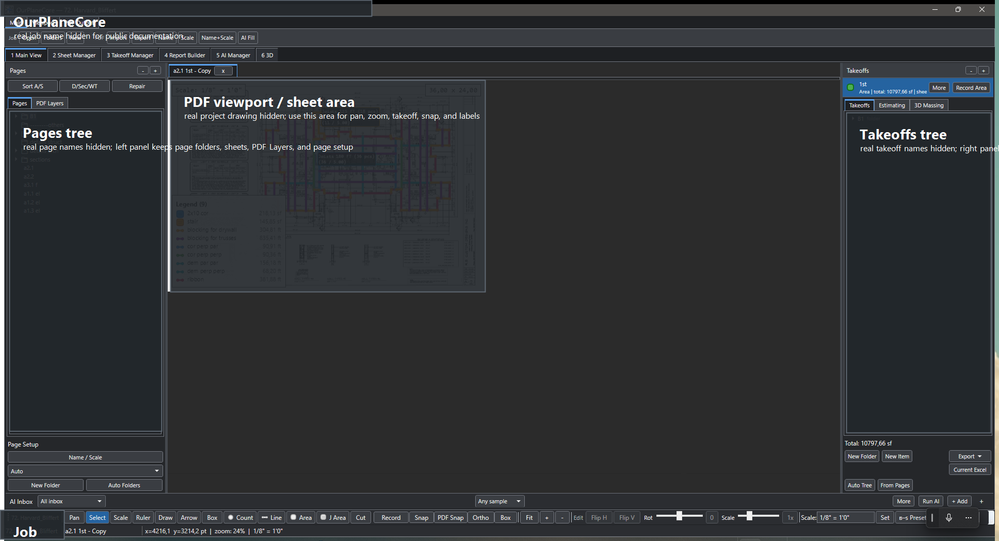
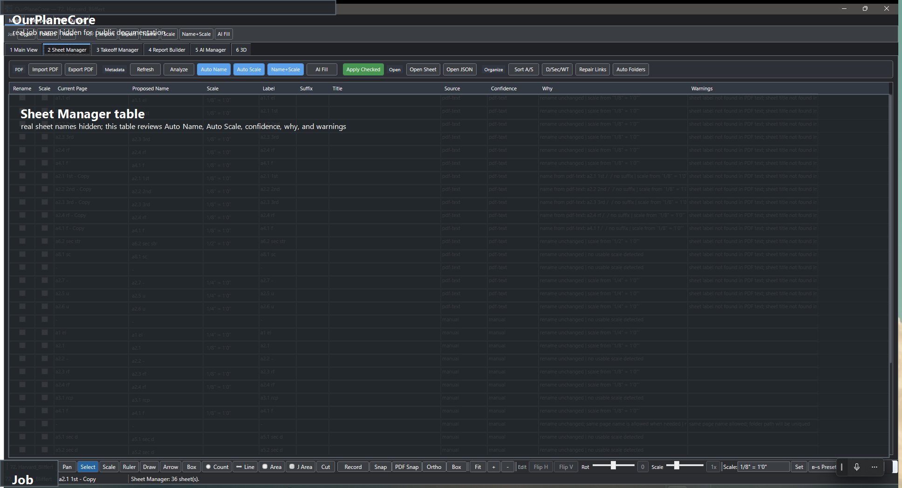
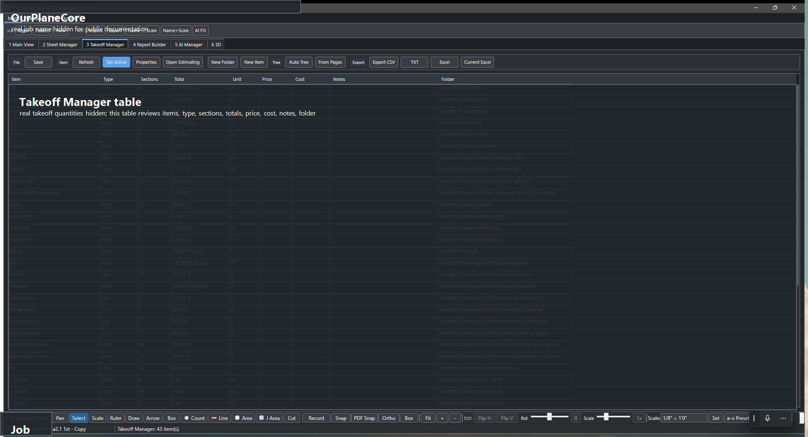

# OurPlaneCore

Локальная программа для takeoff по PDF — рабочее место estimator-а: PDF viewer,
Pages tree, Takeoffs tree, Estimating, Excel export и AI review в одном окне.

!!! note "Статус"
    Внутренняя программа, не публичный SaaS. Скриншоты ниже redacted: job names,
    sheet names, real takeoff names — скрыты.

!!! tip "Нужна каждая кнопка и ползунок?"
    Полный разбор всех табов, кнопок, ползунков и процесса от и до —
    [OurPlaneCore — полный гайд](ourplanecore-guide.md).

<figure markdown>
  
  <figcaption>Main View: PDF viewport, Pages tree слева, Takeoffs tree справа, tools снизу.</figcaption>
</figure>

## Что внутри { .kb-section-title .kb-st--cyan }

<div class="grid cards" markdown>

-   :material-file-pdf-box:{ .lg .middle .kb-mk--cyan } **PDF Workspace**

    ---

    Job, sheets, page folders, layers, overlays, scale, sheet legend, display
    settings, PDF export with measurements.

-   :material-table-edit:{ .lg .middle .kb-mk--magenta } **Sheet Manager**

    ---

    Review-gated `Auto Name` / `Auto Scale` / confidence / `Why` / warnings.
    Применяется только то, что отмечено галкой.

-   :material-ruler-square:{ .lg .middle .kb-mk--amber } **Takeoff Tools**

    ---

    `Count`, `Line`, `Area`, `J Area`, `Scale`, `Select`, `Ruler`, markups, copy/paste.

-   :material-folder-tree:{ .lg .middle .kb-mk--green } **Pages / Takeoffs**

    ---

    Слева sheets/folders, справа takeoff folders/items. Sheet selection
    подсвечивает takeoff items, и наоборот.

-   :material-chart-box-outline:{ .lg .middle .kb-mk--blue } **Estimating / Manager**

    ---

    Табличный обзор quantities, sections, units, notes, prices.
    Current-sheet filter, export commands.

-   :material-microsoft-excel:{ .lg .middle .kb-mk--violet } **Report Builder**

    ---

    Excel-like workspace для сборки report blocks из takeoff source rows
    (`TemplateCom.xlsm`). В разработке.

-   :material-robot-outline:{ .lg .middle .kb-mk--orange } **AI Inbox**

    ---

    Markers, crops, requests, action drafts. AI работает как помощник с review,
    а не как скрытая магия — ничего не применяется автоматом.

-   :material-cube-outline:{ .lg .middle .kb-mk--cyan } **3D Massing**

    ---

    Reviewable draft: footprint, walls, roof planes из markers. Не BIM,
    а visual QA для проверки openings/roof shape.

</div>

## Главный workflow { .kb-section-title .kb-st--magenta }

1. **Открыть/создать job**.
2. **Импортировать PDF** sheets.
3. **Sheet Manager:** запустить `Auto Name + Scale`, проверить confidence/warnings, применить только checked rows.
4. **Разложить sheets:** `Sort A/S` → `D/Sec/WT` → `Auto Folders`.
5. **Открыть sheet** в Main View — проверить scale, layers, overlays.
6. **Создать/выбрать takeoff item** (см. [Как называть takeoffs](takeoff-naming.md)).
7. **Включить Record** ([Space]) и нарисовать `Count` / `Line` / `Area` / `J Area`.
8. **Проверить totals** в `Estimating` или `Takeoff Manager`.
9. **Export** в CSV/TXT/Excel или прямо в open workbook через `Current Excel`.

## Hotkeys { .kb-section-title .kb-st--amber }

<div class="grid cards kb-hotkey-cards" markdown>

-   :material-folder-open-outline:{ .lg .middle .kb-mk--cyan } **Job / file**

    ---

    | Hotkey | Действие |
    | --- | --- |
    | ++ctrl+o++ | Open job |
    | ++ctrl+shift+o++ | Recent job picker |
    | ++ctrl+s++ | Save job state |
    | ++ctrl+shift+p++ | Command Palette |

-   :material-pencil-ruler:{ .lg .middle .kb-mk--magenta } **Tools (без модификатора)**

    ---

    | Hotkey | Действие |
    | --- | --- |
    | ++p++ | Quick `Count` target + Record |
    | ++l++ | Quick `Line` target + Record |
    | ++a++ | Quick `Area` target + Record |
    | ++j++ | Quick `J Area` target + Record |
    | ++t++ | New takeoff item |
    | ++space++ | Toggle Record on active item |
    | ++b++ then ++k++ | Add Bookmark (sequence) |
    | ++b++ | Box markup (если K не нажат за 450 мс) |

-   :material-magnet-on:{ .lg .middle .kb-mk--green } **Snap / constraint**

    ---

    | Hotkey | Действие |
    | --- | --- |
    | ++f3++ | `Snap` — к app-нарисованной геометрии |
    | ++ctrl+f3++ | `PDF Snap` — к vector PDF geometry |
    | ++f8++ | `Ortho` — 90/45° constraint |

-   :material-cursor-default-click-outline:{ .lg .middle .kb-mk--blue } **Edit (Pages/Takeoffs tree)**

    ---

    | Hotkey | Действие |
    | --- | --- |
    | ++ctrl+c++ / ++ctrl+x++ / ++ctrl+v++ | Copy / Cut / Paste |
    | ++ctrl+d++ | Duplicate |
    | ++ctrl+up++ / ++ctrl+down++ | Move node up / down |
    | ++f2++ | Rename |
    | ++delete++ | Delete |

</div>

!!! tip "Sequence-shortcuts"
    Некоторые сочетания работают как последовательность из двух нажатий: ++b++
    потом ++k++ в течение 450 мс. Если вторая клавиша не нажата — срабатывает
    одиночный shortcut (++b++ → Box).

## Mental model { .kb-section-title .kb-st--green }

Программа построена вокруг **job folder** — всё локально, ничего в облаке.

```text
<job>/
  Pages/        PDF sheets, folders, page metadata
  Takeoffs/     takeoff folders/items + measurements
  sources/      original PDFs
  AI_Context/   markers, crops, AI requests/drafts
  Data.xml      takeoff item/folder metadata
```

| Слой | Что хранит | Source of truth для |
| --- | --- | --- |
| `Pages` | Sheets, scale, layers | Sheet name + scale (после review) |
| `Takeoffs` | Folders, items, sections | Quantity structure |
| `Measure` | Геометрия в PDF coords | Конкретные числа quantities |
| `AI` | Crops, requests, drafts | Доказательства (НЕ quantities — пока не accepted) |

!!! tip "Главная логика"
    `Page` отвечает за drawing context и scale. `Takeoff item` — за то, что
    считается. `Measurement` связывает: на каком sheet, с каким scale, в какой
    item записана геометрия.

## Tools { .kb-section-title .kb-st--blue }

| Tool | Quantity | Когда |
| --- | --- | --- |
| `Count` | `ea` | Windows/doors/posts/beams count, hardware |
| `Line` | `lf` | Walls, plates, blocking, trims, railings |
| `Area` | `sf` | Sheathing, roof/floor area, slab, drywall |
| `J Area` | joist count + length | Joist layout с direction, spacing, pitch, rounding |
| `Scale` | page scale | Set/verify до Line/Area |
| `Ruler` | temp check | Проверить расстояние без takeoff item |

### Scale rules

- `Count` можно ставить **без scale**.
- `Line` / `Area` **требуют sheet scale** — иначе record блокируется.
- Scale хранится **per page** и **per measurement**.
- При переносе measurement на другой sheet — scale пересчитывается.

### Snap

| Mode | К чему snap | Когда работает |
| --- | --- | --- |
| `Snap` (++f3++) | Endpoints/midpoints/intersections **уже нарисованной** геометрии | Всегда |
| `PDF Snap` (++ctrl+f3++) | Vector PDF: corners, line segments, overlay geometry | Только если PDF реально vector (не scan) |
| `Ortho` (++f8++) | 90/45° constraint | Line/Area/Scale |

## Sheet Manager { .kb-section-title .kb-st--orange }

<figure markdown>
  
  <figcaption>Review-gated rename + scale apply.</figcaption>
</figure>

Sheet Manager нужен, чтобы **не применять auto-renaming/scale вслепую**.

| Поле | Что проверять |
| --- | --- |
| `Proposed Name` | Sheet label из PDF text, title block, AI fallback |
| `Scale` | Parsed scale, например `1/8" = 1' 0"` |
| `Confidence` | Насколько уверенно найдено |
| `Why` | Почему предложен именно этот result |
| `Warnings` | Missing label, duplicate, conflict, no-scale, skipped |
| `Apply Checked` | Применить только проверенные строки |

### Auto-organization

| Команда | Что делает |
| --- | --- |
| `Sort A/S` | `A`-sheets → Arch, `S` → Struct, trailing `-` → Others |
| `D/Sec/WT` | Details / Sections / Wall-Type sheets раскладывает по местам |
| `Auto Folders` | Создаёт типовые COM/EWP folder templates |

## Takeoff Manager { .kb-section-title .kb-st--violet }

<figure markdown>
  
  <figcaption>Items, totals, sections, notes, export commands.</figcaption>
</figure>

Принципы:

- **Section row** можно `Go to Page`, `Select on Canvas`, `Rename`, `Properties`, `Delete`.
- **Current-sheet filter** — проверять только активный sheet.
- **Notes** экспортируются — рабочие комментарии не теряются.
- **Multi-select** поддерживает move/copy/cut/paste/delete.

## Export { .kb-section-title .kb-st--cyan }

| Export | Статус | Для чего |
| --- | --- | --- |
| CSV | ✅ | Табличный output: quantities, notes, scale, price |
| TXT | ✅ | PlanSwift-like text blocks |
| Excel `.xlsx` | ✅ | Rows в стиле `Name / Value / Unit` |
| `Current Excel` | ✅ | Пишет selected rows в **уже открытый** workbook от active cell |
| `Report Builder` | 🚧 В разработке | Полная сборка report блоков внутри app |

!!! warning "`Current Excel` не делает auto-save"
    Программа пишет строки, **проверка и save — на пользователе**. Это by design.

## AI safety rules { .kb-section-title .kb-st--magenta }

| Правило | Почему |
| --- | --- |
| AI output — **draft**, пока user не accept | Чтобы не появились quantities из ниоткуда |
| AI сохраняет request/response JSON | Можно открыть и проверить |
| AI хранит crop evidence | Видно по какому фрагменту drawing предложен result |
| AI создаёт **review rows**, не quantities | Quantities появляются только после accept |
| AI не показывает secrets | OpenAI key — found/missing, без значения |

## Что уже работает / что в разработке { .kb-section-title .kb-st--green }

| Область | Статус |
| --- | --- |
| Job open / PDF import / page render | ✅ |
| Auto Name / Auto Scale (review-gated) | ✅ |
| Count / Line / Area / J Area | ✅ |
| Select / edit / copy-paste | ✅ |
| Estimating + Takeoff Manager | ✅ |
| CSV / TXT / Excel export | ✅ |
| `Current Excel` write | ✅ (без auto-save) |
| AI Inbox / markers / drafts | ✅ как review workflow |
| 3D Massing draft + preview | ✅ как review tool |
| Report Builder | 🚧 первый useful slice |
| `Image Snap` для scan/raster PDF | ⏳ planned |
| Auto-routing для SQFT/walls | ⏳ см. [Как называть takeoffs](takeoff-naming.md) |
| Rule warnings (garage Base/Crown, FRT, MTL doors) | ⏳ planned |

## Ограничения сейчас

- `PDF Snap` зависит от vector PDF — для scan/raster нужен `Image Snap`.
- `Auto Name` / `Auto Scale` нельзя применять без просмотра warnings.
- `Report Builder` ещё не покрывает все final Excel blocks.
- Complex roof / multi-roof в `3D Massing` требует улучшения.

## Принципы разработки { .kb-section-title .kb-st--amber }

- **Local-first** — job и context лежат на диске.
- **Review-gated** — automation показывает preview/warnings до apply.
- **Evidence-first** — AI result имеет crop/source/request/response link.
- **PlanSwift-like** — workflow привычен estimator-у.
- **No hidden magic** — если программа не уверена, она говорит почему.
- **Manual fallback** — ручной takeoff всегда работает, AI его не ломает.

## Архитектура { .kb-section-title .kb-st--blue }

Для понимания, почему программа ведёт себя именно так (не для разработки).

- **Стек:** WPF desktop, `.NET 9` (`net9.0-windows`), `x64`. Namespace
  `OurPlaneCore`. Близкий функциональный клон PlanSwift.
- **Three-panel shell** (`MainWindow` + множество `MainWindow.*.cs`
  partials — pages, takeoffs, estimating, export, AI, 3D):
    - слева **Pages tree** — импортированные PDF sheets по папкам;
    - центр **PDF viewport** — SkiaSharp-overlay поверх отрендеренного PDF;
    - справа **Takeoffs tree** — items (контейнеры measurements) в папках;
    - снизу **AI Inbox** (сворачиваемый) — pending-наблюдения и draft-действия.
- **PDF-рендер в два слоя:**
    1. статичная картинка страницы — Python-воркер (PyMuPDF,
       `pdf_layers_helper.py`, живёт как процесс) с layer-aware рендером и
       извлечением sheet-метаданных;
    2. overlay measurements — `PdfViewport` (SkiaSharp): pan/zoom, tools,
       rubber-band, vertex editing;
    3. fallback — Docnet/PDFium, если Python недоступен.
- **Геометрия:** `Line` = сумма отрезков в PDF-точках × scale; `Area` =
  shoelace по полигону; `Count` = число маркеров. Каждый `Measurement`
  хранит свой `PageFolder` + scale → один item может идти по нескольким
  sheet с разным масштабом.
- **Autosave** — debounce 500 мс после любого изменения measurement.
- **Настройки приложения:** `%APPDATA%\OurPlaneCore\settings.json`;
  логи — `%APPDATA%\OurPlaneCore\logs\app-<yyyyMMdd>.log`.

| Слой данных | Модель | Хранит |
| --- | --- | --- |
| Job/pages | `OurPlaneCoreJob` (+ `JobStore`) | дерево job/page/folder, persistence |
| Measurement | `Measurement` | `SKPoint[]` в PDF-координатах + per-measure scale |
| Takeoff item | `TakeoffItem` | контейнер measurements с фиксированным типом |
| Units | `UnitMode` / `Units` | Metric/Imperial формат |
| AI | `SmartContextStore` / `SmartLearningStore` | observations, requests/responses, обучение rename/scale |
| OpenAI | `OpenAiRequestRunner` | HTTP к `/v1/responses`, ключ из `OPENAI_API_KEY` |

## «8 Settings» — редактируемые правила { .kb-section-title .kb-st--orange }

Верхний таб **8 Settings** — канонический дом для всех редактируемых
шаблонов и правил. Поведение-определяющие константы не зашиты в код, а
вынесены сюда. Категории:

| Категория | Что настраивает |
| --- | --- |
| `Page Folders` | шаблон папок для sheets |
| `Auto Tree` | авто-дерево takeoff'ов |
| `From Pages` | генерация из pages |
| `Sort A/S` | `A`→Arch, `S`→Struct, trailing `-`→Others |
| `Sort D/Sec/WT` | Details / Sections / Wall-Type раскладка |
| `Auto Rename / Scale` | правила авто-имени и масштаба |
| `Defaults` | дефолты по умолчанию |

Каждая категория: live-редактор (точное зеркало результата), `Reset to
default`, `Save global default`, `Save as this job`, `Apply`. Разрешение
правила: **job override → global → default** (`SettingsPresetStore`:
global в `SmartContextStore/presets/`, per-job в `<job>/AI_Context/settings/`).

## Полная карта возможностей { .kb-section-title .kb-st--violet }

| Область | Что есть |
| --- | --- |
| Pages | импорт PDF, папки, drag/drop, organization, метаданные, page tabs, detached sheet window, page setup, bookmarks |
| Layers | layer visibility, **Layer Trace**, PDF geometry highlight/trace |
| Takeoffs | items/folders, multi-select, copy/cut/paste, undo, bulk properties, sections order, auto-routing, joist calculator |
| Tools | Count / Line / Area / J Area / Scale / Ruler, Snap / PDF Snap / Ortho, vertex & transform editing, note editing, cut regions |
| Estimating | Estimating window, Takeoff Manager, current-sheet filter, notes export |
| Export | CSV / TXT / Excel, `Current Excel` (в открытый workbook), PlanSwift import/export |
| Material | Material Extraction + Material Report page |
| AI | AI Inbox, marker sets / training, crop bookmarks, OpenAI settings, learned rules, action review |
| 3D Massing | footprint/walls/roof из markers, roof guides/eaves/ridges/rakes, openings review, 3D viewer |
| Командное | Command Palette (++ctrl+shift+p++), workspace tabs, shortcuts map |

## Disk-модель (расширенно) { .kb-section-title .kb-st--cyan }

```text
<job>/
  Pages/        PDF sheet folders (00. imported/, --------others/, …)
  Takeoffs/     item folders, measurements.json в каждом
  sources/      исходные PDF
  AI_Context/   observations.jsonl, requests/, responses/, crops/,
                markers/, learning/, settings/
  Data.xml      per-folder item metadata
```

- **Local-first** — ничего в облаке; job полностью на диске.
- AI работает **файлами**: запрос → `AI_Context/requests/`, ответ →
  `responses/`, нарисованная geometry → `actions/`, всегда с crop-evidence.
- Per-job настройки правил — в `AI_Context/settings/`.

## Сборка и обновление { .kb-section-title .kb-st--amber }

```powershell
dotnet restore .\ourplanecore.sln
dotnet build   .\ourplanecore.sln
dotnet run --project .\ourplanecore.csproj
```

- Без параллельных билдов (lock в `obj\Debug\net9.0-windows`).
- Release single-file (~166 МБ, сжатый) → кладётся в
  `C:\Users\User\Desktop\updates\OurPlaneCore\ourplanecore.exe`, Desktop-ярлык
  указывает туда (working dir — та же папка). Это тот же ярлык, что в
  `wiki.url`-стиле — программа берётся из update-папки, не из Debug.
- «Запустилось ли» проверяют **не** по окну (crash тоже показывает окно
  `OurPlaneCore`), а по `%APPDATA%\OurPlaneCore\logs\app-<date>.log` от
  последней `Application startup.`: процесс жив + нет `ERROR` после маркера
  + есть `Loaded takeoffs` / `Viewport`.

## See also

- [Как называть takeoffs](takeoff-naming.md) — правила naming + auto-routing
- [Workflow](../start/workflow.md) — общий takeoff workflow в команде
- [Excel macro hotkeys](excel-hotkeys.md) — VBA shortcuts после export
- [Структура takeoff](../start/takeoff-structure.md)
- [Советы и важные вещи](boss-feedback-rules.md)
