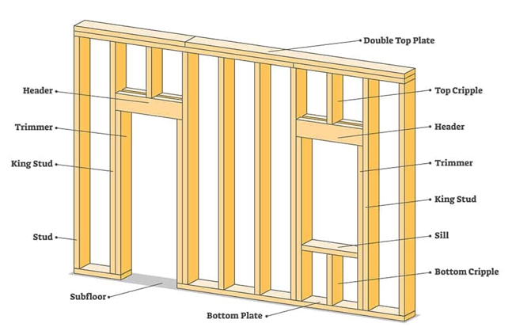
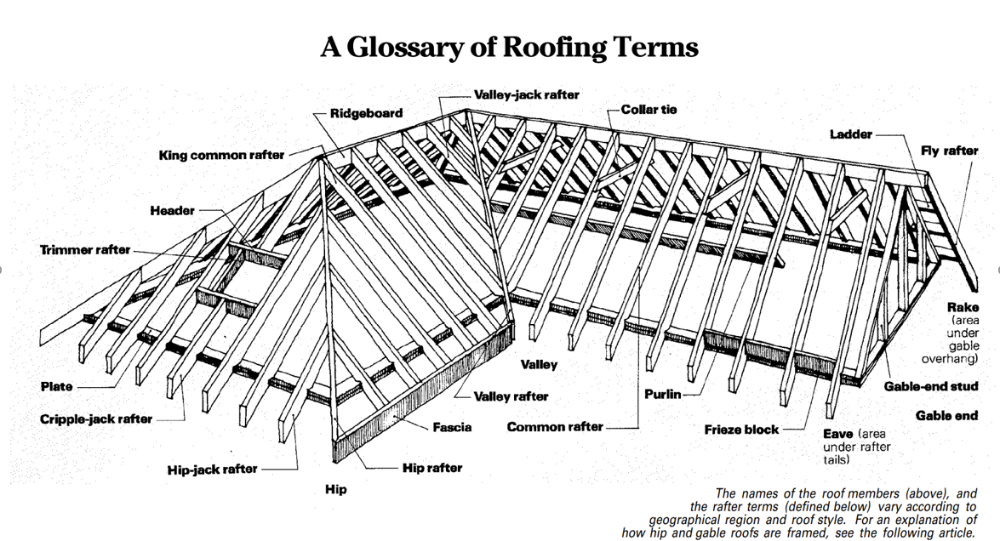
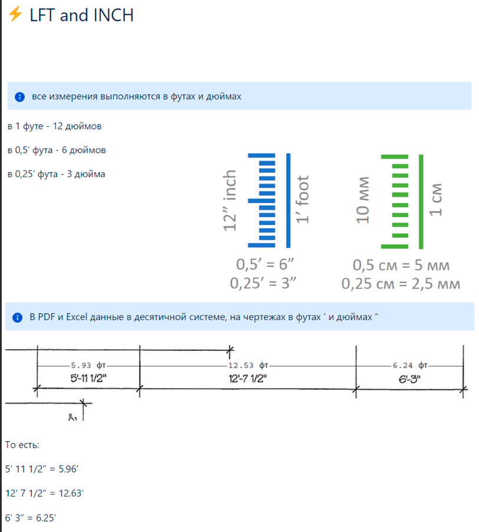
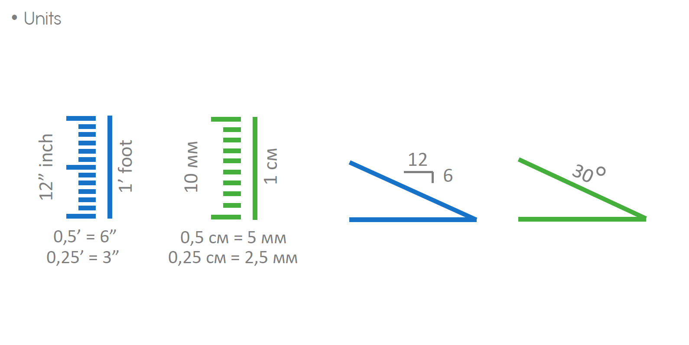
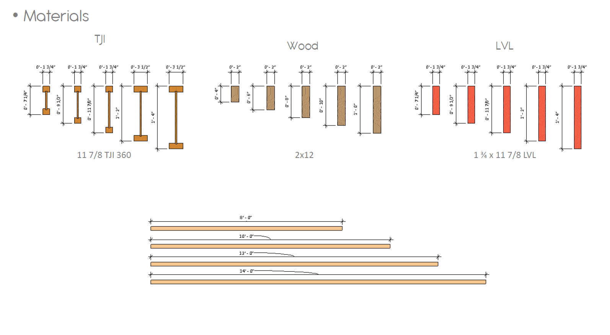

# Source Map

This wiki was built from the local Obsidian vault:

`C:\Users\User\Documents\0.Obsidian`

## Imported Work Sources

| Obsidian path | Used for |
| --- | --- |
| `E-Wood/notes.md` | Project #84/#87 mistakes and reminders |
| `E-Wood/Mistakes_my.md` | Boss feedback rules, COM/EWP mistakes |
| `E-Wood/from_twist.md` | DHU/ITS clarification, client and output rules |
| `E-Wood/---.md` | Joist factors and recurring correction notes |
| `wiki/sources/Boss Feedback - Mistakes.md` | Synthesized feedback source |
| `wiki/sources/Check list COM 2026.md` | COM checklist |
| `wiki/sources/COM Commercial Job.md` | COM workflow |
| `wiki/sources/EWP Capital Job.md` | EWP/Capital rules |
| `wiki/sources/[legacy takeoff workflow note].md` | takeoff workflow |
| `wiki/sources/[legacy takeoff structure note].md` | takeoff tree structure |
| `wiki/sources/Walls.md` | Wall component reference |
| `wiki/sources/Vertical Constructions.md` | Vertical construction overview |
| `wiki/sources/Beam - Балки.md` | Beam rules |
| `wiki/sources/Joist - Ригели.md` | Joist rules |
| `wiki/sources/Hangers - Крепления.md` | Hanger rules |
| `wiki/sources/Hangers and Ties Schedule.md` | Hanger tables |
| `raw/clippings/work - work.md` | Interior/Exterior trim placeholders and trim categories |
| `raw/clippings/--- - work.md` | Misc rules including crowns |
| Confluence `work` space pages and image attachments | [Confluence Source Map](confluence-source-map.md) and [Confluence Image Archive](confluence-image-archive.md) |
| Trello `https://trello.com/b/TyUKA0Zw/int-trims` | Full Trello API export: 44 cards, 43 attachments. See [Trello Source Map](trello-source-map.md). |
| Tilda `https://ewood.tilda.ws/` | Site menu and active work links |
| Tilda `https://ewood.tilda.ws/page22624825.html` | Walls checklist |
| Tilda `https://ewood.tilda.ws/gables` | Gables checklist |
| Trello `https://trello.com/b/wDztpnZg/изменения-очень-важно` | Full Trello API export: 75 cards, 20 attachments. See [Trello Source Map](trello-source-map.md). |

## External Web References

These are sanity-check references only. They do not replace E-Wood estimating
rules, source drawings, project specifications, or AHJ/code requirements.

| Source | Used for |
| --- | --- |
| [UL fire-rated doors guide](https://www.ul.com/thecodeauthority/knowledge/ul-fire-rated-doors-guide) | Fire-rated door assembly terminology and label/check mindset. |
| [NAAMM/HMMA hollow metal fire doors checklist](https://www.naamm.org/news/31/hollow-metal-doors-and-frames-fire-rating-checklist) | Hollow-metal fire-rated door notes: self-closing and positive latching. |
| [Steel Door Institute fire door assembly tips](https://steeldoor.org/tips-for-specifying-fire-door-assemblies/) | Steel fire door schedule/spec terminology: latching, closers, labels. |
| [American Wood Council FRTW FAQ](https://awc.org/faq/can-surface-coated-wood-products-be-approved-for-use-in-applications-where-fire-retardant-treated-wood-is-permitted/) | Difference between `F.R.` door notation and `FRTW` lumber/material scope. |
| [Helonic finish schedule guide](https://helonic.com/knowledge-base/finish-schedule-guide) | Finish schedule column sanity-check: Base / Ceiling / Remarks. |
| [Metrie measuring guide](https://www.metrie.com/how-do-i-measure) | General trim measuring sanity-check: wall-by-wall / linear run. |

## Redacted / Not Published

- Employee email, UID, salary history, and private payment tables.
- Dropbox links.
- Private ChatGPT/Twist links.
- Any credentials or server access details.

## Refresh Process

1. Search the Obsidian vault for new E-Wood work notes.
2. Extract only reusable estimating rules.
3. Add the rule to the closest topic page.
4. Update the relevant reference page.
5. Run `python -m mkdocs build --strict`.

## Trello Import

The Trello boards `int-trims` and `изменения очень важно` were imported through
the user's logged-in browser session and full Trello API export. Raw imports are
stored under:

- `imports/live-sources/trello-int-trims-full/`
- `imports/live-sources/trello-important-changes-full/`

To refresh these sections, open the boards through Playwright after login and
repeat the authenticated JSON export flow; do not publish private attachment
links, tokens, or cookies.

## Confluence Image Import

Confluence image attachments were imported through the user's logged-in browser
session. Raw originals are stored under:

`imports/live-sources/confluence-work-images/`

Public web-friendly copies and previews are stored under:

`docs/assets/images/confluence/`

The gallery page is [Confluence Image Archive](confluence-image-archive.md).
The private `salary - conditions` page is intentionally excluded.

## Tilda Import

The public Tilda site was checked from the homepage. Only `Walls` and `Gables`
were active internal work links; the other menu items were visible labels with
empty `href` values at the time of import.

<!-- confluence-gallery:start -->
## Визуальная проверка

Эти картинки уже привязаны к правилам страницы. Используй их как быстрые
checkpoint-ы перед output: сначала прочитай правило выше, потом открой нужную
карточку и проверь похожий condition на плане/schedule.

??? info "Источник картинок"
    - dictionary: [3 карт. Confluence](https://ewood.atlassian.net/wiki/spaces/work/pages/1933726/dictionary)
    - Materials: [3 карт. Confluence](https://ewood.atlassian.net/wiki/spaces/work/pages/1933821/Materials)

  <a class="kb-rule-card" href="../../assets/images/confluence/confluence-043.png" title="image-20250210-055520.png">
    
    

      
Source Map - исходные screenshots 01

      
Используй как карту источников, а не как рабочую страницу takeoff.

      
Правила из source map переносим в topic pages; private данные не публикуем.

    

  </a>
  <a class="kb-rule-card" href="../../assets/images/confluence/confluence-044.png" title="image-20250210-055504.png">
    
    

      
Source Map - исходные screenshots 02

      
Используй как карту источников, а не как рабочую страницу takeoff.

      
Правила из source map переносим в topic pages; private данные не публикуем.

    

  </a>
  <a class="kb-rule-card" href="../../assets/images/confluence/confluence-045.png" title="image-20250210-055338.png">
    
    

      
Source Map - исходные screenshots 03

      
Используй как карту источников, а не как рабочую страницу takeoff.

      
Правила из source map переносим в topic pages; private данные не публикуем.

    

  </a>
  <a class="kb-rule-card" href="../../assets/images/confluence/confluence-046.png" title="image-20250210-120404.png">
    
    

      
Source Map - исходные screenshots 04

      
Используй как карту источников, а не как рабочую страницу takeoff.

      
Правила из source map переносим в topic pages; private данные не публикуем.

    

  </a>
  <a class="kb-rule-card" href="../../assets/images/confluence/confluence-047.png" title="image-20250210-112058.png">
    
    

      
Source Map - исходные screenshots 05

      
Используй как карту источников, а не как рабочую страницу takeoff.

      
Правила из source map переносим в topic pages; private данные не публикуем.

    

  </a>
  <a class="kb-rule-card" href="../../assets/images/confluence/confluence-048.png" title="image-20250210-111922.png">
    
    

      
Source Map - исходные screenshots 06

      
Используй как карту источников, а не как рабочую страницу takeoff.

      
Правила из source map переносим в topic pages; private данные не публикуем.

    

  </a>

<!-- confluence-gallery:end -->
