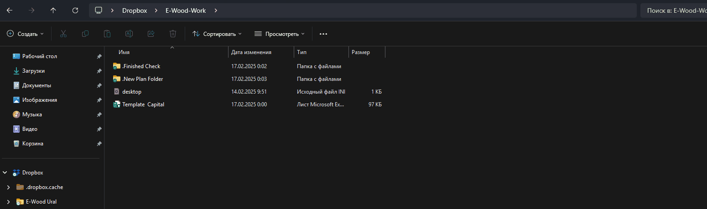
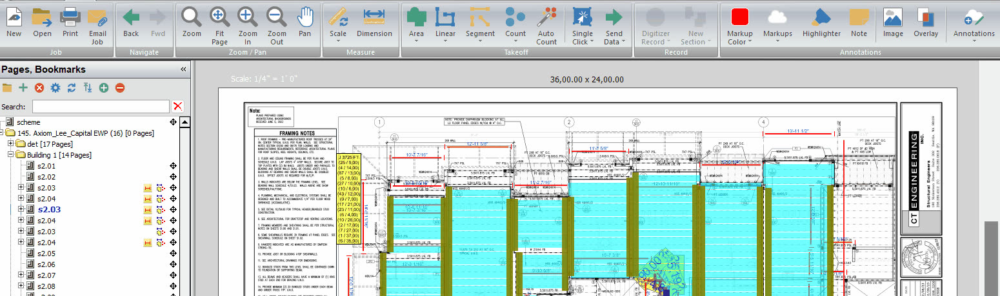
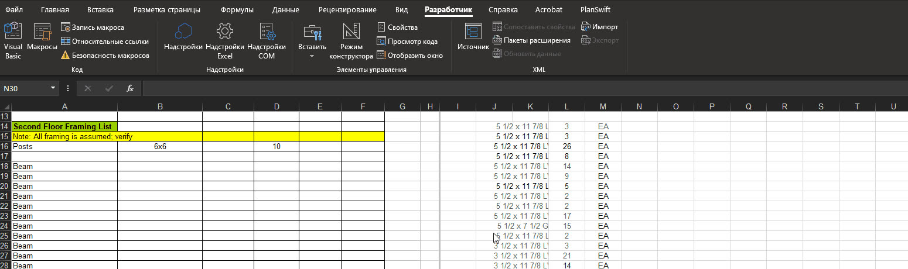
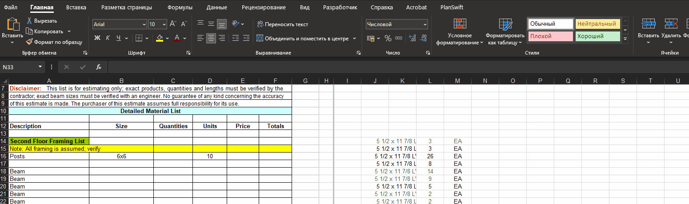
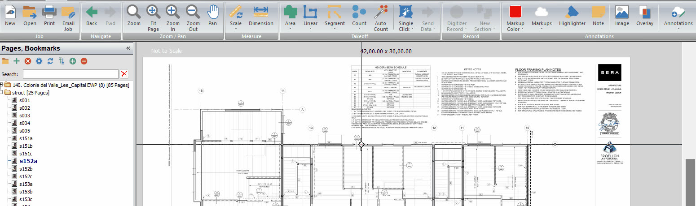
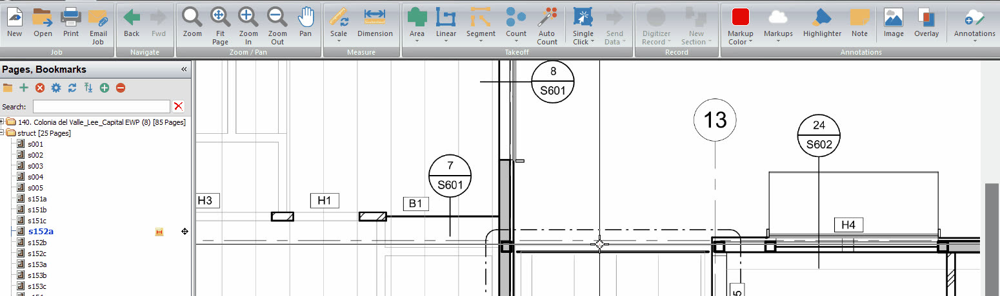
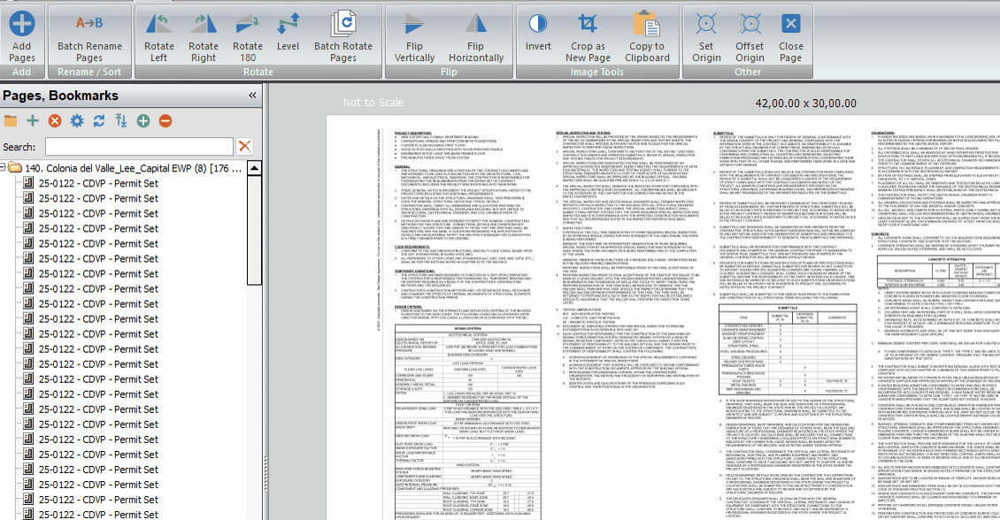

# Как пользоваться

Эта wiki должна быть быстрой рабочей памятью: открыл страницу, проверил правило,
применил в takeoff tool или Excel.

## Приоритет источников

1. Реальные drawings/specs текущего проекта.
2. Structural details и schedules.
3. Arch plans, assemblies, RCP, wall types, energy notes.
4. Client-specific rules из этой wiki.
5. [Советы и важные вещи](../reference/boss-feedback-rules.md).

Если правило из wiki конфликтует с drawings/specs, не подменяй проект. Запиши
вопрос или note в output.

## Как читать страницы

- `Старт` — процесс, структура, checklist.
- `Типы работ` — логика COM, EWP/Capital, Residential.
- `Работа` — предметные страницы по разделам takeoff.
- `Справочник` — правила, таблицы, формулы, source map.

## Как обновлять

- Добавляй новые правила в точную предметную страницу и в
  [Советы и важные вещи](../reference/boss-feedback-rules.md), если это feedback.
- Не храни приватные ссылки, emails, UIDs, salary history и credentials.
- Если правило относится к конкретному клиенту, обнови
  [Правила клиентов](client-rules.md).
- Если правило повторяется в разных местах, держи короткую версию на topic page
  и полную версию в reference page.

<!-- confluence-gallery:start -->
## Визуальная проверка

Эти картинки уже привязаны к правилам страницы. Используй их как быстрые
checkpoint-ы перед output: сначала прочитай правило выше, потом открой нужную
карточку и проверь похожий condition на плане/schedule.

??? info "Источник картинок"
    - Excel: [5 карт. Confluence](https://redacted.atlassian.net/wiki/spaces/work/pages/3276801/Excel)
    - PlanSwift: [2 карт. Confluence](https://redacted.atlassian.net/wiki/spaces/work/pages/4292609/PlanSwift)
    - PlanSwift - large GIF attachments: [1 карт. Confluence](https://redacted.atlassian.net/wiki/spaces/work/pages/4292609/PlanSwift)

  
Показать 8 иллюстраций

  

    
    
    
    
    
    
    
    
  

<!-- confluence-gallery:end -->
