# Important Changes

<figure markdown>
  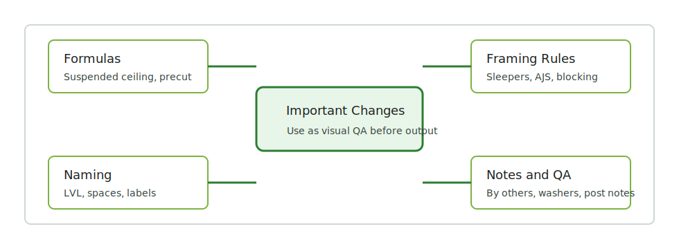
  <figcaption>Important Changes — use as a visual QA map before output.</figcaption>
</figure>

Source board:
`https://trello.com/b/wDztpnZg/изменения-очень-важно`

Imported from the logged-in browser session and full Trello API export:
**75 cards** and **20 attachments**.
This page is the visual shelf for high-priority rule changes.

## Visual Rules

| Rule / reminder | Topic | Source |
| --- | --- | --- |
| Suspended ceiling formula: `S*0.75*2 + S*0.75*1*0.75` in `LFT`. | Formula | [Trello](https://trello.com/c/G2Stf2Ap) |
| Balcony framing: 2-ply and 2 layers of sleepers. | Balcony / Deck | [Trello](https://trello.com/c/yccc3pHP) |
| For roof with `AJS Rafters`, count rafters manually instead of `Rake` when the condition is like an exposed floor overhang. | Roof / Rake | [Trello](https://trello.com/c/Bf9qwCpI) |
| `Sound insulation` only when insulation is actually required. | Insulation | [Trello](https://trello.com/c/BZTIykI8) |
| `Ribbonboard` only for trusses. | Floor / Truss | [Trello](https://trello.com/c/pUzOwM8G) |
| Count every `10'` as `blocking` for `Trusses - Bracing 2x6`. | Blocking | [Trello](https://trello.com/c/ZDDIgL2Y) |
| If a post is not specified, leave the correct visible note instead of guessing. | Post | [Trello](https://trello.com/c/CeqrmfZv) |
| Washers: do not leave the spacing unchanged; update the spacing. | Anchor / Washers | [Trello](https://trello.com/c/TFIsHlji) |
| Write `LVL` without quotation marks. | Naming | [Trello](https://trello.com/c/vhU8cDuG) |
| If `EWP by others` but one `LVL` beam is in the floor, write a note. | EWP / Notes | [Trello](https://trello.com/c/RbUsIPnE) |
| Fix extra spaces in material names. | Output QA | [Trello](https://trello.com/c/8uM9XNkM) |
| `Cantilevered` needs that label. | SQFT / Label | [Trello](https://trello.com/c/TKGVrLrE) |
| Use the `precut` formula because manual errors are common. | Formula / Precut | [Trello](https://trello.com/c/dM3K1XRD) |

## Full Gallery

  <a class="kb-gallery__item" href="../../assets/images/reference/important-change-01.png">
    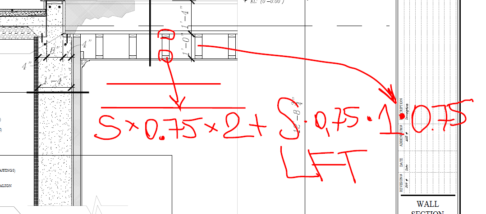
    
01. Suspended ceiling formula

  </a>
  <a class="kb-gallery__item" href="../../assets/images/reference/important-change-02.png">
    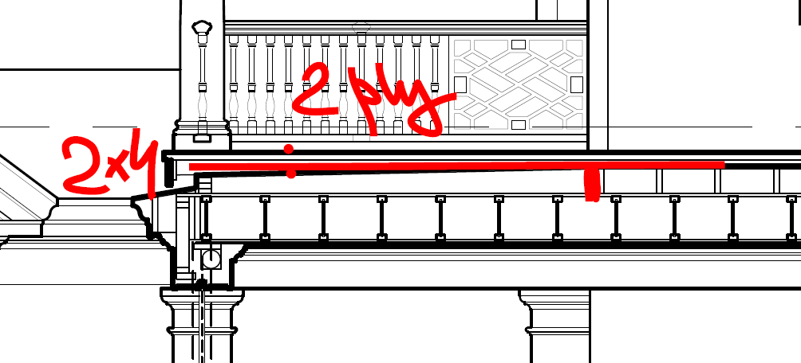
    
02. Balcony framing / sleepers

  </a>
  <a class="kb-gallery__item" href="../../assets/images/reference/important-change-03.png">
    
    
03. AJS Rafters: manual rafters

  </a>
  <a class="kb-gallery__item" href="../../assets/images/reference/important-change-04.png">
    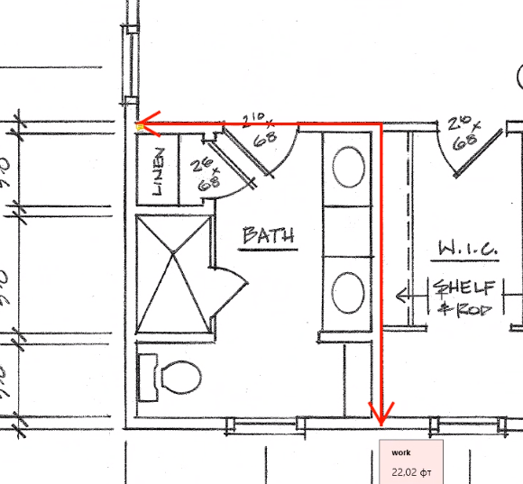
    
04. Sound insulation only when needed

  </a>
  <a class="kb-gallery__item" href="../../assets/images/reference/important-change-05.png">
    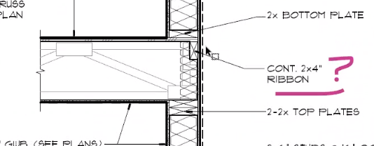
    
05. Ribbonboard only for trusses

  </a>
  <a class="kb-gallery__item" href="../../assets/images/reference/important-change-06.png">
    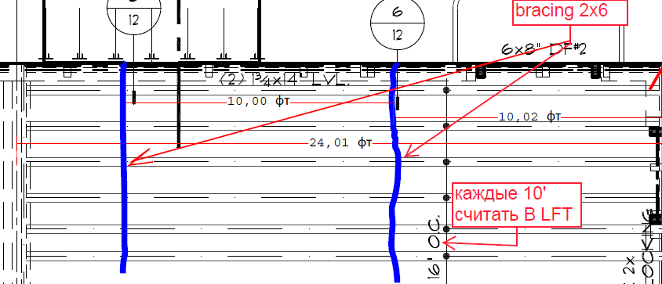
    
06. Truss bracing blocking every 10'

  </a>
  <a class="kb-gallery__item" href="../../assets/images/reference/important-change-07.png">
    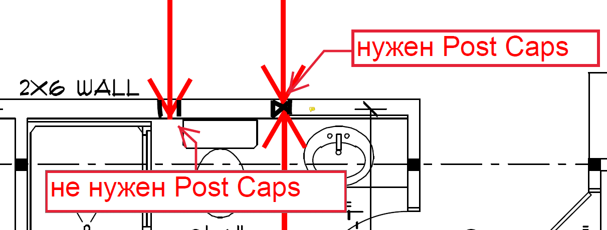
    
07. If post is not specified

  </a>
  <a class="kb-gallery__item" href="../../assets/images/reference/important-change-08.png">
    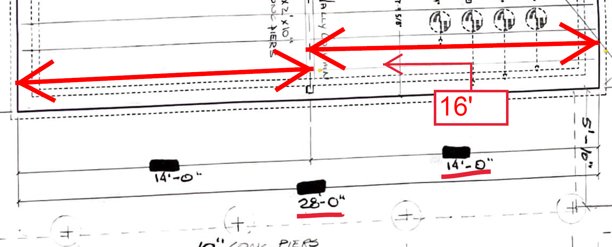
    
08. 20.10.21 screenshot

  </a>
  <a class="kb-gallery__item" href="../../assets/images/reference/important-change-09.png">
    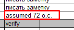
    
09. Washers: update spacing

  </a>
  <a class="kb-gallery__item" href="../../assets/images/reference/important-change-10.png">
    
    
10. Write `LVL` without quotes

  </a>
  <a class="kb-gallery__item" href="../../assets/images/reference/important-change-11.png">
    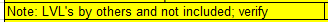
    
11. EWP by others + LVL note

  </a>
  <a class="kb-gallery__item" href="../../assets/images/reference/important-change-12.png">
    
    
12. Fix material-name spacing

  </a>
  <a class="kb-gallery__item" href="../../assets/images/reference/important-change-13.png">
    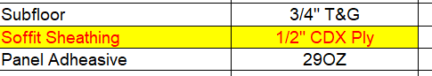
    
13. Cantilevered label

  </a>
  <a class="kb-gallery__item" href="../../assets/images/reference/important-change-14.png">
    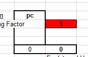
    
14. Use formula for precut

  </a>
  <a class="kb-gallery__item" href="../../assets/images/reference/important-change-15.png">
    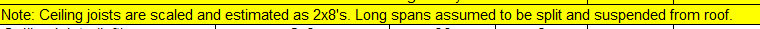
    
15. Imported image rule

  </a>
  <a class="kb-gallery__item" href="../../assets/images/reference/important-change-16.png">
    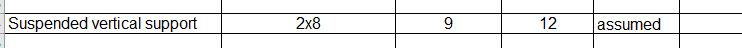
    
16. Imported image rule

  </a>
  <a class="kb-gallery__item" href="../../assets/images/reference/important-change-17.png">
    
    
17. EWP by others + LVL note (older card)

  </a>
  <a class="kb-gallery__item" href="../../assets/images/reference/important-change-18.png">
    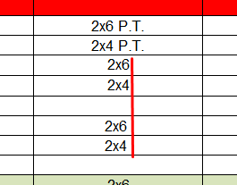
    
18. Fix material-name spacing (older card)

  </a>
  <a class="kb-gallery__item" href="../../assets/images/reference/important-change-19.png">
    
    
19. Use formula for precut (older card)

  </a>
  <a class="kb-gallery__item" href="../../assets/images/reference/important-change-20.png">
    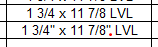
    
20. Write `LVL` without quotes (older card)

  </a>

## Raw Import

Raw markdown copies are stored in:

`imports/live-sources/trello-important-changes-full/pages/`

