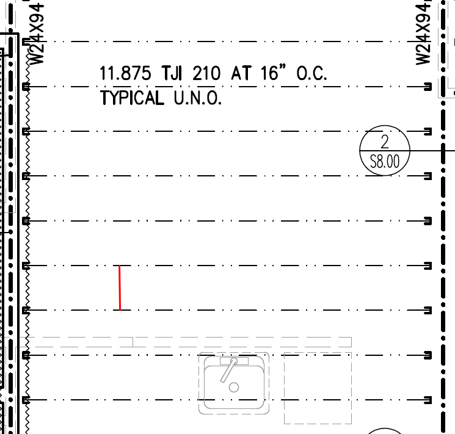
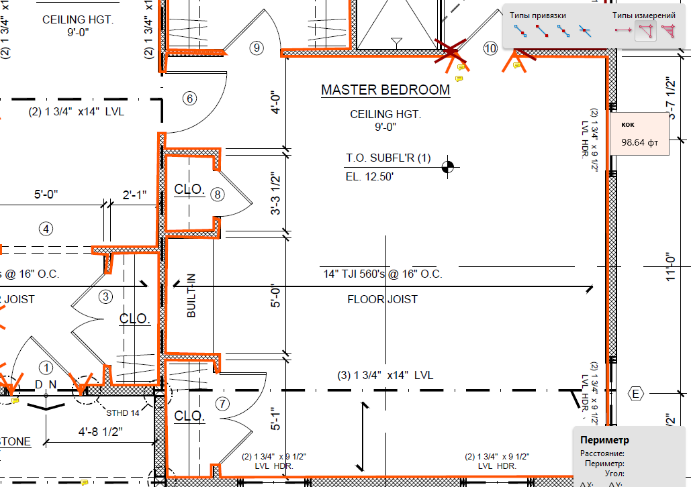

# Preview страницы

Эта страница нужна как быстрый visual check: открыть локально, посмотреть
читабельность, карточки с картинками, таблицы и связи между правилами. Она не
заменяет рабочие разделы wiki, а показывает, как должна выглядеть хорошая
topic page.

## Быстрый маршрут

-   :material-floor-plan:{ .lg .middle } **Joist**

    ---

    Product family, spacing, hangers и EWP naming должны быть видны рядом с
    картинками, а не спрятаны в длинном тексте.

    [:octicons-arrow-right-24: Открыть Joist](../work/horizontal/floor-framing/joist.md)

-   :material-format-paint:{ .lg .middle } **Interior Trims**

    ---

    Base, Crown, Casing и Door/Window Trim лучше проверять по rule cards:
    картинка + правило + что делать в takeoff.

    [:octicons-arrow-right-24: Открыть Interior Trims](../work/interior-trims/overview.md)

-   :material-wall:{ .lg .middle } **Exterior Wall**

    ---

    Wall height, bottom plate, shear/draft-stop notes и material variants
    должны читаться как чек-лист.

    [:octicons-arrow-right-24: Открыть Exterior](../work/vertical/walls/exterior.md)

-   :material-clipboard-check-outline:{ .lg .middle } **QA**

    ---

    Перед output проверь scope, drawings, formulas, waste, FRT, hangers и
    client-specific rules.

    [:octicons-arrow-right-24: Открыть QA checklist](quality-checklist.md)

## Как должна читаться topic page

| Блок | Что в нём должно быть | Для чего |
| --- | --- | --- |
| `Что считать` | Конкретные элементы takeoff | Чтобы не спорить, входит ли item в scope |
| `Правила` | Короткие estimating rules | Чтобы быстро применять правило в PlanSwift/Excel |
| `Где смотреть` | Plan, schedule, notes, details | Чтобы estimator не искал источник наугад |
| `Визуальная проверка` | Картинка + правило + action note | Чтобы картинка не была отдельной галереей без смысла |
| `Проверить` | Финальный QA list | Чтобы поймать ошибки перед output |

!!! note "Главное правило"
    Картинка должна быть связана с действием: что проверить на drawings и как
    это меняет takeoff/output.

## Быстрые клавиши

| Где | Клавиши | Что делает |
| --- | --- | --- |
| Wiki search | ++ctrl+k++ / ++cmd+k++ | Быстро найти правило по русскому или английскому term. |
| Command Palette | ++ctrl+shift+p++ | Найти command в программе без охоты по меню. |
| Save | ++ctrl+s++ | Сохранить job state. |
| Open Job Picker | ++ctrl+shift+o++ | Открыть recent/pinned jobs и browse/create. |
| PDF Snap | ++ctrl+f3++ | Включить snap к vector PDF/overlay geometry. |
| Copy / Paste | ++ctrl+c++ / ++ctrl+v++ | Скопировать и вставить выбранные measurements. |
| Multi-select | `Ctrl+Click` | Добавить или убрать отдельный measurement из selection. |

!!! tip "Где полная таблица"
    Полные hotkeys и command map держать в
    [Программа](ourplanecore.md#command-palette-hotkeys), а на topic pages
    показывать только те shortcut-ы, которые реально помогают в этом workflow.

## Визуальная проверка

  <a class="kb-rule-card" href="../assets/images/confluence/confluence-007.png">
    
    

      
Joist product family

      
Сохраняй точную series: <code>TJI 230</code>, <code>RED</code>, <code>LPI</code>, <code>BCI</code>.

      
В output должно быть видно, какой product family был указан в schedule.

    

  </a>
  <a class="kb-rule-card" href="../assets/images/confluence/confluence-075.png">
    
    

      
O.C. spacing

      
Spacing считается center-to-center, не от края lumber.

      
Перед formula проверь, что plan реально показывает 12 / 16 / 19.2 / 24 o.c.

    

  </a>
  <a class="kb-rule-card" href="../assets/images/trims/int-trims-02.png">
    
    

      
Interior Trim perimeter

      
Base и Crown считаются по room perimeter, но исключения надо проверять отдельно.

      
Kitchen cabinets, closets, garage и room schedule могут менять count.

    

  </a>
  <a class="kb-rule-card" href="../assets/images/reference/important-change-04.png">
    
    

      
Feedback rules

      
Правки от boss должны попадать в точную topic page и в reference, если это общий rule.

      
Так правило потом находится через search и не теряется в source map.

    

  </a>

## Мини-чеклист перед сдачей

- [ ] Rule написан коротко и применимо.
- [ ] Technical terms оставлены на английском: `Joist`, `Rim Board`, `FRT`,
  `Sheathing`, `Hangers`.
- [ ] Объяснения на русском.
- [ ] У картинки есть action note: что проверить и что сделать.
- [ ] Есть ссылка на смежные страницы.
- [ ] Нет private data: emails, UID, salary, credentials, private links.

## See also

- [Как пользоваться](how-to-use.md)
- [Картинки и схемы](images-and-schemas.md)
- [Советы и важные вещи](../reference/boss-feedback-rules.md)
- [Общая source map](../reference/source-map.md)
