# Структура takeoff

Source: `https://redacted.atlassian.net/wiki/spaces/work/pages/65961989/Deck+Porch+Balcony+-`

Эта структура повторяет рабочий порядок COM takeoff.

## Vertical Constructions

- Walls:
  - Sill Plates
  - Unit
  - Exterior
  - Corridor
  - Demising
  - Gable
  - Parapet
  - Shaft
  - Furring
  - Corners
- Openings:
  - Windows and Doors
  - Headers
- Sheathing:
  - Wall Sheathing
  - Floor
  - Gable
  - Box Sheathing
  - Truss Heel
  - Shear Wall

## SQFT

- Basement
- 1st-5th Floors
- Loft
- Roof
- Deck
- Porch
- Balcony
- Cantilevered

## Sheathing and Misc

- Eve
- Rake
- Returns
- Roof Types
- Ridge / Valley / Hip
- Flashing

## Horizontal Constructions

- Floor Framing:
  - Post
  - Beam
  - Joist
  - Stair
  - Subfloor
  - Details: Rim, Ribbon, Blocking, Bracing, Bolts, Screws, Steel Beam Web Fillers
- Roof Framing:
  - Ridge
  - Header
  - Hip
  - Valley
  - Dormer
  - Overframes
  - Dbl/Trpl Rafters
  - Canopy
  - Roof Sheathing

## Deck / Porch / Balcony

- Railing
- Balcony Trims
- Anchor Bolts

## Interior Finishes

- Interior Trims
- Base
- Casing
- Crown
- Door and Window Trim
- Room Schedule

## Заметки по naming

- Floors держи отдельно, даже когда identical.
- Если floor identical, добавь note вроде `4th floor frame is identical to 3rd floor`,
  но materials всё равно list separately.
- Panelized wall jobs требуют других counting rules; см. [COM Commercial](../work-types/com.md).
- Interior trims отделяй от exterior trims и gypsum.
- Старый Tilda source имел много menu items как labels без active links. Сейчас
  подтверждённые active work pages: Walls и Gables.

## Vertical Constructions — что входит

Вертикалка ≈ **50% здания**, важно ничего не пропустить:

- Несущие и ненесущие стены: `Ext`, `Unit`, `Corr`, `Demising` walls.
- Фронтоны — `Gables`.
- Наружная и внутренняя обшивка: `Plywood`, `OSB`, siding, gypsum.
- Обшивка торцов перекрытия — `Floor Height`.
- Обшивка торцов перекрытия — `Eve Heel` / `Truss Heel`.
- Ветроизоляция — `Tyvek`.
- Утеплитель — `Insulation`.

## Структура файла в PlanSwift

В PlanSwift сначала идут общие layers (без счёта), потом — группы по этажам и
типам. Общая идея — каждая ячейка `xxx` — это место для своей цифры.

### Background layers (не считаются)

- `wall type`, `beam schedule`, `shear wall schedule`
- `details struct`, `details arch`
- `rcp`, `sections`, `others`

### Группы (порядок в файле)

- **walls + gables**: `units`, `base`, `1st`, `2nd`, `3rd`, `4th`, `roof`, `parapet`, `el gables` (×2), `wall materials (insulation etc.)`.
- **sqfts + balconies + porch**: `1st`, `2nd`, `3rd`, `4th`.
- **roof - eve rakes**: `roof`.
- **framing + headers**: `base`, `1st`, `2nd`, `3rd`.
- **balconies / porches**: `balconies`, `porches`.
- **shear walls / holdowns / ties**: `shear walls`, `shear`, `holddowns`.
- **siding / trims**: `siding` (×2), `trims` (×2).
- **interior trims**, **drywall**.

## Floor Abbreviations

| Сокращение | Что |
| --- | --- |
| `f` | foundation — фундамент |
| `1st` | first floor |
| `2nd` | second floor |
| `3rd` | third floor |
| `5th–8th` | fifth to eighth floors |
| `el` | elevation — фасад |
| `sec` | section — разрез |
| `sec d` | section details |
| `rcp` | reflected ceiling plan |
| `wt` | wall type |
| `u` | units |
| `ext` | exterior |
| `int` | interior |
| `dem` | demising |
| `cor` | corridor |
| `str` | stair |

## SQFT-сокращения в PlanSwift

`deck`, `blcny`, `porch`, `cant`, `base`, `1st`, `2nd`, `3rd`, `4th`, `flat`,
`rf x`, `rf mtl x`, `overframe x`, `gable truss`, `gable stick`.

## Details — короткие коды

| Код | Что |
| --- | --- |
| `r` | rim board |
| `rr` | rim board × 2 |
| `l` | ledger |
| `ll` | ledger × 2 |
| `b` | blocking |
| `bи` | blocking × 2 |
| `b48` | blocking 48" o.c. |
| `bb48` | blocking 48" o.c. × 2 |
| `rb` | ribbon board |
| `bd` | blocking for drywall |
| `bft` | bracing for trusses |
| `h16` | hangers 16" o.c. |
| `hh16` | hangers 16" o.c. × 2 |

## Material Override Legend

В конце выделения добавляется override для конкретного материала. Формат:

| Код | Что записать |
| --- | --- |
| `r` | `1 3/4 x 11 7/8 LVL` |
| `r 1` | `1 3/4 x 18 LVL` |
| `b` | `11 7/8 TJI 230` |
| `b48` | `2x10` |
| `h16` | `ITS2.56/9.5` |
| `l` | `2x12 P.T.` |
| `l 1` | `2x10` |

<!-- confluence-gallery:start -->
## Визуальная проверка

Эти картинки уже привязаны к правилам страницы. Используй их как быстрые
checkpoint-ы перед output: сначала прочитай правило выше, потом открой нужную
карточку и проверь похожий condition на плане/schedule.

??? info "Источник картинок"
    - Roof Framing - конструкции крыши: [2 карт. Confluence](https://redacted.atlassian.net/wiki/spaces/work/pages/65962048/Roof+Framing+-)
    - Vertical Constructions: [10 карт. Confluence](https://redacted.atlassian.net/wiki/spaces/work/pages/65110035/Vertical+Constructions)
    - Walls: [3 карт. Confluence](https://redacted.atlassian.net/wiki/spaces/work/pages/65175555/Walls)
    - work: [9 карт. Confluence](https://redacted.atlassian.net/wiki/spaces/work/overview)
    - work - large GIF attachments: [2 карт. Confluence](https://redacted.atlassian.net/wiki/spaces/work/overview)

  <a class="kb-rule-card" href="../../assets/images/confluence/confluence-032.jpg" title="3.gif">
    
    

      
PlanSwift structure - визуальная проверка 01

      
Сверь folders, naming и vertical/horizontal split перед output.

      
Картинки нужны как контроль структуры, чтобы не смешать work types.

    

  </a>
  <a class="kb-rule-card" href="../../assets/images/confluence/confluence-033.jpg" title="1.gif">
    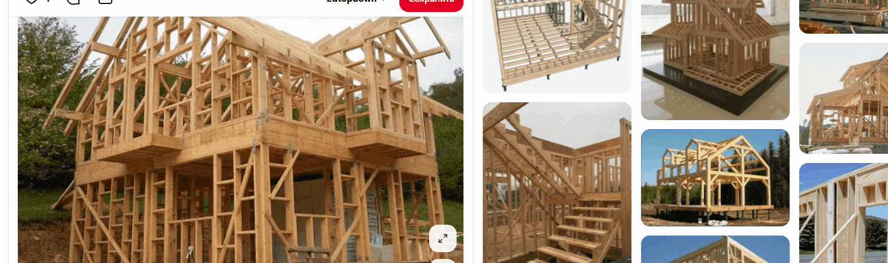
    

      
PlanSwift structure - визуальная проверка 02

      
Сверь folders, naming и vertical/horizontal split перед output.

      
Картинки нужны как контроль структуры, чтобы не смешать work types.

    

  </a>
  <a class="kb-rule-card" href="../../assets/images/confluence/confluence-034.png" title="image-20251103-183255.png">
    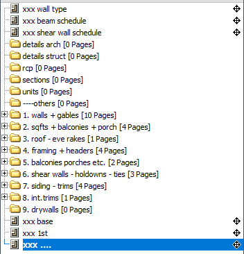
    

      
PlanSwift structure - визуальная проверка 03

      
Сверь folders, naming и vertical/horizontal split перед output.

      
Картинки нужны как контроль структуры, чтобы не смешать work types.

    

  </a>
  <a class="kb-rule-card" href="../../assets/images/confluence/confluence-035.jpg" title="struct.jpg">
    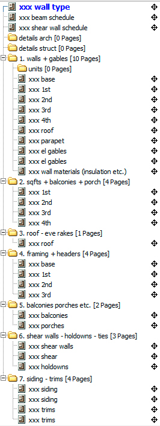
    

      
PlanSwift structure - визуальная проверка 04

      
Сверь folders, naming и vertical/horizontal split перед output.

      
Картинки нужны как контроль структуры, чтобы не смешать work types.

    

  </a>
  <a class="kb-rule-card" href="../../assets/images/confluence/confluence-036.png" title="image-20250619-200240.png">
    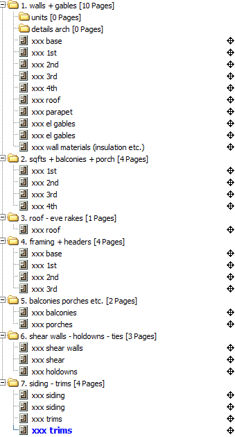
    

      
PlanSwift structure - визуальная проверка 05

      
Сверь folders, naming и vertical/horizontal split перед output.

      
Картинки нужны как контроль структуры, чтобы не смешать work types.

    

  </a>
  <a class="kb-rule-card" href="../../assets/images/confluence/confluence-037.png" title="image-20250619-200019.png">
    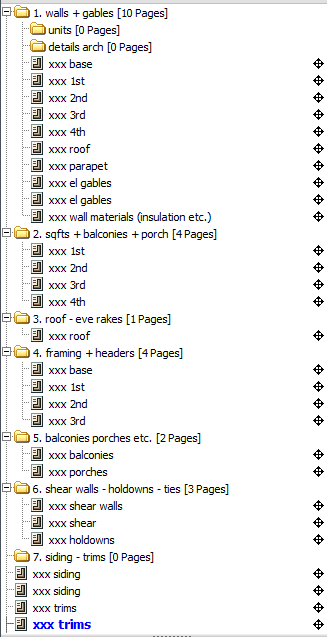
    

      
PlanSwift structure - визуальная проверка 06

      
Сверь folders, naming и vertical/horizontal split перед output.

      
Картинки нужны как контроль структуры, чтобы не смешать work types.

    

  </a>
  <a class="kb-rule-card" href="../../assets/images/confluence/confluence-038.png" title="image-20250524-215800.png">
    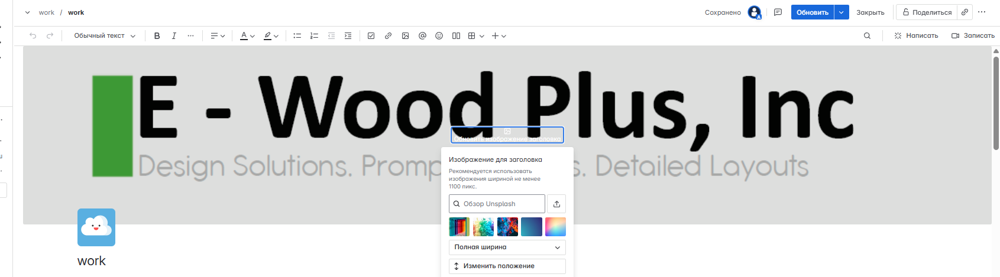
    

      
PlanSwift structure - визуальная проверка 07

      
Сверь folders, naming и vertical/horizontal split перед output.

      
Картинки нужны как контроль структуры, чтобы не смешать work types.

    

  </a>
  <a class="kb-rule-card" href="../../assets/images/confluence/confluence-039.png" title="Без-имени-2.png">
    
    

      
PlanSwift structure - визуальная проверка 08

      
Сверь folders, naming и vertical/horizontal split перед output.

      
Картинки нужны как контроль структуры, чтобы не смешать work types.

    

  </a>
  <a class="kb-rule-card" href="../../assets/images/confluence/confluence-040.png" title="c27beda1-ce6d-4252-98d2-63be7f261548.png">
    
    

      
PlanSwift structure - визуальная проверка 09

      
Сверь folders, naming и vertical/horizontal split перед output.

      
Картинки нужны как контроль структуры, чтобы не смешать work types.

    

  </a>
  <a class="kb-rule-card" href="../../assets/images/confluence/confluence-041.png" title="e8eea12d-25c0-4ac0-99ca-8bd8764ab780.png">
    
    

      
PlanSwift structure - визуальная проверка 10

      
Сверь folders, naming и vertical/horizontal split перед output.

      
Картинки нужны как контроль структуры, чтобы не смешать work types.

    

  </a>
  <a class="kb-rule-card" href="../../assets/images/confluence/confluence-042.png" title="image-20250210-113643.png">
    
    

      
PlanSwift structure - визуальная проверка 11

      
Сверь folders, naming и vertical/horizontal split перед output.

      
Картинки нужны как контроль структуры, чтобы не смешать work types.

    

  </a>
  <a class="kb-rule-card" href="../../assets/images/confluence/confluence-096.png" title="image-20250625-035545.png">
    
    

      
PlanSwift structure - визуальная проверка 12

      
Сверь folders, naming и vertical/horizontal split перед output.

      
Картинки нужны как контроль структуры, чтобы не смешать work types.

    

  </a>
  <a class="kb-rule-card" href="../../assets/images/confluence/confluence-097.png" title="image-20250625-035410.png">
    
    

      
PlanSwift structure - визуальная проверка 13

      
Сверь folders, naming и vertical/horizontal split перед output.

      
Картинки нужны как контроль структуры, чтобы не смешать work types.

    

  </a>
  <a class="kb-rule-card" href="../../assets/images/confluence/confluence-098.png" title="image-20250625-035202.png">
    
    

      
PlanSwift structure - визуальная проверка 14

      
Сверь folders, naming и vertical/horizontal split перед output.

      
Картинки нужны как контроль структуры, чтобы не смешать work types.

    

  </a>
  <a class="kb-rule-card" href="../../assets/images/confluence/confluence-099.png" title="image-20250625-034853.png">
    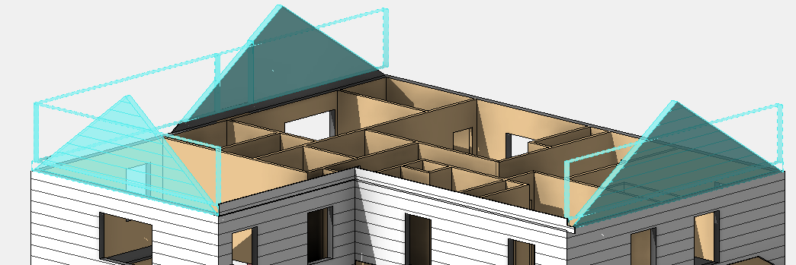
    

      
PlanSwift structure - визуальная проверка 15

      
Сверь folders, naming и vertical/horizontal split перед output.

      
Картинки нужны как контроль структуры, чтобы не смешать work types.

    

  </a>
  <a class="kb-rule-card" href="../../assets/images/confluence/confluence-100.png" title="image-20250625-034719.png">
    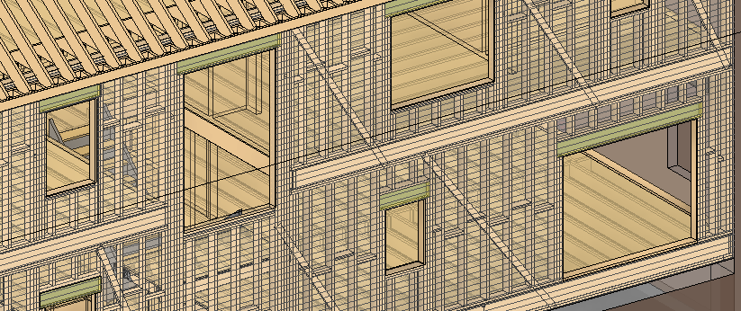
    

      
PlanSwift structure - визуальная проверка 16

      
Сверь folders, naming и vertical/horizontal split перед output.

      
Картинки нужны как контроль структуры, чтобы не смешать work types.

    

  </a>
  <a class="kb-rule-card" href="../../assets/images/confluence/confluence-101.png" title="image-20250625-034639.png">
    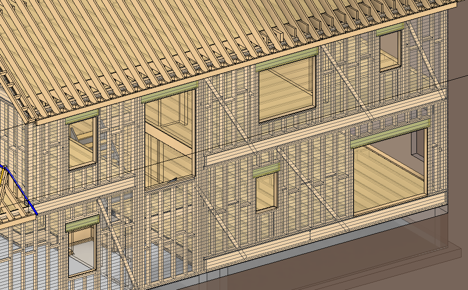
    

      
PlanSwift structure - визуальная проверка 17

      
Сверь folders, naming и vertical/horizontal split перед output.

      
Картинки нужны как контроль структуры, чтобы не смешать work types.

    

  </a>
  <a class="kb-rule-card" href="../../assets/images/confluence/confluence-102.png" title="image-20250625-034357.png">
    
    

      
PlanSwift structure - визуальная проверка 18

      
Сверь folders, naming и vertical/horizontal split перед output.

      
Картинки нужны как контроль структуры, чтобы не смешать work types.

    

  </a>
  <a class="kb-rule-card" href="../../assets/images/confluence/confluence-103.png" title="image-20250625-034132.png">
    
    

      
PlanSwift structure - визуальная проверка 19

      
Сверь folders, naming и vertical/horizontal split перед output.

      
Картинки нужны как контроль структуры, чтобы не смешать work types.

    

  </a>
  <a class="kb-rule-card" href="../../assets/images/confluence/confluence-104.png" title="image-20250625-033747.png">
    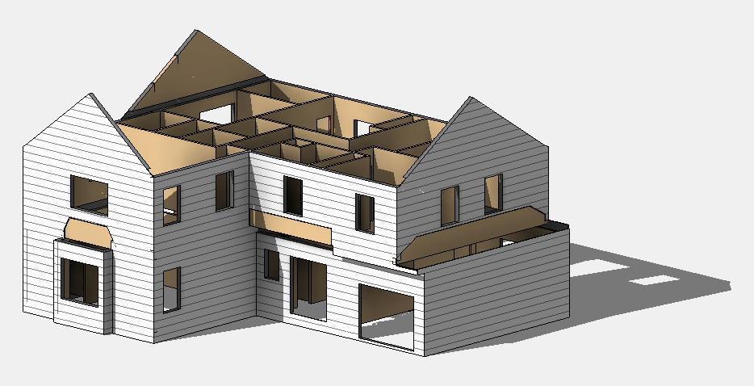
    

      
PlanSwift structure - визуальная проверка 20

      
Сверь folders, naming и vertical/horizontal split перед output.

      
Картинки нужны как контроль структуры, чтобы не смешать work types.

    

  </a>
  <a class="kb-rule-card" href="../../assets/images/confluence/confluence-105.png" title="image-20250625-033553.png">
    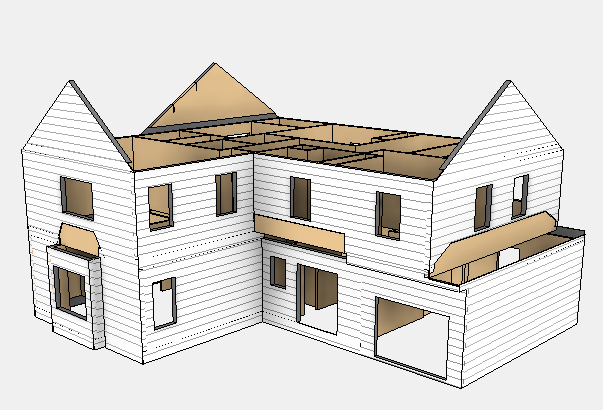
    

      
PlanSwift structure - визуальная проверка 21

      
Сверь folders, naming и vertical/horizontal split перед output.

      
Картинки нужны как контроль структуры, чтобы не смешать work types.

    

  </a>
  <a class="kb-rule-card" href="../../assets/images/confluence/confluence-106.png" title="image-20250625-041034.png">
    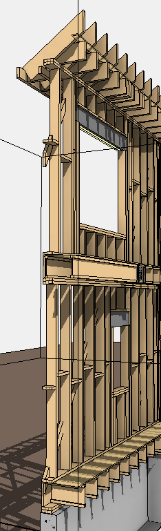
    

      
PlanSwift structure - визуальная проверка 22

      
Сверь folders, naming и vertical/horizontal split перед output.

      
Картинки нужны как контроль структуры, чтобы не смешать work types.

    

  </a>
  <a class="kb-rule-card" href="../../assets/images/confluence/confluence-107.png" title="image-20250625-035805.png">
    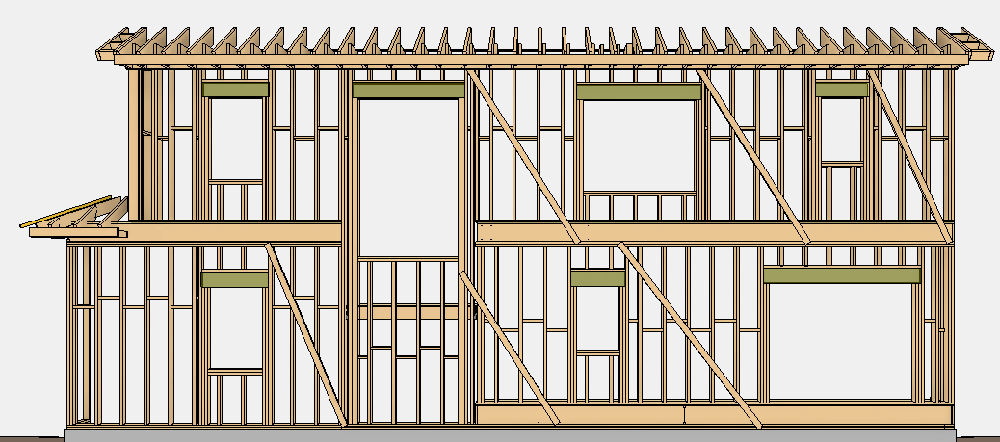
    

      
PlanSwift structure - визуальная проверка 23

      
Сверь folders, naming и vertical/horizontal split перед output.

      
Картинки нужны как контроль структуры, чтобы не смешать work types.

    

  </a>
  <a class="kb-rule-card" href="../../assets/images/confluence/confluence-108.png" title="image-20250625-035800.png">
    
    

      
PlanSwift structure - визуальная проверка 24

      
Сверь folders, naming и vertical/horizontal split перед output.

      
Картинки нужны как контроль структуры, чтобы не смешать work types.

    

  </a>
  <a class="kb-rule-card" href="../../assets/images/confluence/confluence-135.png" title="image-20250603-180752.png">
    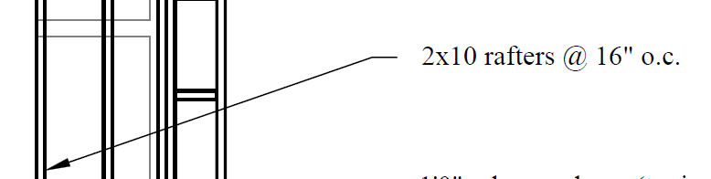
    

      
PlanSwift structure - визуальная проверка 25

      
Сверь folders, naming и vertical/horizontal split перед output.

      
Картинки нужны как контроль структуры, чтобы не смешать work types.

    

  </a>
  <a class="kb-rule-card" href="../../assets/images/confluence/confluence-136.png" title="image-20250603-180924.png">
    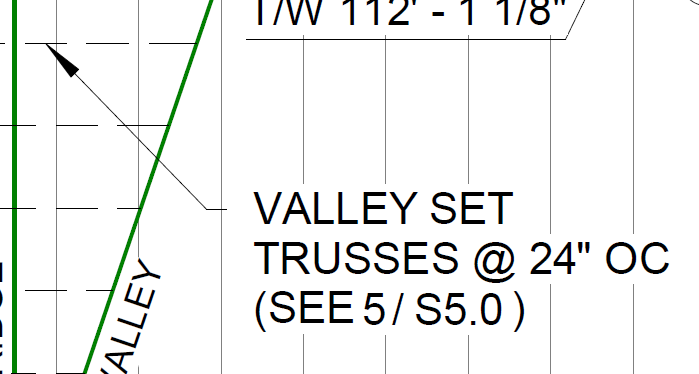
    

      
PlanSwift structure - визуальная проверка 26

      
Сверь folders, naming и vertical/horizontal split перед output.

      
Картинки нужны как контроль структуры, чтобы не смешать work types.

    

  </a>

<!-- confluence-gallery:end -->
