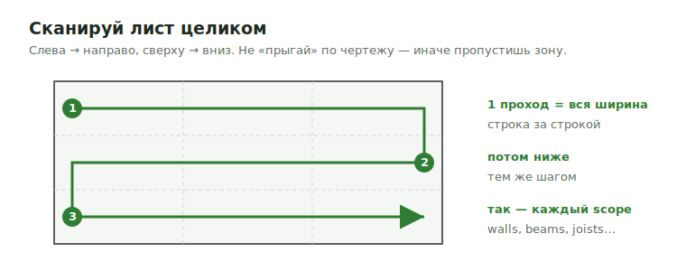
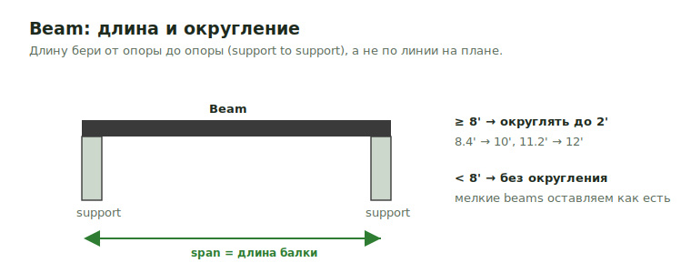

# Workflow

Полный порядок работы над takeoff — от импорта PDF до отправки. Это общий
маршрут; детали по каждому scope лежат на предметных страницах раздела
[Работа](../work-types/com.md), а формулы и waste — в
[Справочнике](../reference/formulas.md).

!!! tip "Золотое правило"
    Не «прыгай» по чертежу. Бери **один scope** (например, exterior walls) и
    **сканируй весь лист слева направо, сверху вниз**, прежде чем переходить к
    следующему. Так не теряются углы, тупиковые зоны и мелкие элементы.

---

## 0. Главный принцип — сканируй лист целиком

Чертёж читается как страница книги: **слева → направо, сверху → вниз**, строка
за строкой. Один проход = одна горизонтальная полоса по всей ширине листа; затем
спускаешься ниже тем же шагом. И так — для **каждого** scope отдельно.

<figure markdown>
  
  <figcaption>Сканируй лист как текст: 1) полоса по всей ширине → 2) ниже → 3) ещё ниже. Один scope за проход.</figcaption>
</figure>

- **Один scope за раз.** Сначала размечаешь все exterior walls по всему листу,
  потом возвращаешься наверх и идёшь по corridor, затем demising и т.д.
- **Не пропускай зоны.** Мелкие куски стен у лестниц, шахт, входов — их легко
  «перепрыгнуть», если двигаться хаотично.
- **Помечай сомнительное note сразу.** Лучше лишняя заметка, чем забытая деталь
  на этапе Excel output.

---

## 1. Подготовить PDF

1. **Импортировать PDF** в takeoff-инструмент.
2. **Переименовать листы** и разложить по структуре (см.
   [Takeoff structure](takeoff-structure.md)).
3. **Установить scale** и обязательно **проверить** его по известному размеру на
   чертеже (door 3'-0", grid spacing). Неверный scale ломает все количества.
4. **Просмотреть Arch + Structural + specs** до массовой разметки — чтобы знать
   wall types, fire rating, sheathing notes, holdowns.
5. **Отметить сомнительные места** notes, чтобы не забыть при Excel output.

!!! warning "Scale — в первую очередь"
    Если scale не выставлен/не проверен, не начинай разметку. Ошибка в scale
    умножается на весь job.

---

## 2. Порядок разметки takeoff

Базовый порядок для COM (сверху вниз по конструкции). Каждый шаг — сканируй лист
целиком, прежде чем перейти к следующему.

1. **Vertical Constructions** — стены:
   [Exterior](../work/vertical/walls/exterior.md) ·
   [Corridor](../work/vertical/walls/corridor.md) ·
   [Demising](../work/vertical/walls/demising.md) ·
   [Unit / Interior](../work/vertical/walls/unit.md) ·
   [Basement](../work/vertical/walls/basement.md).
2. **Openings** — [Windows & Doors](../work/vertical/openings/windows-doors.md),
   [Headers](../work/vertical/openings/headers.md).
3. **Sheathing** — [Wall Sheathing](../work/vertical/sheathing/wall-sheathing.md),
   [Box Sheathing](../work/vertical/sheathing/box-sheathing.md),
   [Shear Wall](../work/vertical/sheathing/shear-wall.md).
4. **SQFT** — площади по уровням:
   [1st–5th Floors](../work/sqfts/1st2nd.md),
   [Basement](../work/sqfts/basement.md),
   [Roof](../work/sqfts/roof.md) и др.
5. **Floor Framing** —
   [Post](../work/horizontal/floor-framing/post.md) →
   [Beam](../work/horizontal/floor-framing/beam.md) →
   [Joist](../work/horizontal/floor-framing/joist.md) →
   [Details](../work/horizontal/floor-framing/details/rim.md).
6. **Roof Framing** —
   [Ridge / Hip / Valley](../work/horizontal/roof-framing/ridge.md),
   [Rafters](../work/horizontal/roof-framing/dbl-trpl-rafters.md),
   [Roof Sheathing](../work/horizontal/roof-framing/roof-sheathing.md).
7. **Sheathing & Misc** —
   [Eave / Rake / Returns](../work/sheathing-and-misc/eve.md),
   [Flashing](../work/sheathing-and-misc/flashing.md).
8. **Deck / Porch / Balcony** —
   [Frame](../work/deck/deck-porch-balcony-frame.md).
9. **Ties / Connectors** — [Hangers](../reference/hangers.md),
   [Hardware catalog](../reference/hardware-catalog.md).

---

## 3. Правила разметки

### Beams — top-down / left-right

Балки размечай **в одном направлении** (top-down и left-right) и держи его весь
run. Это главное правило: если менять направление по ходу, длины и точки
опирания начинают «съезжать».

<figure markdown>
  
  <figcaption>Balки — сверху вниз, слева направо, одним направлением. Длина — от опоры до опоры; ≥ 8' округлять до 2'.</figcaption>
</figure>

- **Направление одно** — top-down / left-right, не переключаться внутри run.
- **Длина** зависит от **точки опирания** (support to support), а не от линии на
  плане.
- Beams **8' и длиннее** — округлять до ближайших **2'** (8.4' → 10', 11.2' → 12').
- Beams **меньше 8'** — оставлять без округления.
- Подробно про продукт и опоры — [Beam](../work/horizontal/floor-framing/beam.md),
  опоры — [Post](../work/horizontal/floor-framing/post.md).

### Joists

- Внутри одного run продолжай **одним spacing** — top-down или left-right,
  не меняя направление.
- **Не начинай spacing заново** от внутренней балки — run считается сквозным.
- Удаляй joist, только если он попадает **прямо на beam** (примерно в пределах
  **2"**).
- Spacing-факторы (studs vs joists — разные таблицы!) —
  [Формулы → Spacing factors](../reference/formulas.md).
- Детали: [Joist](../work/horizontal/floor-framing/joist.md),
  [Rim](../work/horizontal/floor-framing/details/rim.md),
  [Blocking](../work/horizontal/floor-framing/details/blocking.md).

---

## 4. Export в Excel

- **Экспортировать** takeoff quantities.
- **Перенести в template** и разнести категории: Beams, Joists, Details, Walls,
  Sheathing, SQFT.
- **Проверять новые формулы сразу**, на первой строке, а не после полного job.
- **Не применять `1.1` повторно**, если формула уже ссылается на данные с waste
  (двойной waste — частая ошибка, см. [Формулы](../reference/formulas.md)).

---

## 5. Перед отправкой

- Пройти полный [QA checklist](quality-checklist.md).
- Для больших COM jobs — делать **PDF sketch / markups**, если есть риск забыть
  детали (см. [Картинки и схемы](images-and-schemas.md)).
- Сверить спорные места с [Советами и важными вещами](../reference/boss-feedback-rules.md)
  и [Client Rules](client-rules.md).

## See also

- [How to use](how-to-use.md) · [Takeoff structure](takeoff-structure.md)
- [Quality checklist](quality-checklist.md) · [Формулы](../reference/formulas.md)
