# COM Commercial

Commercial jobs — это большие проекты: multifamily, office, hotel, mixed-use
buildings.

## Порядок COM

1. Exterior walls.
2. Corridor walls.
3. Demising walls.
4. Unit / interior walls.
5. Openings.
6. Sheathing.
7. SQFT.
8. Floor framing.
9. Roof framing.
10. Deck / porch / balcony / misc.

## Два типа COM plans

| Тип | Что считать | Что не считать |
| --- | --- | --- |
| Normal walls | Studs, plates, blocking, sheathing, bracing, headers, openings | Items, которые явно by others |
| Panelized walls | Exterior/corridor/demising bracing, floor-height plywood, box sheathing, truss heel, parapet | Studs, plates, blocking, most plywood inside panels |

Для panelized exterior walls обычно считаем только Tyvek на exterior walls, если
drawings/specs не показывают дополнительный loose material.

## Multipliers

- COM обычно использует 1.1 waste в formulas.
- Не применяй 1.1 дважды, когда formula ссылается на другую formula, где waste
  уже учтён.
- Blocking в COM notes может идти с factor 1 — зависит от scope.

## Что не пропустить

- FRT scope.
- Double studs на lower bearing walls.
- Wall schedule и structural notes.
- Arch details, которые дополняют structural details.
- RCP dropped soffits.
- Underlayment и sound membrane.
- Shafts, stairs, elevators.
- Metal studs по client rule.

## Wall Order и состав

- Сначала каркас в порядке: `Ext` → `Corridor` → `Demising`. Юнитовые `int walls` идут после.
- `Demising` стены могут быть двойные — выписывать отдельной строкой.
- На масштабе **1/4"** SQFT берется от общей площади — внимательно.
- `Siding` и `Ext trims` бывают редко — но появляются в commercial.

## Panelized Walls — что считаем и не считаем

Panelized COM значит: основные wall panels делает другой подрядчик. Мы не
пересчитываем panel как обычную stick-framed wall. Наш takeoff — только
материал, который остаётся **outside panel package** или прямо показан как
loose/additional detail.

!!! warning "Не превращай panel job в обычные стены"
    Если notes/specs говорят, что walls are panels, не считай заново весь
    каркас стены. `Studs`, `Plates`, in-panel `Blocking`, in-panel `Plywood`,
    `Corners` и типовые `Headers` уже относятся к wall panel package.

### Что обычно внутри wall panel

| Элемент | Считать отдельно? | Как понимать |
| --- | --- | --- |
| `Studs` | Нет | Вертикальные стойки входят в panel. |
| `Bottom/Top Plates` | Нет | Plates внутри panel package; отдельные sill/anchor детали считать только если они shown as loose scope. |
| In-panel `Blocking` | Нет | Blocking между studs для самой panel не выносится отдельной строкой. |
| In-panel `Plywood` / `Sheathing` | Нет | Обшивка, которая является частью wall panel, уже в panel. |
| `Corners` | Нет | Углы panelized walls не считать как отдельные corners. |
| Типовые `Headers` над openings | Нет | Перемычки внутри panel не считать отдельно, если schedule/detail не говорит, что они loose/not included. |
| `Unit / Interior walls` | Обычно нет | В panelized COM они часто outside our scope; считай только если scope явно возвращает interior walls в takeoff. |

### Что считать outside panel package

| Item | Когда считать | Note для output |
| --- | --- | --- |
| `Exterior Walls` для bracing | Только exterior wall runs, которые нужны для bracing length | Не добавляй studs/plates как обычную wall line. |
| `Corridor Walls` и `Demising Walls` для bracing | Только несущие corridor/demising walls | Demising может быть double wall; показывай отдельной строкой. |
| `Tyvek` / WRB | Обычно на exterior walls | Если specs дают только Tyvek для panels, не добавляй plywood/studs. |
| Floor-height plywood | Когда это отдельная loose zone, не часть panel | Держи отдельной строкой от wall panel. |
| `Box Sheathing` | Когда box sheathing показан вне panel | Смотри детали и elevations. |
| `Truss Heel` sheathing | Когда heel/sheathing shown as loose material | Часто остаётся in scope даже при panelized walls. |
| `Parapet Walls` / parapet sheathing | Когда parapet не входит в panel package | Проверяй FRT и blocking/bolts по details. |
| `Gable` plywood at trusses | Когда gables относятся к truss/roof condition | Не путай с обычной wall panel sheathing. |
| `Shear Walls` plywood | Когда shear wall plywood shown отдельно | Вносить с одной стороны, если detail не показывает иначе. |
| `Holdowns`, `Strapping`, `Straps` | Когда показаны в structural details | Не прятать в wall count; это отдельные items. |
| `Hurricane Ties` | Когда есть в details | Проверять отдельно, особенно около trusses/roof. |
| `LVL Beams` | Когда beam shown in structural | Считать и учитывать даже в panelized job. |

### Headers / openings в panelized walls

- Если opening находится в wall panel и drawings не говорят обратного, header
  внутри этой panel **не считается отдельной строкой**.
- Если detail/schedule явно показывает `flush header`, special header, metal
  header, extra jamb blocking или пишет `not included in panels`, тогда это
  становится loose scope и считается отдельно.
- Для проверки смотри [Headers](../work/vertical/openings/headers.md) и
  opening schedule. Не бери header только из архитектурного размера двери/окна,
  если panel package уже включает openings.

### Blocking в panelized COM

`Blocking` в panel job бывает двух разных типов. Их нельзя смешивать:

| Blocking type | Считать? | Что это значит |
| --- | --- | --- |
| In-panel blocking | Нет | Blocking между studs внутри wall panel уже включён в panel. |
| Drywall/ribbon blocking at truss/floor detail | Да, если shown | `blocking for drywall`, `ribbon board`, `ribbon board interior`, `ribbon board interior + drywall`. |
| `Bracing for Trusses` | Да | Каждые `10'`, обычно `2x6` в LFT. |
| Flat/diagonal blocking `48" o.c.` | Да, если относится к loose detail | Используй отдельные formulas ниже. |
| Parapet / roof edge blocking | Да, если detail shows | Может быть FRT/PT и идти вместе с bolts/plates. |
| Plywood blocking | Да, если detail shows | Иногда blocking делают из `Plywood`; проверяй материал в detail. |

### Как быстро решить: считать или нет

1. Сначала найди note/scope: `panelized`, `wall panels`, `panels by others`.
2. Если item physically inside wall panel — не считай отдельно.
3. Если item is outside panel package или shown as loose detail — считай.
4. Если сомневаешься, добавь visible note в output: `Assumed included in wall
   panels unless noted otherwise`.
5. Под подиумом или внутри existing building панели обычно **не применяются** —
   там проверяй stick-framed scope отдельно.

## Bracing — высота стены → длина

| Высота стены | Bracing length |
| --- | --- |
| `16'` | `20'` |
| `12'` и выше | `18'` |
| `10'–12'` | `16'` |
| Всё остальное | `14'` |

`Bracing for Trusses` — каждые `10'`, `2x6` в LFT.

## Blocking-формулы (panelized walls)

- `Blocking Flat 48" o.c.` = `=ОКРВВЕРХ(G242*12/48*2*1.1/D242;1)`
- `Blocking Diagonal 48" o.c.` = `=ОКРВВЕРХ(G241*12/48*2.5*1.1/D241;1)`

Эти formulas применять только к loose blocking/bracing details. Не применяй их
к обычному in-panel blocking, потому что он уже входит в wall panels.

## Corridor

- Смотреть внимательнее — обычно коридор `6'–7'` перекрывается `2x10`, крепится на `ledger`.
- Trusses на полу и на крыше отличаются по высоте — не путать.
- Направление Joists (перпендикулярно или параллельно стенам) определять по `Structural Detail` — это самое главное.
- Accessories for Trusses (всё по периметру) — сначала по Structural plans (опирание параллельно/перпендикулярно и внутри на стенах).

## Specs Check (приходит на каждый COM)

- **FRT (Fire Treated)** — может быть только на Wall Sheathing, либо на всю экстерьерную стену (sheathing + studs + plates + headers). Если второе — то и blocking/parapets обычно тоже FRT.
- Watch OSB Ext sheathing с названиями `Flame Block` или `Densglass Sheathing`. `Densglass` часто на metal walls.
- **Glulam grades**: Architectural `24F-V3` и т.п. Слова вроде `camber` — отметить.
- **Stud / Plates specs**: `SP plates`; `SPF` studs vs `DF`, `DF#2`, `HF`, `MSR`, `LSL`.
- **Bearing walls** — spacing и количество. На нижних этажах часто **double studs**, demising studs — выписывать отдельной строкой.
- Multi-layer sheathing, subfloor, underlayment, sound membrane — проверить.
- Edge sheathing может быть `FRT 4'` или `2'` по периметру (Floor & Roof — see notes; над demising тоже).
- `Gypcrete` floors — чаще всего **double bottom plates**.
- `Rigid Insulation` — проверить.
- **Interior sheathing** и **Holdowns**: если location не указан — assume каждая сторона SW.
- **Parapet** sheathing внутри = снаружи минус insulation board.
- **Tall Trusses w Piggy trusses** требуют `2x6 bearing plates` `4' o.c.`
- **Flat curb blocking** на flat roofs — `(2) 2x6 PT`, если ничего не указано и нет детали.
- **Exact stud height** — считать вручную: `9'`, `9'1-1/8"`, `9'1-1/4"` и т.п.
- Всегда следовать **S-details**, когда они есть.
- **Exterior Sheathing** по Arch plans (если Structural не даёт более точную инфу). **Interior sheathing** — по Structural.
- **Blocking around windows** — особенно когда используется Insulation или Zip R sheathing.
- `1x3 PT strapping` под siding типа Hardi paneling — если указано.
- **Любые Exterior buildouts** — стик-фрейм, не панели.
- Все новые формулы **проверять сразу**, не потом.
- **Shaft walls** — не пропускать.
- **Dropped Soffits** — проверять RCP pages. Может быть `2x4 soffit frame` в bath или в коридоре.
- **Soffit plywood** под Roof trusses — возможно.
- Под **Podium** или внутри существующего здания — **не панели**.

<!-- confluence-gallery:start -->
## Визуальная проверка

Эти картинки уже привязаны к правилам страницы. Используй их как быстрые
checkpoint-ы перед output: сначала прочитай правило выше, потом открой нужную
карточку и проверь похожий condition на плане/schedule.

??? info "Источник картинок"
    - COM Commercial Job: [13 карт. Confluence](https://redacted.atlassian.net/wiki/spaces/work/pages/2359297/COM+Commercial+Job)

  
Показать 13 иллюстраций

  

    <a class="kb-figure" href="../../assets/images/confluence/confluence-053.png" target="_blank" rel="noopener">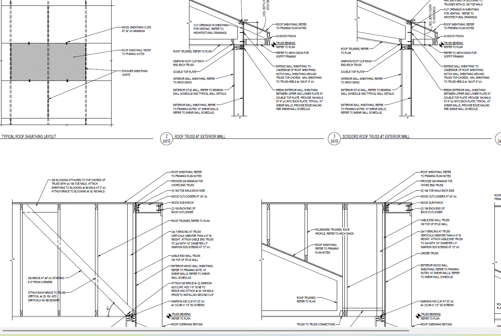</a>
    <a class="kb-figure" href="../../assets/images/confluence/confluence-054.png" target="_blank" rel="noopener">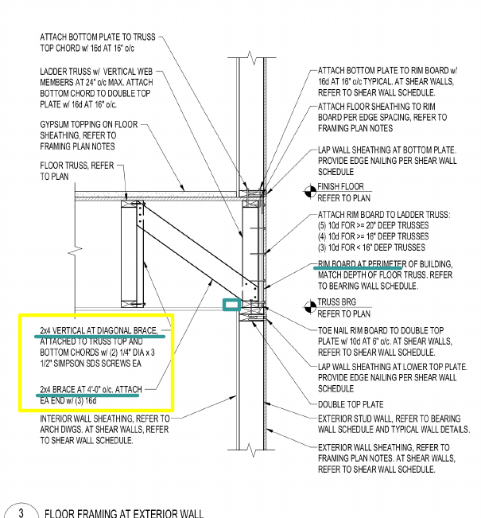</a>
    <a class="kb-figure" href="../../assets/images/confluence/confluence-055.png" target="_blank" rel="noopener">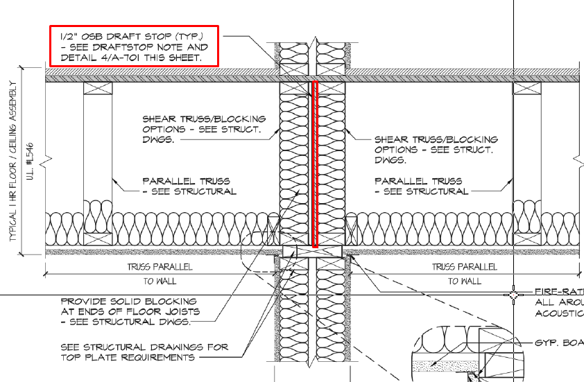</a>
    <a class="kb-figure" href="../../assets/images/confluence/confluence-056.png" target="_blank" rel="noopener">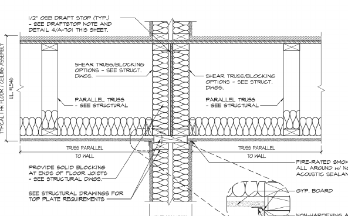</a>
    <a class="kb-figure" href="../../assets/images/confluence/confluence-057.png" target="_blank" rel="noopener">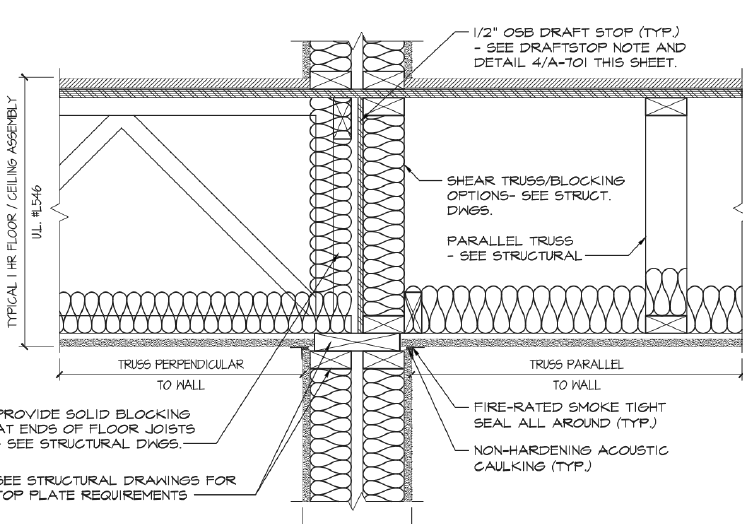</a>
    <a class="kb-figure" href="../../assets/images/confluence/confluence-058.png" target="_blank" rel="noopener">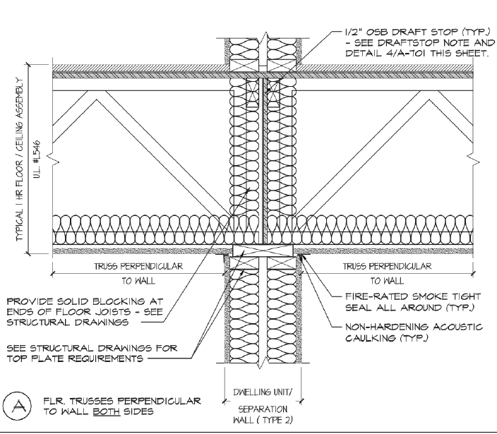</a>
    <a class="kb-figure" href="../../assets/images/confluence/confluence-059.png" target="_blank" rel="noopener">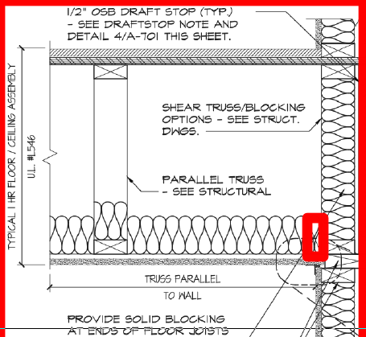</a>
    <a class="kb-figure" href="../../assets/images/confluence/confluence-060.png" target="_blank" rel="noopener">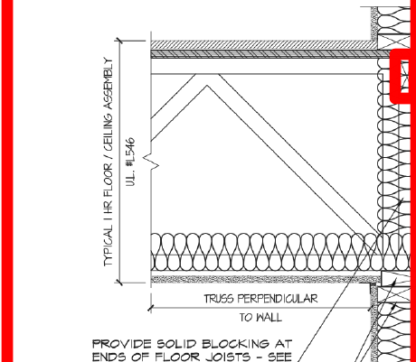</a>
    <a class="kb-figure" href="../../assets/images/confluence/confluence-061.png" target="_blank" rel="noopener">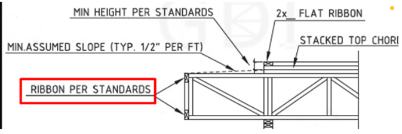</a>
    <a class="kb-figure" href="../../assets/images/confluence/confluence-062.png" target="_blank" rel="noopener">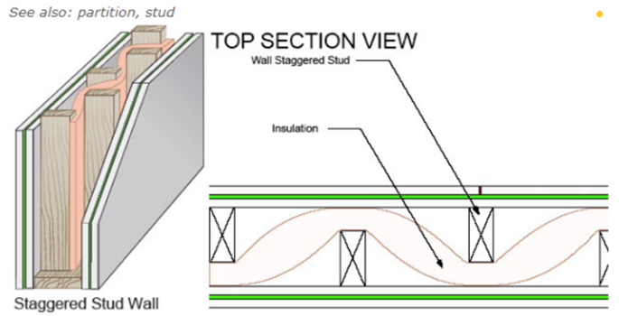</a>
    
    
    <a class="kb-figure" href="../../assets/images/confluence/confluence-065.png" target="_blank" rel="noopener">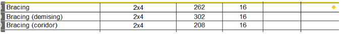</a>
  

<!-- confluence-gallery:end -->
