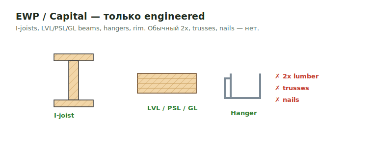

# EWP / Capital

EWP jobs включают только engineered wood products, если project scope не говорит
иначе.

<figure markdown>
  
  <figcaption>Считаем engineered: I-joists, LVL/PSL/GL, hangers, rim. 2x, trusses, nails — нет.</figcaption>
</figure>

## Что считать

- I-joists: TJI, LPI, RED, BCI, RFPI, Nordic.
- Beams: LVL, PSL, GL.
- Associated hangers.
- Rim board и blocking в LFT.

## По умолчанию не считать

- Обычный 2x lumber.
- Trusses.
- Ties вроде CS, MST и т.д., если их прямо не попросили.
- Nails.

## Главные правила

- TJI 110 series не превращается в 230; пиши как показано.
- Большинство hangers на таких jobs — top mount.
- Rim factor: 1.05.
- Blocking: без factor, если continuous.
- Joists over 16" используют HIT hangers, не ITS.
- Если floor identical, добавь note, но всё равно перечисли materials.

## Rim Sizing

Если LVL нигде явно не указан, не предполагаем `1-3/4 LVL Rim`. Используй `Rim`
или помечай product как assumed.

Типичные размеры 24" Rim в порядке предпочтения:

- Если указан очень тонкий Rim — `1-1/8" × 24 OSB`.
- Далее по толщине — `1-1/2" × 24 LSL`.
- Затем — `1-3/4" × 24 LVL`.

Стандартные толщины Rim, на которые обращать внимание: `1-1/4"`, `1-1/2"`, `1-3/4"`.

## Hangers — детали выбора

- Чаще всего на EWP-jobs используются **верхнемонтируемые (top mount)** крепления — на стенах, балках или стальных post.
- В архитектурных чертежах указаны стены с **двойным гипсокартоном (double gypsum / firewall)** — в этих местах могут быть специальные крепления `DGU` или `DGT`. Их выписывать отдельной строкой.
- TIES (`CS`, `MST` и подобные) на EWP не учитываем — только Hangers.

## Identical floors

Если один этаж идентичен другому, добавляй пометку сверху, но **всё равно перечисляй все материалы**, чтобы не дублировать инфу:

> `4th floor frame is identical to 3rd floor`

## Scope recap

- **Включает**: перекрытия, возможно колонны, косоуры лестниц (`stringers`).
- **Не считаем**: 2x материалы, соединители для лестниц, Trusses (их ставят другие).

## See also

- [Joist → EWP materials](../work/horizontal/floor-framing/joist.md#ewp-joist-materials) · [Beam](../work/horizontal/floor-framing/beam.md) · [Rim Board](../work/horizontal/floor-framing/details/rim.md) · [Hangers](../reference/hangers.md)
