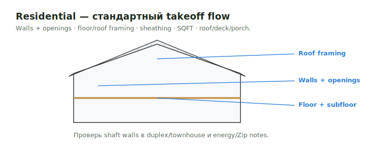

# Residential

Residential jobs идут по стандартному takeoff flow, если plans не добавляют
commercial-style assemblies, shaft walls или panelized scope.

<figure markdown>
  
  <figcaption>Walls + openings · floor/roof framing · sheathing · SQFT · roof/deck/porch.</figcaption>
</figure>

## Типовой scope

- Walls и openings.
- Floor и roof framing.
- Sheathing, SQFT, roof/deck/porch materials.
- Details, hangers, bolts, screws, когда они called out.

## Всё равно проверить

- Structural vs Arch wall sizes.
- Exact stud heights, если schedules отличаются.
- Shaft walls в duplex или townhouse plans.
- Exterior sheathing vs energy/Zip notes.
- Roof overframes, canopies, dormers и truss heel conditions.

## Вывод

Assumptions держи видимыми. Если detail неясен, добавь note, а не прячь
решение в quantity.

## See also

- [COM Commercial](com.md) · [Reconstruction](reconstruction.md) · [Структура takeoff](../start/takeoff-structure.md) · [Workflow](../start/workflow.md)
