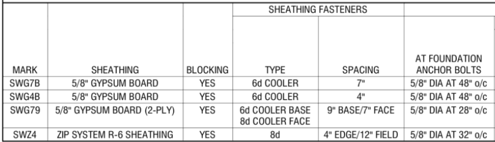

# Anchor Bolts

## Что считать

- Anchor bolts, holdown anchors, deck/balcony attachment bolts и washers там,
  где details требуют их.

## Критические правила

- **Стандартный bolt** (когда не указан другой) — `5/8" Dia Titen HD x 5 1/2"`, заглубление **3 1/2" Emb**.
- **Shear walls at foundation** часто имеют **другой шаг** anchor bolts — обязательно проверять **SW Schedule** (Shear Wall Schedule), не брать стандартный шаг автоматом.

## Проверить

- ATS rod systems часто by others; не считай, если scope не говорит считать.
- Используй detail-specific bolt sizes.
- Bolts держи отдельно от screws.
- Washers — не copy/paste item: обновляй spacing/count по current detail, а не
  оставляй previous spacing unchanged.

<!-- confluence-gallery:start -->
## Визуальная проверка

Эти картинки уже привязаны к правилам страницы. Используй их как быстрые
checkpoint-ы перед output: сначала прочитай правило выше, потом открой нужную
карточку и проверь похожий condition на плане/schedule.

??? info "Источник картинок"
    - Anchor Bolts (анкерные болты): [2 карт. Confluence](https://ewood.atlassian.net/wiki/spaces/work/pages/72482856/Anchor+Bolts)

  <a class="kb-rule-card" href="../../../assets/images/confluence/confluence-153.png" title="image-20251030-160235.png">
    
    

      
Anchor Bolt - визуальная проверка 01

      
Проверь spacing, edge/corner conditions, washers и plate connection.

      
Anchor bolts идут вместе с Sill Plates/Btm Plate rules, но output может быть отдельной строкой.

    

  </a>
  <a class="kb-rule-card" href="../../../assets/images/confluence/confluence-154.png" title="image-20251030-160116.png">
    
    

      
Anchor Bolt - визуальная проверка 02

      
Проверь spacing, edge/corner conditions, washers и plate connection.

      
Anchor bolts идут вместе с Sill Plates/Btm Plate rules, но output может быть отдельной строкой.

    

  </a>

<!-- confluence-gallery:end -->
