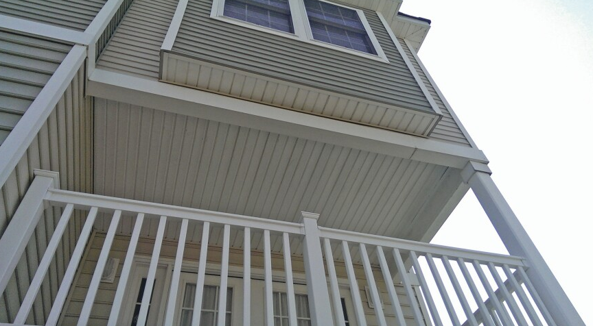

# Balcony Trims

## Что считать

- Balcony trims, edge trims, flashing, soffit/underside trims и related finish
  material.

## Проверить

- Balcony trims не должны исчезать внутри general exterior trim.
- Проверь, показывают ли details decking without sheathing.
- Trim, flashing и structural material держи отдельно.
- Balcony framing может требовать 2-ply framing и two layers of sleepers; держи
  framing/sleeper notes видимыми, не прячь их в trim.

<!-- confluence-gallery:start -->
## Визуальная проверка

Эти картинки уже привязаны к правилам страницы. Используй их как быстрые
checkpoint-ы перед output: сначала прочитай правило выше, потом открой нужную
карточку и проверь похожий condition на плане/schedule.

??? info "Источник картинок"
    - Balcony Trims - отделка для балконов: [1 карт. Confluence](https://redacted.atlassian.net/wiki/spaces/work/pages/67469321/Balcony+Trims+-)

  
Показать 1 иллюстраций

  

    
  

<!-- confluence-gallery:end -->
