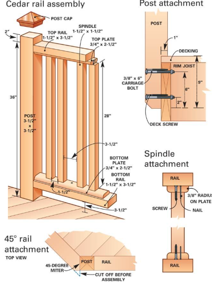

# Railing

## Что считать

- Railing LF, posts, blocking, attachments и special trims, когда in scope.

## Проверить

- Deck/porch/balcony railing может быть by others; проверь scope.
- Attachment details can drive blocking, bolts, and rim material.

<!-- confluence-gallery:start -->
## Визуальная проверка

Эти картинки уже привязаны к правилам страницы. Используй их как быстрые
checkpoint-ы перед output: сначала прочитай правило выше, потом открой нужную
карточку и проверь похожий condition на плане/schedule.

??? info "Источник картинок"
    - Railing - перила: [1 карт. Confluence](https://ewood.atlassian.net/wiki/spaces/work/pages/67043361/Railing+-)

  <a class="kb-rule-card" href="../../../assets/images/confluence/confluence-151.png" title="image-20250610-135631.png">
    
    

      
Railing - визуальная проверка

      
Проверь railing run, post condition, returns и connection points.

      
Не смешивай railing LF с deck/balcony trim, если scope просит отдельно.

    

  </a>

<!-- confluence-gallery:end -->
