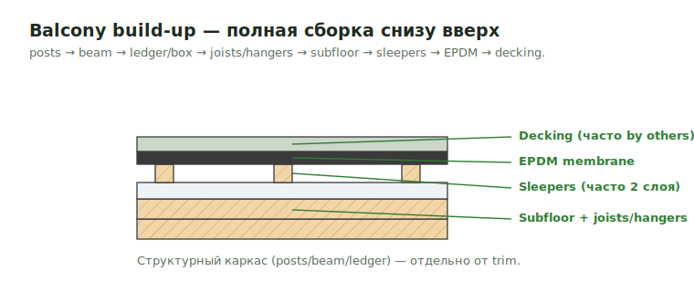

# Balcony build-up

Balcony — это полная сборка от structural framing снизу до finish сверху.
Эта страница — **карта сборки + finish/trim слои**. **Структурный каркас**
вынесен в отдельную страницу.

<figure markdown>
  
  <figcaption>Сборка снизу вверх: structure → sleepers → EPDM → decking. Decking часто by others.</figcaption>
</figure>

!!! abstract "Где структурный каркас"
    Posts / Post Bases / Caps / Beam / Ledger / Box / Joists / Hangers /
    Blocking / Rim / Sleepers / structural Subfloor / Stringers — детально в
    [Deck / Porch / Balcony Frame](../deck/deck-porch-balcony-frame.md).
    Здесь — finish: decking finish, soffit, fascia/edge trim, flashing,
    composition.

!!! info "Template-макрос"
    Весь блок целиком вставляет `B_Balcony_Insert_Template_FromText` —
    командой `b 12x30` или `b 1.3x1.9 u2`. Defaults: beam `2x10 P.T.`,
    posts `6x6 P.T.`, OC `16"`. Подробно — [Trim macros](macros.md).

## Карта сборки снизу вверх { .kb-section-title .kb-st--green }

| # | Label | Материал | Unit | Scope |
| --- | --- | --- | --- | --- |
| 1 | `Posts` + `Post Bases` + `Post Caps` | `6x6 P.T.` + `ABU66`/`BCS2` | `pcs` | → [Frame](../deck/deck-porch-balcony-frame.md) |
| 2 | `Beam (…)` (multi-ply) | `2x10 P.T.` | `LFT` | → Frame |
| 3 | `Ledger` / `Box` | `2x10 P.T.` | `LFT` | → Frame |
| 4 | `Joists` + `Hangers` + `Blocking` + `Rim` | `2x10/2x12 P.T.` @16" | `LFT`/`pcs` | → Frame |
| 5 | `Sleepers` (часто 2 слоя) | `2x4 P.T.` | `LFT` | → Frame |
| 6 | `Subfloor` (structural) / `Stringers` | `3/4" CDX` / `2x12` | `4x8`/`pcs` | → Frame |
| 7 | `Post Wrap` | `1x` / `5/4x` | `LFT` | **finish** |
| 8 | `EPDM` | `EPDM` membrane | `SQ FT` | **finish** |
| 9 | `Decking` (finish) | `5/4x6` Composite/Azek/Wd | `SQ FT` | **finish** |
| 10 | `Soffits at Balcony` | `Beadboard` | `SQ FT` | **finish** |
| 11 | `Balcony Trims` | fascia / edge trim `1x` / `5/4x` | `LFT` | **finish** |
| 12 | `Flashings at Wall` | `Copper` / drip edge | `LFT` | **finish** |

!!! warning "Frame и finish — раздельно"
    Строки 1–6 (structural) считаются по
    [Frame](../deck/deck-porch-balcony-frame.md), не растворяются в
    `Balcony Trims`. Здесь — только finish (строки 7–12).

## Finish-слои { .kb-section-title .kb-st--cyan }

- **`Post Wrap`** — обшивка structural post (`1x`/`5/4x`), `LFT`.
- **`EPDM`** — гидроизоляция под decking, `SQ FT`.
- **`Decking`** (finish) — `5/4x6` Composite/Azek/Wd, `SQ FT`; полный разбор —
  [Rails & Decking](rails-decking.md).
- **`Soffits at Balcony`** — `Beadboard`, `SQ FT` (низ балкона).
- **`Balcony Trims`** — fascia / edge trim по периметру, `LFT`.
- **`Flashings at Wall`** — `Copper` / drip edge примыкание к стене, `LFT`.

## Composition (paver-вариант) { .kb-section-title .kb-st--magenta }

Если balcony не deck-on-sleepers, а **paver on membrane** — слои сверху вниз:

| Слой | Что это | Scope |
| --- | --- | --- |
| `Porcelain Pavers` | финиш | часто **by others** |
| `Thinset Mortar` | клей | by others с pavers |
| `Roofing Membrane` | гидроизоляция | проверь scope |
| `Tapered Rigid Insulation` | разуклонка | проверь scope |
| `Conc. Deck` | плита | structural |
| `Structural Steel` | каркас | structural — не trim |

!!! danger "Pavers / membrane часто by others"
    `Note: Pavers Deck System are by others`. Тогда из composition считаем
    только наш framing/trim, paver-систему — нет. То же правило исключений:
    [Exclusions](exclusions.md).

## Чек перед выводом (finish) { .kb-section-title .kb-st--green }

- [ ] Структурный каркас посчитан по [Frame](../deck/deck-porch-balcony-frame.md)?
- [ ] Post wrap / EPDM / decking finish / soffit / trim / flashing — все слои?
- [ ] Decking finish в `SQ FT`; trim/flashing в `LFT`?
- [ ] Composition: pavers/membrane — by others проверено?
- [ ] Finish отделён от structural (не дублирует Frame)?

## See also

- [Deck / Porch / Balcony Frame](../deck/deck-porch-balcony-frame.md) — структурный каркас
- [Porch / Deck / Balcony](porch-deck-balcony.md) · [Rails & Decking](rails-decking.md)
- [Trim macros](macros.md)
- [Balcony Trims](../deck/balcony-trims.md) · [Hangers](../../reference/hangers.md) · [Standard notes](../../reference/standard-notes.md)
