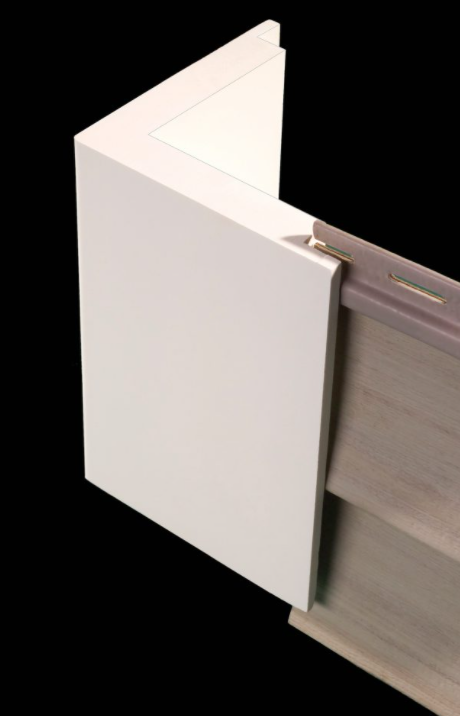

# Casing, Corner & Band

Trim вокруг openings и по полю стены: ext. casing, corner boards, band /
watertable, head crowns, flashing, shutters, louvers, brackets.

## Ext. Casing { .kb-section-title .kb-st--green }

Casing — это обкладка вокруг окон и дверей снаружи. Считается **LFT**.
Часто разбивается по позициям, потому что профиль разный:

| Позиция | Типовой size | Unit | Заметка |
| --- | --- | --- | --- |
| `Ext. Casing sides` | `5/4x4` | `LFT` | вертикальные стороны openings |
| `Ext. Casing (apron & sides)` | `5/4x3` | `LFT` | sides + apron под окном |
| `Ext. Casing heads` | `5/4x4` / `5/4x6` | `LFT` | верх openings, часто шире |
| `Ext. Casing heads (at crowns)` | `5/4x6` | `LFT` | где сверху crown |
| `Ext. Casing - mulls` / `Mull trims` | `5/4x6` | `LFT` | между спаренными окнами |
| `Casing at basement windows` | `5/4x3` / `5/4x4` | `LFT` | часто `assumed` |
| `Casing garage doors (sides)` | `5/4x4` / `5/4x8` | `LFT` | garage openings шире |
| `Head casing garage dr` | `5/4x12` / `5/4 Panel` | `LFT` / `SQ FT` | большой head |
| `Ext. Casing 4-sides` | `3-1/2" Vinyl casing` | `LFT` | при vinyl siding |
| `Ext. Casing` | `Vinyl J-channel` | `LFT` | vinyl siding → casing = J-channel |
| `Ext. Casing` | `1x4 azek trim` | `LFT` | при Azek/PVC спецификации |

!!! tip "`4-sides` и `3-sides`"
    `4-sides` = casing по всему периметру opening. `3-sides` = без apron/sill
    снизу (низ закрыт sill или siding). Держи это в Label — это меняет LFT.

!!! warning "Vinyl siding"
    При vinyl siding casing часто = `Vinyl J-channel` или `3-1/2" Vinyl
    casing`. Не добавляй сверху ещё `5/4` wood casing. Подробно —
    [Exclusions и J-Channel](exclusions.md).

## Head crowns / caps / flashing { .kb-section-title .kb-st--cyan }

Над head casing часто идёт «слойка»: crown → cap → flashing.

| Label | Типовой size | Unit |
| --- | --- | --- |
| `Head crowns` / `Crowns` | `3-1/2" crown` / `4" crown` / `5" crown` | `LFT` |
| `Crown cap` / `Crown caps` | `1x4` | `LFT` |
| `Crown Base` | `5/4x6` | `LFT` |
| `Head flashing` / `Flashing at head trims` | `Drip edge` | `LFT` |
| `Drip cap` | `1" Drip cap` | `LFT` |
| `Window Sills` | `1" Sill` / `2" Sill` / `1-1/2" Sill` | `LFT` |

- Crown без cap и без flashing — редкость; если показан crown, проверь, нет ли
  ещё `1x4` cap и `drip edge` сверху.
- `verify size` / `scaled` оставляй в note — crown profile часто не указан.

## Corner boards { .kb-section-title .kb-st--magenta }

Corner board закрывает наружный (иногда внутренний) угол, куда упирается
siding. Считается **LFT** по высоте угла (× кол-во углов).

- Wood/PVC: `5/4x6`, `5/4x8` (на bays часто `5/4x8`).
- Vinyl: `4" Vinyl corner` — отдельный product, не путать с `5/4`.
- Может варьироваться `5/4x4`…`5/4x6` — если не указано, бери крупнее и пиши
  `verify for 5/4x4`.
- На углах bays считается отдельной строкой (`CornerBoards at Bays`).

<figure markdown>
  
  <figcaption>Corner board заводит cut edge siding — считается LFT по высоте.</figcaption>
</figure>

  
Скрыть corner board детали

  <figure class="kb-figure-row">
    <figcaption class="kb-figure-row__text">
      
Corner board — общий вид

      
Outside corner, wood/PVC <code>5/4x6</code>.

      
LFT = высота угла × количество углов этого типа.

    </figcaption>
    
  </figure>
  <figure class="kb-figure-row">
    <figcaption class="kb-figure-row__text">
      
Build-up под corner

      
Под corner board нужен solid nailing base.

      
Если показан build-up — это может быть отдельный blocking item.

    </figcaption>
    
  </figure>

## Band / Watertable { .kb-section-title .kb-st--green }

Горизонтальные пояса по фасаду (между этажами, по низу стены):

| Label | Типовой size | Unit | Заметка |
| --- | --- | --- | --- |
| `Band Trims` / `Band trim front 2nd floor` | `5/4x10` / `5/4x6` | `LFT` | межэтажный пояс |
| `Watertable Trim` | `5/4x10` / `5/4x12` | `LFT` | по низу стены |
| `Flashing at band` / `Flashing` | `drip edge` | `LFT` | поверх горизонтали |
| `Frieze` (в trim-блоке) | `5/4x6` | `LFT` | под soffit — см. Soffit & Fascia |

- Любой горизонтальный wood/PVC пояс почти всегда требует `drip edge` сверху —
  проверь, не пропущен ли он.

## Shutters / Louvers / Brackets { .kb-section-title .kb-st--cyan }

Counted items — `pairs` / `pcs` / `units`, не LFT:

| Label | Пример | Unit |
| --- | --- | --- |
| `Shutters - paneled` / `Shutters louvered` | `20"x60"`, `14"x57"` | `pairs` |
| `Shutters Composite 2-panel` | `18"x52"` | `pairs` |
| `Louver vent` / `gables Louvers` | `24" Dia`, `12"x18"` | `units` / `pcs` |
| `Brackets` | `5-1/2"x7"x?` | `pcs` |

- Shutters считаются **парами** на окно (две створки = 1 pair).
- Размер shutter держи в Label (`20"x60"`) — он задаёт product.
- `?` в размере (`5-1/2"x7"x?`) — оставляй, это явный verify-flag.

## Чек перед выводом { .kb-section-title .kb-st--magenta }

- [ ] Casing разбит по sides / heads / mulls / garage, где профили разные?
- [ ] При vinyl siding casing = J-channel / vinyl casing (не двойной счёт)?
- [ ] Над head: crown + cap + flashing проверены?
- [ ] Corner boards: правильный size, bays отдельно, vinyl corner не смешан с 5/4?
- [ ] Band / watertable: есть drip edge сверху?
- [ ] Shutters в pairs, louvers/brackets в pcs/units?
- [ ] EIFS / stucco / stone veneer исключены?

## See also

- [Exclusions и J-Channel](exclusions.md)
- [Furring & Window Jambs](furring-and-jambs.md)
- [Soffit & Fascia](soffit-fascia.md)
- [Trim macros](macros.md)
