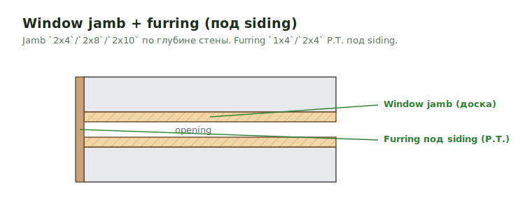

# Furring & Window Jambs

Две вещи, которые **легко пропустить**, потому что они спрятаны в wall
sections и window details, а не на elevation.

<figure markdown>
  
  <figcaption>Window jamb (доска) по глубине стены + furring 1x4/2x4 P.T. под siding.</figcaption>
</figure>

!!! danger "Смотреть внимательно в разрезах"
    Furring под siding и window jamb extensions часто **не показаны на
    elevation** — только в wall section / window detail. Перед выводом
    exterior trim открой sections и detail-листы по окнам.

## Furring под siding { .kb-section-title .kb-st--green }

Под siding часто идёт **furring** — рейка, которая создаёт rainscreen / ровную
nailing-плоскость / зазор для вентиляции.

| Что искать | Типовой size | P.T.? | Unit |
| --- | --- | --- | --- |
| Furring strips под siding | `1x4` | P.T. **или** не P.T. | `LFT` или `SQ FT` стены |
| Furring (толще, по structural) | `2x4` | P.T. **или** не P.T. | `LFT` |
| `2x blocking, rip as req'd` (на flare) | `2x` | по детали | `LFT` |
| Base over furring (внутри, опционально) | `Base TBD optional` | — | `LFT` |

- **`P.T.` или не `P.T.` — это разный product.** P.T. (pressure-treated) идёт
  внизу, у foundation, у влажных зон; выше — обычно не P.T. Не пиши один size
  на всю стену, если деталь различает.
- Считается одним из двух способов:
    - **LFT** — суммарная длина реек (по spacing, напр. 16" o.c.);
    - **SQ FT** стены — если furring сплошной по площади (тогда отдельной
      строкой `Furring | 1x4 | <SQ FT> | SQ FT`).
- Пиши spacing в Label/note, если оно задано: `Furring 1x4 @ 16" o.c.`.
- Если деталь показывает furring, но siding scope чужой — furring всё равно
  может быть наш (это framing/trim), проверь по scope.

!!! tip "Где furring почти всегда есть"
    - Открытые/вентилируемые фасады (rainscreen).
    - Стены под `flare` / shingled bump (`2x blocking, rip as req'd`).
    - Basement / over-foundation walls (тогда часто `P.T.`).
    - Под cedar / Hardi на CMU или неровном основании.

## Window jamb extensions { .kb-section-title .kb-st--cyan }

Вокруг окон (и дверей) часто стоит **jamb** — доска, добирающая глубину
проёма от рамы окна до плоскости siding / casing.

| Что искать | Типовой size | P.T.? | Unit |
| --- | --- | --- | --- |
| Window jamb (тонкая стена) | `2x4` | P.T. **или** не P.T. | `LFT` |
| Window jamb (толстая стена) | `2x8` | P.T. **или** не P.T. | `LFT` |
| Window jamb (очень толстая / CMU) | `2x10` | P.T. **или** не P.T. | `LFT` |
| `5/4` jamb (open structure / shower) | `5/4 IPE Jambs`, `2x4 P.T.` | по детали | `LFT` / `pcs` |
| `Blocking around all openings` | `5/4x4 P.T.` | P.T. | `LFT` |

- **Глубина стены задаёт size jamb:** `2x4` тонкая, `2x8`/`2x10` толстая стена
  (например, с furring + EIFS + sheathing). Бери size из section, не угадывай.
- **`P.T.` или нет** — тот же принцип, что и у furring: низ/влажно → P.T.
- Считается **LFT** по периметру openings (обычно 3 sides: 2 jambs + head, или
  4 sides если есть и sill). Quantity = периметр × количество окон этого типа.
- Не путай **structural window jamb** (наш framing/trim) с **interior jamb
  trim / casing** — это разные scope и разные страницы.
- **`Window jamb` (`2x4` / `2x8` / `2x10`)** и **`Blocking around all openings`
  (`5/4x4 P.T.`)** — это **две разные строки**, не выбор. Jamb добирает
  глубину проёма по детали; blocking — nailer по периметру под casing /
  flashing. Бывают вместе: одна строка по structural (если деталь требует
  jamb), вторая — `5/4x4 P.T.` под отделку (вставляется макросом
  `B_JambsAllBlock`).

!!! warning "Доска-jamb в metal стенах"
    В **metal stud** стенах проёмы окон/дверей иногда добирают **деревянной
    доской** (`2x` jamb) — это наш material, даже если каркас by others. Смотри
    section внимательно. Если jambs не используются — фиксируй note, напр.
    `Assumed window jambs 2x4 are not used page A8.53; verify`. См.
    [Exterior Wall Materials](../vertical/sheathing/exterior-materials.md).

### Макрос вставки блока openings

В trims workbook есть helper-макрос, который вставляет готовый блок
«Blocking / jamb around all openings»:

- `B_JambsAllBlock` / `D_JambsAllBlock` — вставляет header `Wall Materials`
  и строку `Blocking around all openings | 5/4x4 P.T.` с формулой по openings.
- Используй его после того, как посчитал openings; затем поправь size
  (`5/4x4` / `2x4` / `2x8`…) и `P.T.` под конкретную деталь.

Подробно про макросы — [Trim macros](macros.md).

## Чек перед выводом { .kb-section-title .kb-st--magenta }

- [ ] Открыл wall sections — есть ли furring под siding?
- [ ] Furring size (`1x4` / `2x4`) и `P.T.` / не `P.T.` взяты из детали?
- [ ] Furring посчитан как LFT (по spacing) или SQ FT (по площади)?
- [ ] Открыл window details — есть ли jamb extension?
- [ ] Jamb size (`2x4` / `2x8` / `2x10`) соответствует толщине стены?
- [ ] `P.T.` jamb там, где низ / влажная зона?
- [ ] Не смешал structural jamb с interior casing?

## See also

- [Overview](overview.md)
- [Casing, Corner & Band](casing-corner-band.md)
- [Trim macros](macros.md)
- [Furring (walls)](../vertical/walls/furring.md)
- [Windows and Doors](../vertical/openings/windows-doors.md)
