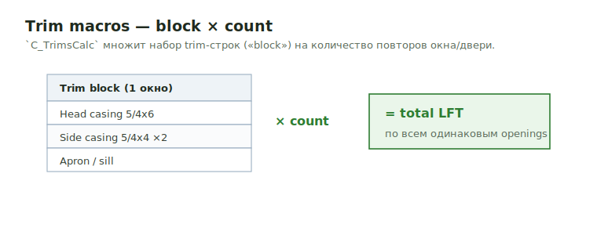

# Trim macros

В trims workbook есть VBA-макросы, которые ускоряют расчёт и заполнение
отделки: суммирование, умножение на count, и вставка готовых блоков
(jambs / pavers / balcony). Это **не** стандартные Excel-шорткаты.

<figure markdown>
  
  <figcaption>`C_TrimsCalc`: trim-block одного окна × count повторов = total LFT.</figcaption>
</figure>

!!! warning "Макросы должны быть включены"
    Если макрос «ничего не делает»:

    1. Активный workbook — это trims workbook с макросами.
    2. Macros включены: `File → Options → Trust Center → Macro Settings`.
    3. Запуск: назначенный shortcut, кнопка, или `Alt+F8` → выбрать макрос.

    Общая карта горячих клавиш — [Excel macro hotkeys](../../reference/excel-hotkeys.md).

## Структура данных, которую ждут макросы { .kb-section-title .kb-st--green }

Расчётные макросы работают с **тремя соседними колонками**: `Label`,
`Value`, `Unit`. Выдели ровно 3 столбца с данными строк отделки:

| Label | Value | Unit |
| --- | --- | --- |
| `Ext. Casing sides` | `380` | `LFT` |
| `Head casing` | `204` | `LFT` |
| `CornerBoards` | `367` | `LFT` |
| `Soffits at Porch` | `120` | `SQ FT` |
| *(count row)* | `2` | `EA` |

Если выделено не 3 столбца — макрос покажет ошибку и выйдет.

## `C_TrimsCalc` — блок × количество { .kb-section-title .kb-st--cyan }

Главный trim-макрос. Считает «отделка на **один** элемент × **количество**
таких элементов» (например, trim на один balcony × число одинаковых
balconies).

**Как работает:**

1. Идёт по выделенным строкам сверху вниз.
2. Строки с unit `FT` или `SQ FT` копит в текущий **блок** (запоминает Label
   и адрес ячейки Value).
3. Когда встречает строку с unit `EA` — берёт её Value как **множитель**
   (количество) и для каждого Label из блока строит формулу
   `=<ячейка>*<EA>`. Одинаковые Label складываются (`+`).
4. После `EA` блок обнуляется — дальше можно начинать следующий блок с другим
   количеством.
5. На 2 строки ниже выделения печатает таблицу `Label | Sum * EA` с
   формулами (а не «голыми» числами).

**Как пользоваться:**

1. Выпиши отделку для **одного** элемента: строки с `FT` / `SQ FT`.
2. Сразу под ними добавь строку, где Value = количество таких элементов,
   Unit = `EA`.
3. Можно несколько блоков подряд (каждый закрывается своей `EA`-строкой).
4. Выдели 3 колонки (Label / Value / Unit) по всем блокам.
5. Запусти `C_TrimsCalc` (через `Alt+F8` или назначенную кнопку).
6. Ниже появится сводка с формулами — проверь, что Label'ы и множители верные.

!!! tip "Зачем формулы, а не числа"
    Макрос пишет `=B12*3`, а не `360`. Reviewer видит, из чего получилось
    итоговое количество. Не заменяй формулу числом вручную.

## `C_SumTheSameValues` — свернуть одинаковые { .kb-section-title .kb-st--magenta }

Сворачивает повторяющиеся строки: ключ = `Label + Unit`, значения
суммируются. Полезно, когда один и тот же trim (`CornerBoards 5/4x6 | LFT`)
встречается много раз по фасадам/этажам.

- Выдели 3 колонки `Label | Value | Unit`.
- Запусти `C_SumTheSameValues` (по умолчанию ++ctrl+shift+f++).
- Выделение **очищается** и на его месте печатаются уникальные строки с
  суммами. Делай на копии, если исходные строки ещё нужны.

## `Y_MultiplySelectedCells` — умножить всё { .kb-section-title .kb-st--green }

Умножает каждую выделенную ячейку на адрес-множитель (спросит адрес,
напр. `G208`).

- Если в ячейке формула — допишет `*G208` к ней.
- Если число — сделает `=<число>*G208`.

Используй для waste-фактора (`*1.1`-ячейка) или общего множителя по блоку.
По умолчанию ++ctrl+m++.

## Вставка готовых блоков { .kb-section-title .kb-st--cyan }

Эти макросы **сдвигают строки вниз** от выделенной строки и заполняют
шаблон. **Сначала встань на нужную строку**, потом запускай — вставка идёт
с неё.

| Макрос | Что вставляет | Потом поправить |
| --- | --- | --- |
| `B_JambsAllBlock` / `D_JambsAllBlock` | `Wall Materials` → `Blocking around all openings 5/4x4 P.T.` с формулой по openings | size (`5/4x4`/`2x4`/`2x8`…) и `P.T.` под деталь |
| `B_PaversBlock` / `D_PaversBlock` | `Pavers` + жёлтый `Note: Pavers Deck System are by others` + Pavers / Posts at Rails / Cables / Cap Rail | количества, проверить by-others scope |
| `B_Balcony_Insert_Template_FromText` | Полный balcony-шаблон (subfloor, sleepers, EPDM, posts, beam, ledger, deck, trims) по команде вида `b 12x30` или `b 1.3x1.9 u2` | размеры берёт из команды; проверить defaults (beam `2x10 P.T.`, posts `6x6 P.T.`) |
| `Z_BalconyAdd_Form` | То же через UserForm (диалог) | поля формы |
| `B_ShaftWallsBlocks` | Блок shaft wall blocking | size/oc |
| `B_BoltsAdd` | Blocking + Anchor Bolts + Washers + Nuts (4 строки) | size, spacing |

!!! note "Pavers / Balcony — `by others`"
    `B_PaversBlock` специально ставит жёлтую заметку `Pavers Deck System are
    by others`. Это совпадает с правилом из [Porch / Deck /
    Balcony](porch-deck-balcony.md): paver-систему обычно **не считаем**,
    оставляем только наш framing/trim.

## Cleanup-макросы (после вставок) { .kb-section-title .kb-st--magenta }

| Макрос | Hotkey | Действие |
| --- | --- | --- |
| `X_DeleteRowsByColor` | ++ctrl+shift+d++ | удалить серые строки (заглушки шаблона) |
| `B_DeleteZeroRowsOnlyIn_AtoH` | ++ctrl+e++ | удалить строки, где Value = `0` |
| `X_DeleteCellsUp` / `Y_InsertCellsUp` | ++ctrl+q++ / ++ctrl+w++ | удалить / вставить ячейки со сдвигом |
| `Y_noValidation` | ++ctrl+shift+v++ | убрать validation-дропдауны |
| `Y_CheckEnglish` | ++ctrl+shift+t++ | проверка орфографии |
| `Y_InsertDate` | ++ctrl+shift+o++ | поставить дату |

## Типовой порядок для блока отделки { .kb-section-title .kb-st--green }

1. Встань на строку, куда нужен блок → `B_JambsAllBlock` / `B_PaversBlock` /
   `B_Balcony_Insert_Template_FromText`.
2. Поправь size и `P.T.` под конкретную деталь (jamb / furring / casing).
3. Заполни Value (длины/площади/количества) — формулами, не числами.
4. Если элемент повторяется N раз: добавь `EA`-строку и прогони
   `C_TrimsCalc`.
5. Сверни дубликаты по фасадам: `C_SumTheSameValues`.
6. Waste/множитель при необходимости: `Y_MultiplySelectedCells`.
7. Чистка: ++ctrl+shift+d++ серые → ++ctrl+e++ нули → ++ctrl+shift+v++
   validation.
8. Финал: ++ctrl+shift+o++ дата → ++ctrl+shift+t++ spell check.

!!! warning "Перед запуском insert-макроса"
    Вставка идёт **с выделенной строки вниз**. Ошибёшься строкой —
    вставит блок не туда и сдвинет данные. Проверь курсор до запуска.

## See also

- [Overview](overview.md)
- [Furring & Window Jambs](furring-and-jambs.md)
- [Porch / Deck / Balcony](porch-deck-balcony.md)
- [Excel macro hotkeys](../../reference/excel-hotkeys.md)
- [Formulas and factors](../../reference/formulas.md)
