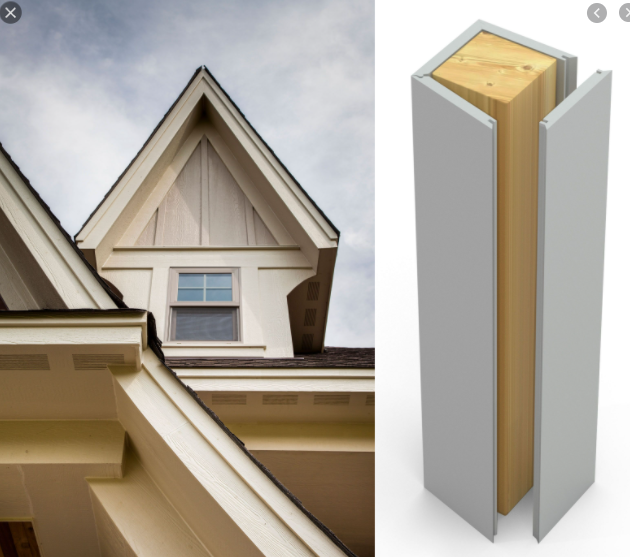
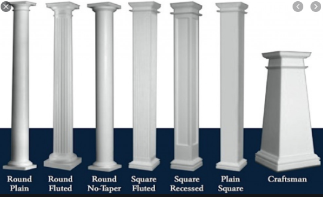

# Exterior Trims

Exterior Trims — это **wood / PVC / composite** finish trim снаружи здания: ext
casing вокруг openings, corner boards, band/watertable, head crowns, soffit и
fascia, frieze, columns, porch / deck / balcony trim.

Это отдельный scope. Это **не** siding, **не** EIFS / Stucco / Stone Veneer и
**не** structural framing. Считаем только trim material.

!!! danger "Главное правило: что НЕ считаем"
    **EIFS — не считаем. Stucco — не считаем. Stone Veneer / Brick Veneer — не
    считаем.** Это finish-системы by others. Полный список и работа с
    `J-Channel` — на странице [Exclusions и J-Channel](exclusions.md).

## Что входит в scope { .kb-section-title .kb-st--green }

-   :material-window-closed-variant:{ .lg .middle } **Casing / Corner / Band**

    ---

    Ext. casing (sides / heads / apron / mulls), corner boards, band &
    watertable, head crowns + crown cap, drip edge / head flashing, shutters,
    louvers, brackets.

    [:octicons-arrow-right-24: Casing, Corner & Band](casing-corner-band.md)

-   :material-format-line-spacing:{ .lg .middle } **Furring & Window Jambs**

    ---

    Furring `1x4` / `2x4` под siding (P.T. или нет) и window jamb extensions
    `2x4` / `2x8` / `2x10` (P.T. или нет). Смотреть в wall sections.

    [:octicons-arrow-right-24: Furring & Jambs](furring-and-jambs.md)

-   :material-home-roof:{ .lg .middle } **Soffit & Fascia**

    ---

    Soffits / fascia at eves & rakes, frieze, rake moulding, returns
    (pork-chop vs proper), columns / posts.

    [:octicons-arrow-right-24: Soffit & Fascia](soffit-fascia.md)

-   :material-balcony:{ .lg .middle } **Porch / Deck / Balcony**

    ---

    Porch header fascia & soffit, columns, post sleeves/caps. Хаб по
    deck/balcony scope.

    [:octicons-arrow-right-24: Porch / Deck / Balcony](porch-deck-balcony.md)

-   :material-fence:{ .lg .middle } **Rails & Decking**

    ---

    Railing-системы (composite / Azek / wood / cable / metal), decking,
    post hardware, ballusters, cap rail, lattice, skirt.

    [:octicons-arrow-right-24: Rails & Decking](rails-decking.md)

-   :material-layers-triple:{ .lg .middle } **Balcony build-up**

    ---

    Полная сборка: posts → beam → ledger/box → joists/hangers → subfloor →
    sleepers → EPDM → decking → soffit/trim. Composition by others.

    [:octicons-arrow-right-24: Balcony build-up](balcony-buildup.md)

-   :material-shower:{ .lg .middle } **Outdoor Shower & Pergola**

    ---

    Privacy / shower screen (IPE slats), pergola / trellis, canopy.

    [:octicons-arrow-right-24: Shower & Pergola](shower-pergola.md)

-   :material-microsoft-excel:{ .lg .middle } **Trim macros**

    ---

    `C_TrimsCalc` (block × count), jamb / pavers / balcony insert helpers —
    как устроены и как ими пользоваться.

    [:octicons-arrow-right-24: Trim macros](macros.md)

-   :material-cancel:{ .lg .middle .kb-mk--amber } **Exclusions**

    ---

    EIFS / Stucco / Stone / Brick veneer — by others. Где появляется
    `J-Channel` и почему он часто идёт с EIFS.

    [:octicons-arrow-right-24: Exclusions & J-Channel](exclusions.md)

## Как устроена строка takeoff { .kb-section-title .kb-st--cyan }

Каждый trim item в Excel — это 3 колонки: **Label**, **Value**, **Unit**.

| Label | Value | Unit | Комментарий |
| --- | --- | --- | --- |
| `Ext. Casing sides` | `5/4x4` | `LFT` | size в Label-paire, длина в Value |
| `Head casing` | `5/4x6` | `LFT` | heads часто шире, чем sides |
| `Head crowns` | `3-1/2" crown` | `LFT` | crown профиль |
| `Crown cap` | `1x4` | `LFT` | обычно идёт с crown |
| `Head flashing` | `drip edge` | `LFT` | поверх head trim |
| `CornerBoards` | `5/4x6` | `LFT` | по углам |
| `Soffits at Porch` | `Beadboard` | `SQ FT` | площадь, не длина |
| `Columns` | `12" Dia Fbg Non-taper` | `pcs` / `8'` | по штукам, высота отдельно |
| `Shutters - paneled` | `20"x60"` | `pairs` | пары |

- `LFT` / `LF` — linear feet (casing, corner, band, fascia, frieze, rail).
- `SQ FT` / `SF` — square feet (soffit panel, beadboard, paneling, lattice).
- `pcs` / `pairs` / `units` — counted items (brackets, louvers, shutters).
- Высота columns / posts пиши отдельной колонкой (`8'`, `10'`), не внутри Label.

!!! tip "Размеры всегда видимы"
    `5/4x4`, `1x8`, `3-1/2" crown`, `4" Vinyl corner` — это product size.
    Никогда не сворачивай к generic `trim`. Reviewer должен видеть профиль.

## Когда размер / материал не указан { .kb-section-title .kb-st--magenta }

Очень часто на чертеже trim profile не специфицирован. Тогда:

- Пиши material как `TBD` (`Casing TBD`, `Crown TBD`, `Base TBD`) — видимая
  неопределённость лучше, чем выдуманный product.
- Если значение scaled с elevation — добавляй note `scaled` / `assumed`.
- Note про siding-материал держи рядом: `Note: Siding is Hardi; verify if
  Trims are Hardi or PVC`. Vinyl siding часто = vinyl trim / J-channel.
- `Note: All trims to be verified. Scaled per elevations` — типовая шапка
  блока, когда деталей нет.

## Типовые trims — визуально { .kb-section-title .kb-st--green }

  
Скрыть типовые trims

  <figure class="kb-figure-row">
    <figcaption class="kb-figure-row__text">
      
Corner board

      
Outside corner: <code>5/4x6</code> / <code>5/4x8</code> wood/PVC, или <code>4" Vinyl corner</code>.

      
Считается LFT по высоте угла. Vinyl corner — отдельный product.

    </figcaption>
    
  </figure>
  <figure class="kb-figure-row">
    <figcaption class="kb-figure-row__text">
      
Columns / posts

      
Round / square, fluted / plain, tapered / non-taper, Craftsman.

      
Считаются <code>pcs</code> + высота. Тип влияет на product line.

    </figcaption>
    
  </figure>
  <figure class="kb-figure-row">
    <figcaption class="kb-figure-row__text">
      
Eave return

      
Returns бывают proper (cornice) и "pork-chop".

      
Подробно — на странице Soffit &amp; Fascia.

    </figcaption>
    
  </figure>

## See also

- [Exclusions и J-Channel](exclusions.md)
- [Casing, Corner & Band](casing-corner-band.md)
- [Furring & Window Jambs](furring-and-jambs.md)
- [Soffit & Fascia](soffit-fascia.md)
- [Porch / Deck / Balcony](porch-deck-balcony.md)
- [Rails & Decking](rails-decking.md)
- [Balcony build-up](balcony-buildup.md)
- [Outdoor Shower & Pergola](shower-pergola.md)
- [Trim macros](macros.md)
- [Interior Trims](../interior-trims/overview.md)
- [Material catalog](../../reference/material-catalog.md) · [Standard notes](../../reference/standard-notes.md) · [Takeoff item labels](../../reference/takeoff-items.md)
- [Excel macro hotkeys](../../reference/excel-hotkeys.md)
