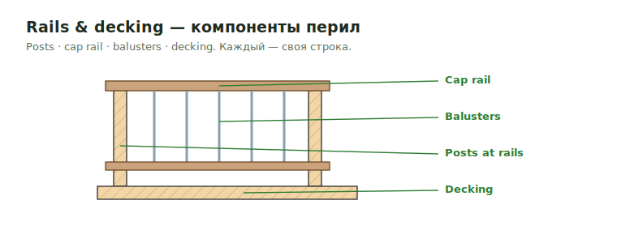

# Rails & Decking

Полный scope перил и настила deck/porch. Это **не «trim»**, это отдельный
материал: decking, railing-системы, post hardware, ballusters, cap rail,
fascia/skirt/risers/stringer, lattice.

<figure markdown>
  
  <figcaption>Posts · cap rail · balusters · decking — каждый своя строка.</figcaption>
</figure>

!!! tip "Railing считается одним из двух способов"
    - **Системой / секциями** — заводская система: `6' Rail section`,
      `8' Stair Rail section`, `36" Rail System composite` (`unit` / `pcs`).
    - **Поэлементно** — `Posts` + `Balustrades` + `Rails (top & bottom)` +
      `Cap Rail` (posts/balusters в `pcs`, rails/cap в `LFT`).

    Способ выбирает деталь/спецификация. Не смешивай оба на одном участке.

## Railing-системы по типу { .kb-section-title .kb-st--green }

| Тип | Состав | Заметка |
| --- | --- | --- |
| **Composite** | Decking `5/4x6 Composite`, posts `4x4 PT` + `Sleeve/Cap for 4x4`, `6' Rail section`, `Stair Rail section` | `Note: Railing called composite; Decking assumed Composite` |
| **Azek / PVC** | `5/4x6 Azek` decking, `4x4 PT` + Post Anchors `DTT2Z` + `4x4 Post Sleeve` `36"` + caps, `36" Rail System composite`, `1x12 Azek` deck fascia | `Note: Railing system assumed Azek or eq` |
| **Wood painted** | `4x4 posts` + `pyramid` cap, `2x2 ballusters`, `2x4 rails`, `2x6 cap rail`, `1x6` risers, `1x12` skirt | `verify grade` |
| **Cable rail** | `4x4 PT` / `1-1/2x1-1/2 Mtl post` + sleeve/base/cap, `Cable` / `Cable SS` (assumed 7 runs), `2x4`/`2x6 Cap Rail` | `Note: Railing appear to be cable; verify product` |
| **Metal / aluminum** | `Mtl post`, `Metal Subrail SS`, cap rail | `Note: Aluminum railing materials are by others` — часто **by others** |

!!! warning "Aluminum / metal rail часто by others"
    `Note: aluminum railing are by others` / `Aluminum railing materials are
    by others; verify components`. Тогда railing **не считаем**, оставляем
    видимую note (см. [Standard notes](../../reference/standard-notes.md)).

## Decking { .kb-section-title .kb-st--cyan }

| Label | Типовой материал | Unit |
| --- | --- | --- |
| `Decking` / `Decking&Treds` | `5/4x6` (Wd / Azek / Trex / Composite), `5/4x4 T&G Mahogany`, `1x6 T&G Red Cedar` | `SQFT` |
| `Treads` | по материалу decking | `LFT` / `pcs` |

- Decking считается по **площади** настила (`SQFT`). Treads (проступи лестницы)
  — отдельно.
- Материал часто `TBD` / `verify`: `Note: Decking & Railing products to
  verify`. Не угадывай product.

## Post hardware (всегда набором) { .kb-section-title .kb-st--magenta }

Post на rail почти никогда не один SKU — это **набор**:

| Label | Пример | Unit |
| --- | --- | --- |
| `Posts at Rails` | `4x4 PT`, `2x4 posts`, `1-1/2x1-1/2 Mtl post` | `pcs` + высота (`4'`, `36"`) |
| `Post Sleeve` / `Post Sleeves` | `Sleeve for 4x4`, `4x4 Post Sleeve 36"` | `pcs` |
| `Post Cap` / `Post Caps` | `Cap for 4x4`, `pyramid` | `pcs` |
| `Post Base` / `Post Bases` | `Post base for 4x4`, `ABU66 Zmax` | `pcs` |
| `Post Anchors` | `DTT2Z` | `pcs` |
| `Post Wrap` | `1x` обшивка | `LFT` / `pcs` |

!!! tip "Проверь полноту набора"
    Если есть `Posts at Rails`, ищи sleeve + cap (+ base/anchor). Пропуск
    одного элемента набора — частая ошибка.

## Balusters / rails / cap { .kb-section-title .kb-st--green }

| Label | Типовой размер | Unit |
| --- | --- | --- |
| `Balustrades` / `Ballustardes` | `2x2 ballusters` | `pcs` |
| `Rails (top & bottom)` | `1x3`, `2x4 rails` | `LFT` (×2: верх+низ) |
| `Cap Rail` | `2x4 tapered`, `2x6 cap rail`, `5/4x6` | `LFT` |
| `Cables` | `Cable`, `Cable SS` | `LFT` (× число прогонов, напр. 7) |
| `Rail sections` / `Stair Rail section` | `4'`/`5'`/`6'`/`8'`/`11'` section | `unit` |

- `Rails (top & bottom)` — это **две** нитки (верх и низ): LFT × 2.
- `Cables` — длина прогона × количество тросов (`assumed 7 pcs run`).

## Deck периметр: fascia / skirt / risers / stringer { .kb-section-title .kb-st--cyan }

| Label | Типовой размер | Unit |
| --- | --- | --- |
| `Deck Fascia` | `1x8`, `1x10`, `1x12 Azek` | `LFT` |
| `Deck Skirt` | `1x12` | `LFT` |
| `Deck Risers` / `Risers` | `1x6`, `1x8` | `LFT` |
| `Stringer trim` | `1x12` | `LFT` |
| `Lattice` | `PVC lattice`, `Lattice diamond` | `SQ FT` |
| `Lattice wrap trim` / `vertical trim` | `5/4x8` / `5/4x6` | `LFT` |

- Lattice — площадь (`SQ FT`) + обрамление по периметру (`LFT`).

## Чек перед выводом { .kb-section-title .kb-st--magenta }

- [ ] Определён тип railing-системы (composite / Azek / wood / cable / metal)?
- [ ] Metal/aluminum rail — проверено by others?
- [ ] Выбран один способ: секции **или** поэлементно?
- [ ] Post = post + sleeve + cap (+ base/anchor) — полный набор?
- [ ] Decking в `SQFT`; treads отдельно?
- [ ] `Rails (top & bottom)` посчитаны ×2 нитки?
- [ ] Cables = прогон × число тросов?
- [ ] Deck fascia / skirt / risers / stringer / lattice не пропущены?
- [ ] Материал `TBD`/`verify` оставлен видимым, не угадан?

## See also

- [Porch / Deck / Balcony](porch-deck-balcony.md)
- [Balcony build-up](balcony-buildup.md)
- [Soffit & Fascia](soffit-fascia.md)
- [Balcony Trims](../deck/balcony-trims.md) · [Railing](../deck/railing.md)
- [Material catalog](../../reference/material-catalog.md)
