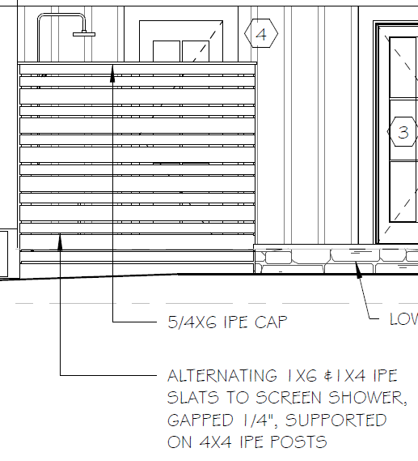

# Outdoor Shower & Pergola

Открытые садовые конструкции, которые тоже входят в exterior scope:
privacy / outdoor shower screen, pergola, trellis, canopy. Часто `assumed`
по elevation — деталей мало.

## Outdoor / privacy shower screen { .kb-section-title .kb-st--green }

Экран наружного душа (часто IPE или cedar). Состав:

| Label | Типовой материал | Unit |
| --- | --- | --- |
| `Posts` | `4x4 P.T.`, `4x4 IPE`, `4x4` | `pcs` + высота (`14'`, `10'`, `7'`) |
| `Jamb` | `5/4 IPE Jambs`, `2x4 P.T.` | `pcs` / `LFT` |
| `Slats` | `1x6 IPE` + `1x4 IPE` alternating, `1x6 Vert. Cedar BDS.` | `SQFT` экрана |
| `Cap` | `5/4 IPE Cap` | `LFT` |

- Slats считаются по **площади экрана** (`SQFT`), gap (`1/4"`) — в note.
- `Garage Shower Outside` — отдельный участок (свой размер posts/slats).
- Когда детали нет: `Posts 4x4 P.T. assumed`, `Jamb 2x4 P.T. assumed`.

<figure markdown>
  
  <figcaption>Alternating 1x6 & 1x4 IPE slats, gap 1/4", на 4x4 IPE posts, 5/4 IPE cap.</figcaption>
</figure>

## Pergola / Trellis { .kb-section-title .kb-st--cyan }

| Label | Типовой материал | Unit |
| --- | --- | --- |
| `1E Shape` | `4x10 Cedar 1E Shape` | `pcs` + длина (`14'`) |
| `Trellis` | `3x3` | `pcs` + длина (`8'`) |
| `Ledger` | `2x4` | `pcs` + длина |
| `Brackets` | по детали | `pcs` |
| `Posts` | `4x4`/`6x6` (P.T. или cedar) | `pcs` + высота |

- Pergola — это набор: главные балки (`1E Shape` / `4x10`), trellis-рейки
  (`3x3`), ledger к стене, brackets, posts.
- Материал почти всегда cedar или P.T. — держи в Label, не своди к generic.

## Canopy { .kb-section-title .kb-st--magenta }

| Label | Типовой размер | Unit |
| --- | --- | --- |
| `Soffits at Canopy Eves` | `Azek Beadboard`, `Beadboard` | `SQ FT` |
| `Fascia at Canopies` / `Canopies rake` | `1x6`, `1x8` | `LFT` |
| `Canopy Hdr wraps` | `1x8`, `1x4` | `LFT` |
| `Frame for Soffits` | по детали (24" o.c.) | `LFT` |

- Canopy = mini-roof над входом: header wrap + fascia + soffit (beadboard).
  Считается как маленький porch (см. [Soffit & Fascia](soffit-fascia.md)).

## Чек перед выводом { .kb-section-title .kb-st--green }

- [ ] Shower: posts (pcs+высота) + jamb + slats (SQFT) + cap (LFT)?
- [ ] Garage/outside shower разделены, gap в note?
- [ ] Pergola: главные балки + trellis + ledger + brackets + posts?
- [ ] Материал (IPE / cedar / P.T.) в Label, не generic?
- [ ] Canopy: header wrap + fascia + soffit beadboard?
- [ ] Где нет деталей — `assumed` в note?

## See also

- [Porch / Deck / Balcony](porch-deck-balcony.md)
- [Rails & Decking](rails-decking.md)
- [Soffit & Fascia](soffit-fascia.md)
- [Furring & Window Jambs](furring-and-jambs.md)
