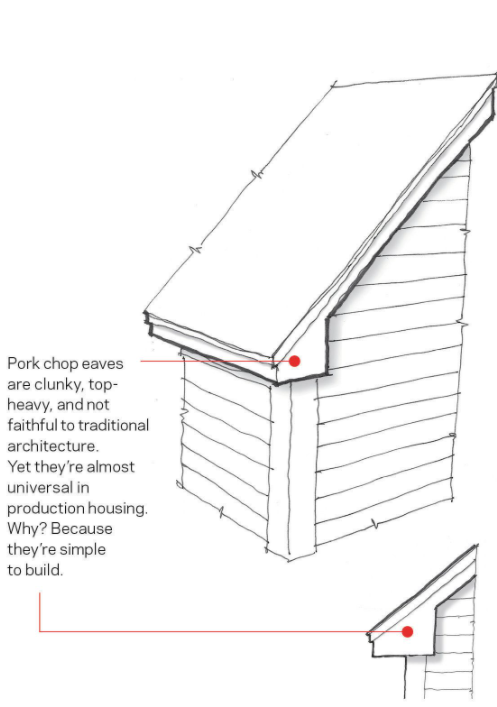
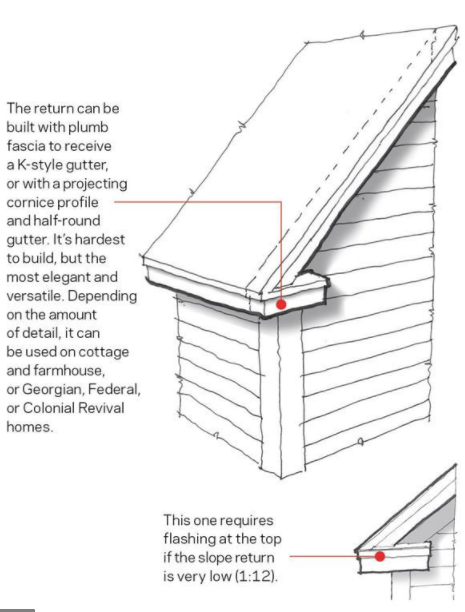
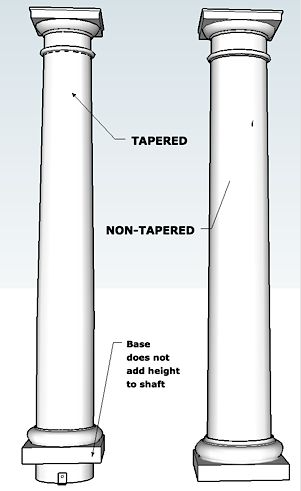

# Soffit & Fascia

Подшивка свесов и торцевая доска по eves и rakes, плюс frieze, rake moulding,
returns и columns. Обычно это отдельный sheet/блок `Soffits and Fascias`.

## Базовые элементы { .kb-section-title .kb-st--green }

-   :material-arrow-expand-horizontal:{ .lg .middle } **Soffit**

    ---

    Горизонтальная подшивка свеса. `1x` доска, vinyl vented, beadboard или
    soffit panel. Узкий — `LFT`, широкий/панель — `SQ FT`.

-   :material-border-bottom-variant:{ .lg .middle } **Fascia**

    ---

    Торцевая доска по краю свеса. `1x6` / `1x8` / `1x10` / `2x8`.
    Считается `LFT`.

-   :material-format-align-bottom:{ .lg .middle } **Frieze**

    ---

    Доска по стене под soffit. `5/4x6` / `5/4x8` / `5/4x10`. `LFT`.

-   :material-vector-triangle:{ .lg .middle } **Rake moulding**

    ---

    Молдинг по наклонной кромке (rake) + crown at frieze. `3" crown`,
    `2" moulding`. `LFT`.

## Eves и Rakes — раздельно { .kb-section-title .kb-st--cyan }

`Eves` (горизонтальный свес) и `Rakes` (наклонный, по фронтону) считаются
**отдельными строками** — у них разные размеры и часто разные материалы.

| Label | Типовой size | Unit | Заметка |
| --- | --- | --- | --- |
| `Soffits at Eves` | `1x12`, `12" Vinyl vented`, `T&G beadboard` | `LFT` / `SQ FT` | широкий → SQ FT |
| `Fascia at Eves` | `1x8`, `2x8`, `5/4x10` | `LFT` | |
| `Frieze` | `5/4x6` / `5/4x8` | `LFT` | по стене под soffit |
| `Trim at Fascia` / `Trim over fascia` | `1x3` / `1x4` / `1x5` | `LFT` | доп. полоса |
| `Soffits at Rakes` | `1x8`, `9" Vinyl`, `beadboard` | `LFT` / `SQ FT` | |
| `Fascia at Rakes` | `1x6` / `1x8` | `LFT` | |
| `Rake Moulding` | `3" crown` | `LFT` | по наклонной кромке |
| `Crown` / `Crown at Frieze` | `5-1/2" crown`, `3" crown` | `LFT` | |
| `Soffits at Porch Eves/Rakes` | по детали | `LFT` / `SQ FT` | porch отдельно |
| `Soffits at Floor Overhangs` / `cantilever` | `1x12`, `Vinyl` | `LFT` / `SQ FT` | underside cantilever |
| `Soffits at Dormer / Chimney / Bay` | по детали | `LFT` | мелкие отдельные runs |

!!! tip "Soffit: LFT или SQ FT"
    - **`LFT`** — когда soffit это `1x` доска постоянной ширины (считаешь длину).
    - **`SQ FT`** — когда soffit это panel / beadboard / wide T&G (считаешь
      площадь = длина × ширина свеса).

    Vinyl vented soffit обычно дают как `LFT` с указанием ширины (`12" Vinyl`).

!!! warning "Vinyl / Alum wrap"
    `Note: Soffits assumed Vinyl; Fascias assumed PVC or 1x Alum wrapped -
    verify`. Материал часто не специфицирован — оставляй note и `verify`.
    Не подставляй wood, если возможен vinyl/alum.

## Returns (eave return) { .kb-section-title .kb-st--magenta }

Return — это завершение свеса на фронтоне. Есть два принципиально разных
варианта, и их **нельзя считать одинаково**:

- **Proper / cornice return** — полноценный возврат с soffit, fascia, crown.
  Считается как отдельный мини-набор trim (soffit + fascia + crown по returns).
  Часто отдельные строки `... Returns`.
- **Pork-chop return** — упрощённый треугольный «обрубок». Простой в постройке,
  trim минимальный, но он всё равно есть (fascia + маленький soffit).
- Если на elevation видно returns — проверь sections: это `pork-chop` или
  полноценный cornice? Это меняет LFT и SQ FT.

<figure markdown>
  
  <figcaption>"Pork-chop" return — простой, но trim (fascia + soffit) считаем.</figcaption>
</figure>

<figure markdown>
  
  <figcaption>Proper cornice return: soffit + fascia + crown — отдельный набор строк.</figcaption>
</figure>

## Columns / Posts { .kb-section-title .kb-st--green }

Колонны и стойки на porch / entry. Считаются **`pcs`** + высота отдельной
колонкой; product зависит от типа.

| Label | Пример | Unit |
| --- | --- | --- |
| `Columns Poly-Classic Fbg` | `10" Dia non-taper w/c&b` | `pcs` + `8'` |
| `Columns` | `12" Dia Fbg Non-taper`, `12" SQ Taper w/c&b` | `pcs` + высота |
| `Columns HB&G` | `12" SQ Taper w/c&b` | `pcs` + `8'` |
| `Column wrap` | `1x8` (обшивка существующей стойки) | `LFT` |
| `Posts at Rails` | `4x4 PT` | `pcs` + `4'` |
| `Post Sleeve` / `Post Sleeves` | `Sleeve for 4x4` | `pcs` |
| `Post cap` / `Post caps` | `Cap for 4x4`, `pyramid` | `pcs` |
| `Post bases` | `Post base for 4x4` | `pcs` |

- **`w/c&b`** = with cap & base — это часть product, оставляй в Label.
- **Tapered vs Non-taper** — разный product line, держи в Label.
- **Round / Square / Fluted / Plain / Craftsman** — тоже product-defining.
- Высота (`8'`, `10'`, `7'7"`) — отдельной колонкой, не внутри Label.
- `Column wrap` (обшивка) ≠ `Column` (сама колонна) — это разные строки.
- `Posts at Rails` обычно идёт тройкой: post + sleeve + cap (часто и base).

  
Скрыть column reference

  <figure class="kb-figure-row">
    <figcaption class="kb-figure-row__text">
      
Типы columns

      
Round Plain / Fluted / No-Taper, Square Fluted / Recessed / Plain, Craftsman.

      
Тип задаёт product — держи в Label.

    </figcaption>
    
  </figure>
  <figure class="kb-figure-row">
    <figcaption class="kb-figure-row__text">
      
Tapered vs Non-tapered

      
Tapered сужается кверху; base не добавляет высоту shaft.

      
Высота считается по shaft, отдельной колонкой.

    </figcaption>
    
  </figure>

## Чек перед выводом { .kb-section-title .kb-st--cyan }

- [ ] Eves и Rakes посчитаны отдельными строками?
- [ ] Soffit: правильно выбран LFT vs SQ FT (доска vs panel)?
- [ ] Frieze + trim at fascia + rake moulding не пропущены?
- [ ] Returns: определён тип (pork-chop vs cornice), trim по returns добавлен?
- [ ] Columns: тип/taper/`w/c&b` в Label, высота отдельной колонкой?
- [ ] Post + sleeve + cap (+ base) — полный набор?
- [ ] Материал (vinyl / PVC / alum / wood) с note `verify`, если не указан?

## See also

- [Overview](overview.md)
- [Casing, Corner & Band](casing-corner-band.md)
- [Porch / Deck / Balcony](porch-deck-balcony.md)
- [Eve](../sheathing-and-misc/eve.md) · [Rake](../sheathing-and-misc/rake.md) · [Returns](../sheathing-and-misc/returns.md)
