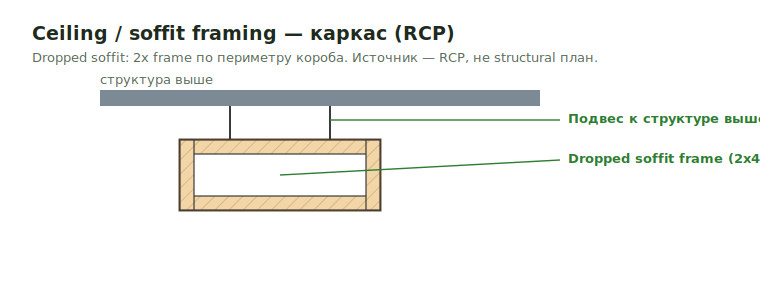

# Ceiling / Soffit Framing (interior)

Внутренний **каркас потолков и софитов** — отдельный framing-scope, не finish-trim
и не roof soffit. Сюда попадают dropped soffits, потолочные короба, потолок мех-комнаты
и потолок кухни. Источник — **RCP** (reflected ceiling plan) + mech/detail-листы.

<figure markdown>
  
  <figcaption>Dropped soffit — 2x frame по периметру короба; источник RCP, не structural план.</figcaption>
</figure>

!!! abstract "Где что (не путать)"
    - **Эта страница** — *каркас* потолков/софитов внутри (2x framing, plates, screws).
    - **Finish-отделка** потолка (crown, beadboard, gypsum) — [Interior Trims](../interior-trims/overview.md).
    - **Roof eave soffit** (под свесом крыши) — [Eve / Eave](../sheathing-and-misc/eve.md).
    - **Soffit plywood под roof trusses** — [Roof Sheathing](roof-framing/roof-sheathing.md).

## Что встречается { .kb-section-title .kb-st--green }

| Секция | Что это | Типично |
| --- | --- | --- |
| **Interior Soffit Framing** | каркас внутренних софитов / потолочных коробов (dropped soffit) | `2x4` frame по периметру короба |
| **Interior Kitchen Ceiling Materials** | потолок кухни, считается **per unit** | материалы потолка (LFT/SQ FT) |
| **Ceiling Mech framing** | потолок под мех-оборудование (mech room / penthouse / screen) | `2x6` Plate + Frame + Screws |
| **Interior Materials** | общие материалы внутренней отделки/потолков | LFT / SQ FT |
| **Interior Gable Walls** | внутренняя сторона фронтонных стен | по [Gable](../vertical/walls/gable.md) |

Организуются **per floor / per area** (1st / 2nd / Loft), как и interior trims.

## Ceiling Mech — состав каркаса { .kb-section-title .kb-st--cyan }

Потолок мех-комнаты (характерно для **MC / 1-storey** проектов; в многоэтажке
вместо него — ceiling per floor в truss-heel зоне):

| Строка | Материал | Что | Unit |
| --- | --- | --- | --- |
| `Plate (1) Ceiling Mech` | `2x6` | опорная плита по периметру | LFT |
| `Frame N" o.c. Ceiling Mech` | `2x6` | балки потолка с шагом (типично `24" o.c.`) | LFT / pcs |
| `Screws N" o.c. (2)` | structural screws | крепёж, 2 на узел (`16" o.c.`) | pcs |

- Frame несёт detail-callout (напр. `A454`) — тот же ceiling-detail, что и во
  «Frame Ceiling» в truss-heel зоне. Сверяй callout в [PDF](../../reference/ourplanecore.md).
- Площадь/периметр потолка — manual measured с A-планов (не из общего sqft).

## Где искать { .kb-section-title .kb-st--magenta }

| Лист / источник | Что взять |
| --- | --- |
| **RCP** (reflected ceiling plan) | dropped soffits, потолочные короба, высоты потолков |
| Mech / MEP-планы | mech-room ceiling, screens, оборудование над потолком |
| Architectural sections | глубина dropped soffit, конструкция короба |
| Kitchen / unit plans | kitchen ceiling per unit |

## Чек перед выводом { .kb-section-title .kb-st--cyan }

- [ ] Dropped soffits с RCP не пропущены (их часто нет на structural плане)?
- [ ] Ceiling Mech: Plate + Frame `N" o.c.` + Screws — все три строки?
- [ ] Kitchen ceiling посчитан **per unit**, не одной площадью?
- [ ] Каркас (эта страница) отделён от finish-отделки потолка (Interior Trims)?
- [ ] Detail-callout у Frame сверен с PDF (не скопирован вслепую)?

## См. также

- [Interior Trims → Обзор](../interior-trims/overview.md) — finish-отделка (crown/base/casing).
- [Eve / Eave](../sheathing-and-misc/eve.md) — наружный roof soffit.
- [Roof Sheathing](roof-framing/roof-sheathing.md) — soffit plywood под trusses.
- [Truss Heel](../vertical/sheathing/truss-heel.md) — ceiling per floor (multi-storey аналог).
- [Quantity benchmarks](../../reference/quantity-benchmarks.md) · [ИИ-ассистент](../../reference/ai-assist-system.md).
