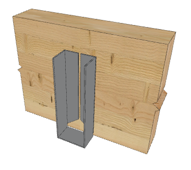
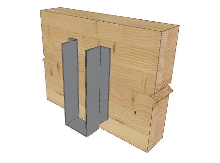

# Beam

## Что считать

- LVL, PSL, GL, and other beams by size, ply count, and length.
- Hangers connected to beams.

## Правила

- Mark beams top-down / left-right.
- Length depends on the bearing/attachment point.
- Lengths 8' and longer round to 2' increments.
- Lengths under 8' stay exact.
- In EWP jobs, ordinary 2x beams are usually excluded.

## Что чаще всего встречается (corpus) { .kb-section-title .kb-st--cyan }

По корпусу самые частые сечения балок: **`1¾x11⅞ LVL`**, **`2x10`**, **`1¾x14 LVL`**,
`2x8`. Типовая длина — медиана `12'` (диапазон `8'–16'`, snap к stock 8/10/12/14/16).
Количество балок на секцию — обычно `2–4`. Это ориентир «нормально ли», не дефолт:
конкретные размеры/ply всегда из structural ([Quantity benchmarks](../../../reference/quantity-benchmarks.md)).

## Standard Built-Up Sizes

| Callout | Actual built-up size |
| --- | --- |
| (2) 1 3/4 x 9 1/2 LVL | 3 1/2 x 9 1/2 |
| (3) 1 3/4 x 9 1/2 LVL | 5 1/4 x 9 1/2 |
| (4) 1 3/4 x 9 1/2 LVL | 7 x 9 1/2 |

## Проверить

- Steel top nailers or steel beam web fillers can drive separate material lines.
- Hanger selection depends on face/top/concealed/skewed condition.
- For `Tri-Force` and beams with steel plates, write nearest foot sizes; do not
  leave noisy inch fractions in the size.

## EWP Materials

Для **EWP** (Engineered Wood Products) обычные деревянные балки **2x10 / 4x12 / 6x14** не учитываем — только инженерные:

- **LVL** (Laminated Veneer Lumber, Versa Lam) — клееный брус, прочный, устойчив к деформациям.
- **PSL** (Parallel Strand Lumber) — параллельные волокна, высокая несущая способность.
- **GL** (Glued Laminated Timber, Glu Lam) — многослойный клееный брус из ламелей.

## Вывод Example

Запись балок и hangers в Excel/PlanSwift (поля: **Description**, **Size**, **Quantities**, **Units**):

| Description | Size | Qty | Units |
| --- | --- | ---: | --- |
| Beam `(3)` | `1 3/4 x 9 1/2 LVL` | 3 | 12 |
| Beam `(1)` | `5 1/2 x 11 7/8 GL` | 1 | 20 |
| Beam `(2)` | `1 3/4 x 11 7/8 LVL` | 2 | 10 |
| Hangers | `HU412` | 10 | pcs |
| Hangers | `HGUS7.25/12` | 20 | pcs |
| Hangers | `GLTV3.514` | 5 | pcs |
| Hangers | `for 7 x 11 7/8` | 10 | pcs |

Длины snap-ятся при scaling — например `scaled 12' 0 1/8"` округляем до `12`.

См. [Hangers](../../../reference/hangers.md) для подбора крепления под ширину/высоту built-up.

<!-- confluence-gallery:start -->
## Визуальная проверка

Эти картинки уже привязаны к правилам страницы. Используй их как быстрые
checkpoint-ы перед output: сначала прочитай правило выше, потом открой нужную
карточку и проверь похожий condition на плане/schedule.

??? info "Источник картинок"
    - Beam - Балки: [4 карт. Confluence](https://redacted.atlassian.net/wiki/spaces/work/pages/3735554/Beam+-)

  
Показать 4 иллюстраций

  

    
    
    
    
  

<!-- confluence-gallery:end -->
