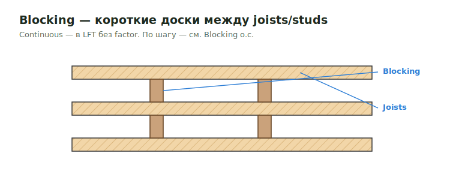

# Blocking

**Blocking** — короткие доски между членами каркаса (joists/studs/trusses) для
жёсткости, опоры кромок и крепления. Считается в LFT (continuous) либо по
шагу — см. [Blocking o.c.](blockingoc.md)

<figure markdown>
  
  <figcaption>Blocking — короткие доски между joists; continuous считается в LFT без factor.</figcaption>
</figure>

## Что считать

- Wall blocking, joist blocking, drywall blocking, roof/floor blocking и
  special detail blocking.

## Правила

- Walls 10' и выше требуют two rows of blocking.
- Blocking остаётся в LFT, если pieces не требуются.
- Continuous blocking без factor, если job-specific output не говорит иначе.
- Exterior blocking = FRT, когда exterior walls = FRT.
- `Bracing` обычно `2x4`, если detail не говорит иначе.
- Для truss bracing считай каждые 10' как blocking, когда note говорит
  `Trusses - Bracing 2x6`.
- I-joist cross bridging / `TB27`: используй `length * 2 * 12 / 16` pcs.

## Проверить

- Drywall blocking/ledger на demising и exterior walls parallel with framing.
- Kitchen and bath blocking.
- Blocking under FRT subfloor perimeter.
- Parapet FRT blocking.
- Если `EWP are by others`, но blocking for steel beams called out, оставь
  `LVL` / `LSL` blocking note видимой и scaled.

## See also

- [Blocking o.c.](blockingoc.md) · [Bracing for Drywall](bracingdrywall.md) · [Ribbon Board](ribbon.md)
- [Формулы → Blocking](../../../../reference/formulas.md#blocking-formulas)

