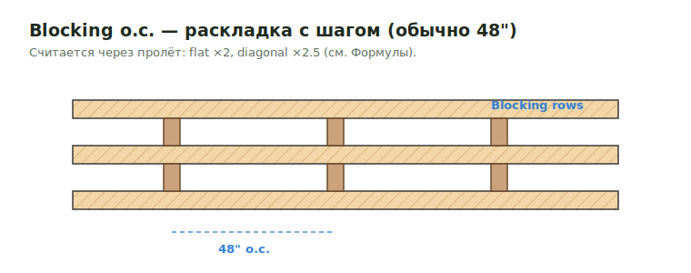

# Blocking o.c.

**Blocking o.c.** — раскладка блокинга с фиксированным шагом (обычно `48" o.c.`).
Считается через площадь/пролёт, не как continuous. Множитель зависит от типа
(flat `2`, diagonal `2.5`) — полная таблица в [Формулах](../../../../reference/formulas.md#blocking-factor).

<figure markdown>
  
  <figcaption>Blocking o.c. — раскладка с фиксированным шагом; считается через пролёт.</figcaption>
</figure>

## Formulas

Используй project-specific Excel syntax, но logic from notes такая:

```text
Flat 48" o.c.     = G * 12 / 48 * 2 * 1.1 / D, ceiling to 1
Diagonal 48" o.c. = G * 12 / 48 * 2.5 * 1.1 / D, ceiling to 1
```

## Проверить

- Убедись, что 1.1 уже не included upstream.
- Используй 16' ceiling для ribbons, bracings и ledgers, когда требуется.
- Plates и wall blocking держи в LFT, когда это expected output.

## See also

- [Blocking](blocking.md) · [Ribbon Board](ribbon.md) · [Формулы](../../../../reference/formulas.md)

