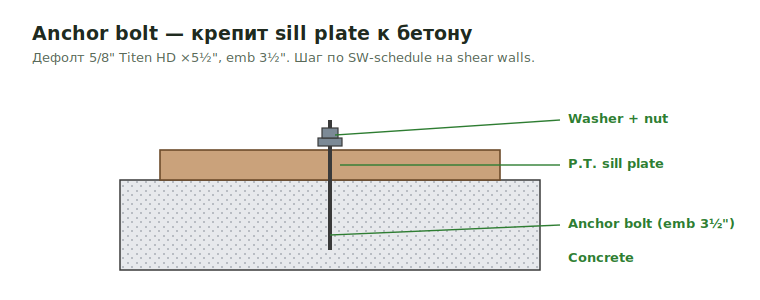

# Bolts

**Bolts** — анкерные, holdown и detail-specific болты с шайбами. Считаются по
деталям; nails покупают коробками и не считаются.

<figure markdown>
  
  <figcaption>Anchor bolt с washer/nut крепит sill plate к бетону; шаг — по SW-schedule.</figcaption>
</figure>

## Что считать

- Bolts, anchor bolts, holdown bolts и detail-specific bolts.

## Правила

- Bolts и Simpson screws считай там, где details требуют их.
- Nails по умолчанию не считай: их покупают boxes, quantity только создаёт шум.
- Washers for filler steel anchors не обязательно писать как 3" square, если
  details не требуют это; plain washer note часто достаточно.

## Проверить

- Не используй один label для screw detail и bolt detail.
- ATS rod systems могут быть by others; перед count проверь scope.

## See also

- [Anchor Bolts](../../../deck/anchor-bolts.md) · [Screws](screws.md) · [Hardware catalog](../../../../reference/hardware-catalog.md)

