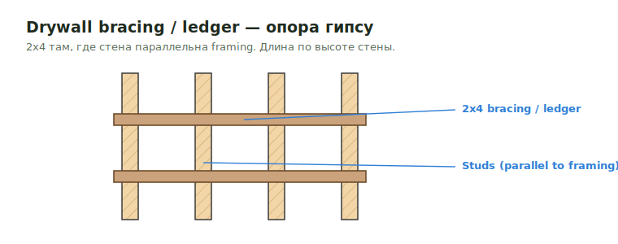

# Bracing for Drywall

**Drywall bracing / ledger** — `2x4` раскосы и леджеры, дающие опору гипсу там,
где стена идёт параллельно framing. Это **элемент стен** (не перекрытия): и
наличие, и **длина куска зависят от высоты стены**.

!!! info "Bracing length — это свойство стены"
    Длина bracing подбирается строго **по высоте стены** (таблица ниже). Тот же
    приём используется на [Exterior Walls](../../../vertical/walls/exterior.md) и в
    [COM → Bracing](../../../../work-types/com.md). `Bracing` обычно `2x4`.

<figure markdown>
  
  <figcaption>2x4 bracing/ledger даёт опору гипсу, когда стена параллельна framing.</figcaption>
</figure>

## Что считать

- 2x4 bracing at exterior, interior carrying, and demising walls where typical
  workflow requires it.
- Drywall ledger at demising walls both sides и exterior walls one side, когда
  parallel with framing.

## Правила

- Bracing lengths by wall height:

| Wall height | Bracing length |
| --- | --- |
| 16'-20' | 20' |
| 12'-16' | 18' |
| 10'-12' | 16' |
| Other | 14' |

## Проверить

- Dropped soffits are not deflection-track walls.
- RCP pages often show bracing/soffit framing scope.

## See also

- [Blocking](blocking.md) · [Demising Walls](../../../vertical/walls/demising.md) · [Exterior Walls](../../../vertical/walls/exterior.md)

