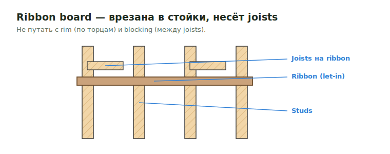

# Ribbon Board

**Ribbon board** (ribband/let-in ledger) — горизонтальная доска, врезанная в
стойки для опоры joists. Не путать с rim (по торцам joists) и blocking
(между joists).

<figure markdown>
  
  <figcaption>Ribbon board врезана в стойки и несёт joists — отличается от rim и blocking.</figcaption>
</figure>

## Что считать

- Ribbon board там, где joists/trusses требуют его и details показывают его.

## Правило

Top chord bearing trusses не требуют 2x4 ribbon board. В таких conditions
используй blocking between trusses, часто `(2) 2x6` over 2x6 bearing walls.

## Проверить

- Не путай ribbon board, rim и blocking.
- Если trusses hang over walls, проверь, является ли реальный material blocking
  или drywall ledger.

## See also

- [Rim Board](rim.md) · [Blocking](blocking.md) · [Joist](../joist.md)

