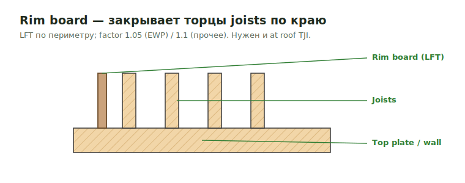

# Rim Board

<figure markdown>
  
  <figcaption>Rim board закрывает торцы joists по краю перекрытия; считается в LFT.</figcaption>
</figure>

## Правила

- Не пиши `1-3/4 LVL Rim`, если LVL явно не called out и не нужен по detail.
- Default output может быть `11-7/8" Rim`.
- Если LSL specified, пиши `11-7/8" LSL Rim`.
- **Rim factor:** `1.05` — **только для EWP-jobs**. На остальных типах работ
  (residential / COM / reconstruction) — `1.1`, как у обычного blocking.
- Roof TJI тоже требует rim.

## Typical products

| Product | When |
| --- | --- |
| 1-1/8" OSB Rim | Частый thin rim |
| 1-1/4" or 1-1/2" LSL Rim | Когда specified LSL или stronger rim |
| 1-3/4" LVL Rim | Deck/corridor frame или explicit detail |

## Проверить

Если product assumed, пиши `assumed` в note.

At demising conditions может требоваться extra rim on both sides. Не считай
только one side, если detail/plan подразумевает both sides of the demising line.
