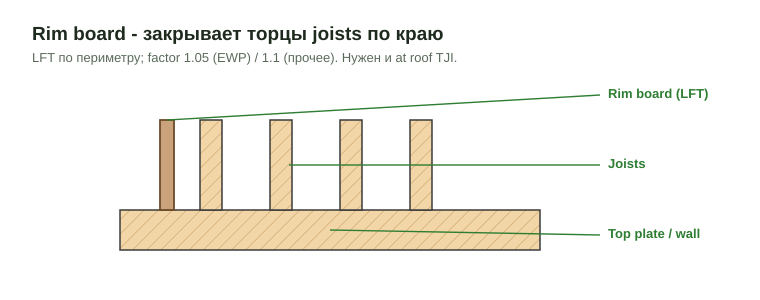
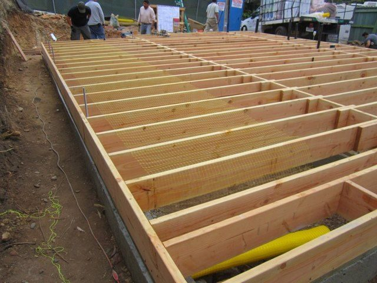

# Rim Board (торцевая доска перекрытия)

<figure markdown>
  
  <figcaption markdown="span">Rim board закрывает торцы joists по периметру перекрытия и несёт стену выше. Меряется одной Line по периметру; в DFL формула переводит длину в доски по 16' (на EWP-only заказе остаётся LFT x 1.05).</figcaption>
</figure>

<figure markdown>
  { width="520" }
  <figcaption markdown="span">Перекрытие первого этажа: rim по всему периметру на sill plate, в него упираются торцы joists. Меряем Line по периметру здания и по краям проёмов перекрытия; с I-joists материал rim только engineered. Фото: hunker.com, [источник](https://www.hunker.com/13720287/what-is-a-rim-joist), найдено через Pinterest.</figcaption>
</figure>

## Что это

Rim - доска по краю перекрытия, в которую упираются торцы joists: `1-1/8" OSB Rim`, `1-1/4" LSL Rim`, `1-3/4" LVL`. С I-joists только engineered rim. [Ribbon](ribbon.md) врезана в стойки и несёт joists, [Blocking](blocking.md) стоит между joists: это разные строки. Rim по периметру deck и balcony - P.T. 2x в [Deck / Porch / Balcony Frame](../../../deck/deck-porch-balcony-frame.md).

## Где искать на чертежах

| Лист | Что взять |
| --- | --- |
| Joist schedule, general notes | продукт и толщина rim по глубине joists |
| Wall sections, details перекрытия | rim у наружной стены, у demising с двух сторон, у roof TJI |
| Deck / corridor details | где rim несёт нагрузку и должен быть `1-3/4" LVL` |
| Framing plan этажа | периметр и внутренние линии, где меняется направление joists |

## Как мерить в OurPlanCore

Line (L) по линии rim на листе framing с точкой F: наружный периметр перекрытия плюс внутренние линии, где joists меняют направление или упираются в стену. Длина линии = длина применения узла. Позиция `framing/<этаж> framing/details/rim` или с номером детали `5/S400 rim`. Линию на куски по 16' не режь: это одна Line на весь участок, а доски считает формула в DFL.

<figure markdown>
  
  <figcaption markdown="span">Line по линии применения детали: длина линии уходит в G строки DFL, имя детали даёт флаг M при экспорте.</figcaption>
</figure>

## Как назвать в дереве и строка DFL

Экспорт: кнопка DT ставит детали в J:L листа этажа; имя с `rim` получает флаг `r` в M, и макрос `C_RimBoardBlockingHangers` переносит длину в строку `Rim Board`.

| Имя в дереве | A (Label) | B (материал) | C | D | E |
| --- | --- | --- | --- | --- | --- |
| `details/rim` | `Rim Board` | `11-7/8" Rim` | `=ОКРВВЕРХ(G/D;1)` | `16` | деталь |
| `details/rim LSL` | `Rim Board` | `11-7/8" LSL Rim` | `=ОКРВВЕРХ(G/D;1)` | `16` | |
| `details/rim corr LVL` | `Rim Board` | `1-3/4 x 11-7/8 LVL` | `=ОКРВВЕРХ(G/D;1)` | `16` | деталь corridor |
| `details/rim dem` | `Rim Board (2)` | | `=ОКРВВЕРХ(G*H/D;1)`, H = 2 | `16` | demising с двух сторон |
| `details/rim` на EWP-only заказе | `Rim Board` | `11-7/8" Rim` | `G x 1.05` | `LFT` | деталь |

`G` - длина линии rim в LFT из OurPlanCore, `D` - длина доски (16), `H` - число plies.

| Продукт | Когда |
| --- | --- |
| `1-1/8" OSB Rim` | частый тонкий rim по schedule |
| `1-1/4"` или `1-1/2" LSL Rim` | LSL указан или нужен усиленный rim |
| `1-3/4" LVL Rim` | к rim крепится deck или corridor frame, или деталь прямо требует |

- Framing-книга (Frame, COM, residential, reconstruction): rim - доски по 16', C = `G / D` с округлением вверх. Отдельного waste нет: запас даёт округление до целой доски.
- EWP-only заказ (считаем только engineered wood): rim остаётся в `LFT`, C = `G x 1.05`, на куски по 16' не делится.
- Клиент обычного заказа просит rim в LFT: `G x 1.1`.

Сводка цифр: [Формулы](../../../../reference/formulas.md#rim-ribbon-blocking-ledger), то же в [Советах](../../../../reference/boss-feedback-rules.md#rim-board).

## Частые ошибки

- Rim назван `1-3/4 LVL`, хотя LVL не указан. По умолчанию `11-7/8" Rim`; продукт не ясен - `assumed` в note.
- Линия rim в дереве порезана на куски по 16'. Мерь одной Line; в доски её переводит формула `G / D`.
- В framing-книге rim оставлен в LFT с `1.05`: этот вид только для EWP-only заказа.
- Rim у roof TJI забыт.
- У demising посчитана одна сторона, деталь даёт rim с обеих сторон.
- На панельной работе rim посчитан с длиной стены, а не по линии перекрытия.
- [Все ошибки по перекрытиям](../../../../start/common-mistakes.md#floor)

## Пример

Framing-книга:

| A | B | C | D | E | G | H |
| --- | --- | --- | --- | --- | --- | --- |
| `Rim Board` | `11-7/8" LSL Rim` | `=ОКРВВЕРХ(G/D;1)` | 16 | `5/S400` | 412 | |
| `Rim Board (2)` | `11-7/8" LSL Rim` | `=ОКРВВЕРХ(G*H/D;1)` | 16 | `9/S400 demising` | 96 | 2 |

412 / 16 = 25.75, значит 26 досок; 96 x 2 / 16 = 12 досок.

Тот же rim на EWP-only заказе:

| A | B | C | D | E | G |
| --- | --- | --- | --- | --- | --- |
| `Rim Board` | `11-7/8" LSL Rim` | `=ОКРВВЕРХ(G*1.05;1)` | LFT | `5/S400` | 412 |

412 x 1.05 = 432.6, значит 433 LFT.

## См. также

- [Ribbon Board](ribbon.md), [Blocking](blocking.md), [Joist](../joist.md)
- [Советы: Rim Board](../../../../reference/boss-feedback-rules.md#rim-board), [Формулы](../../../../reference/formulas.md)
