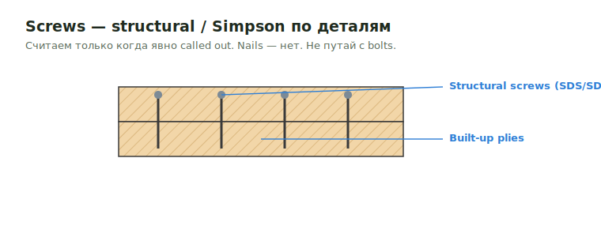

# Screws

**Screws** — structural/Simpson винты (SDS, SDW, SDWS и пр.) по деталям
соединений. Считаются только когда явно called out; nails — нет.

<figure markdown>
  
  <figcaption>Structural/Simpson screws по деталям соединений; не путать с bolts.</figcaption>
</figure>

## Что считать

- Simpson screws и structural screws, которые called out by details.

## Правила

- Screws считаются, когда details specifically call them out.
- Не смешивай screw и bolt detail labels.
- Nails обычно excluded.

## Проверить

- Detail 1 и detail 3 могут выглядеть похоже, но использовать different fasteners.
- Screw notes держи рядом с related connection item.

## See also

- [Bolts](bolts.md) · [Hardware catalog](../../../../reference/hardware-catalog.md)

