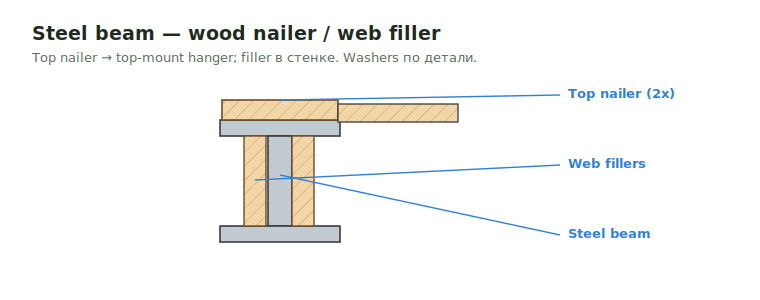

# Steel Beam Web Fillers

**Web fillers / nailers** — деревянные вставки в полку/стенку стального бимa,
дающие поверхность для крепления и hangers. Top nailer часто задаёт top-mount
hanger.

<figure markdown>
  
  <figcaption>Wood nailer/web filler в стальном биме; top nailer → top-mount hanger.</figcaption>
</figure>

## Что считать

- Wood fillers, nailers, bolts/screws/washers и attachment material at steel
  beams там, где shown.

## Правила

- Steel top nailers могут задавать top-mount hanger conditions.
- Filler steel anchors могут требовать washers, но не over-specify washer size,
  если он не called out.

## Проверить

- Hangers могут опираться **сверху** на сталь или на wood nailer — это меняет
  тип hanger (top-mount vs face-mount), проверь по детали.
- Assumptions держи видимыми.

## See also

- [Beam](../beam.md) · [Hangers](../../../../reference/hangers.md) · [Bolts](bolts.md)

