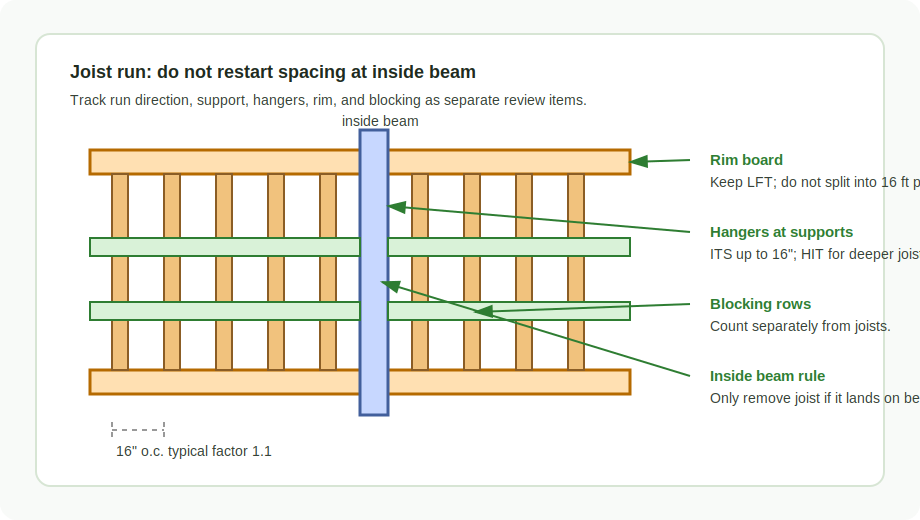
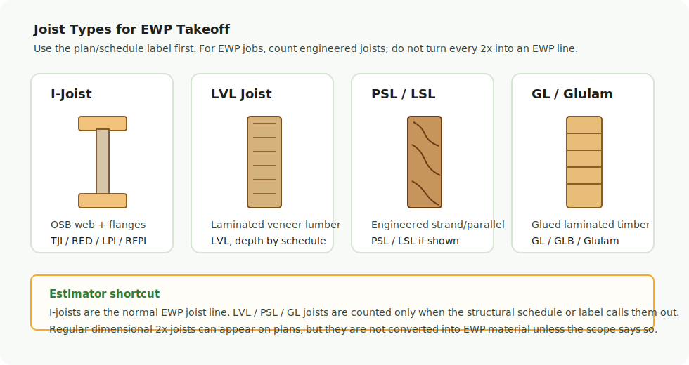

# Joist

<figure markdown>
  
  <figcaption>Joist runs: keep spacing, rim, blocking, supports, and hangers reviewable.</figcaption>
</figure>

## Joist Type Pictures

<figure markdown>
  
  <figcaption>Joist types: I-Joist, LVL, PSL/LSL, GL/Glulam. For EWP, count engineered joists only.</figcaption>
</figure>

Use this section when the plan/schedule names a joist product family. The
picture block below is pulled from the Confluence `Joist Series` source and is
easier to find than the raw gallery at the bottom.

| Product / mark | Picture | Estimating note |
| --- | --- | --- |
| `TJI` | [TJI series](../../../assets/images/confluence/confluence-007.png) | Includes 110 / 210 / 230 / 360 / 560 families; keep series visible. |
| `RED` | [Red-I series](../../../assets/images/confluence/confluence-009.png) | Do not rewrite to TJI; keep Red-I mark and depth. |
| `LP` / `LPI` | [LP chart](../../../assets/images/confluence/confluence-006.png) / [LPI profile](../../../assets/images/confluence/confluence-005.png) | LP SolidStart / LPI profiles; keep exact family from schedule. |
| `RFPI` | [RFPI dimensions](../../../assets/images/confluence/confluence-008.png) | RFPI has LVL-flange and solid-sawn-flange variants. |
| `BCI` / `BCI + s` | [BCI profiles](../../../assets/images/confluence/confluence-004.png) / [BCI chart](../../../assets/images/confluence/confluence-003.png) | `BCI + s` is its own notation; do not drop the `s`. |
| `Nordic Joist` | [Nordic NI series](../../../assets/images/confluence/confluence-002.png) | `NI-20`, `NI-40x`, `NI-60`, `NI-80`, `NI-90`; keep `NI` series visible. |

  <a class="kb-gallery__item" href="../../../../assets/images/confluence/confluence-007.png">
    
    
TJI series: 110 / 210 / 230 / 360 / 560

  </a>
  <a class="kb-gallery__item" href="../../../../assets/images/confluence/confluence-009.png">
    
    
RED / Red-I series

  </a>
  <a class="kb-gallery__item" href="../../../../assets/images/confluence/confluence-006.png">
    
    
LP SolidStart I-Joist

  </a>
  <a class="kb-gallery__item" href="../../../../assets/images/confluence/confluence-005.png">
    
    
LPI profile details

  </a>
  <a class="kb-gallery__item" href="../../../../assets/images/confluence/confluence-008.png">
    
    
RFPI dimensions

  </a>
  <a class="kb-gallery__item" href="../../../../assets/images/confluence/confluence-004.png">
    
    
BCI / Boise profiles

  </a>
  <a class="kb-gallery__item" href="../../../../assets/images/confluence/confluence-002.png">
    
    
Nordic Joist NI series

  </a>
  <a class="kb-gallery__item" href="../../../../assets/images/confluence/confluence-075.png">
    
    
Spacing: 12 / 16 / 19.2 / 24 o.c.

  </a>

## Count

- I-joists: TJI, LPI, RED, BCI, RFPI, Nordic.
- Joist hangers.
- Rim and blocking related to joist runs.
- Web stiffeners, squash blocks, or special blocking only when called out by
  details/general notes.

## Spacing

| Spacing | Factor |
| --- | ---: |
| 12" o.c. | 1.4667 |
| 16" o.c. | 1.1 |
| 24" o.c. | 0.625 |

## Rules

- Continue spacing top-down / left-right inside a run.
- Do not restart spacing from an inside beam.
- Remove joist only when it lands directly on top of beam, about plus/minus 2".
- For 18"/20"/22"/24" joists, use HIT hangers, not ITS.
- ITS is only for light floor applications up to 16".
- Keep joist depth/product visible in the row name: `11-7/8 TJI 230` is easier
  to review than a generic `TJI joist`.
- Treat top chord bearing conditions separately; they can change ribbon/rim and
  blocking requirements.

## Where To Look

| Drawing area | What to verify |
| --- | --- |
| Framing plan | Direction, spacing, depth, product family, repeated areas |
| Beam schedule | Support condition and hanger family |
| General notes | Web stiffeners, blocking rows, rim material, squash blocks |
| Details | Top chord bearing, skewed hangers, firewall conditions |

## Check

- Add a note when odd lengths are intentional.
- If joists are top chord bearing, ribbon board may not apply.
- Check that rim is still counted at roof TJI conditions.
- Do not split rim into 16' pieces unless the output format specifically asks
  for pieces.
- Do not swap joist count and joist length in Excel/output.
- If the house is about 28' wide and a beam is dropped, verify the joist span
  labels; joists may be longer than 14'.
- `TJI 9 1/2` does not use 360 / 560 series.
- Long 2x ceiling joists may be split and imply supporting vertical joists; look
  for notes/details before assuming one continuous member.

## EWP Joist Materials

Для **EWP** считаем только engineered joists. Обычные деревянные `2x`
joists не превращаем в EWP material line, если scope/schedule прямо этого не
требует.

- **I-Joists**: самый частый EWP joist. OSB web + LVL/OSB flanges.
- **LVL Joists**: laminated veneer lumber; обычно для больших пролетов.
- **PSL / LSL Joists**: engineered strand/parallel lumber; считать только
  когда так показано в schedule/details.
- **GL / Glulam Joists**: laminated timber; чаще architectural / exposed
  условия, не путать с обычным I-joist.

### Common I-Joist series

`TJI` · `RED` · `LP` / `LPI` · `RFPI` · `BCI` (+ `s`) · `Nordic Joist`
(`NI-20` / `NI-40x` / `NI-60` / `NI-80` / `NI-90`).

## Standard O.C. Spacing

Spacing измеряется **on center (O.C.)**: от центра одного joist до центра
следующего. Типовые шаги:

- `12" O.C.`
- `16" O.C.`
- `19.2" O.C.`
- `24" O.C.`

## Output Example

| Description | Size | Qty | Units |
| --- | --- | ---: | --- |
| Joists `16" o.c.` | `11 7/8 TJI 230` | 3 | 12 |
| Joists `16" o.c.` | `11 7/8 TJI 230` | 36 | 20 |
| Joists `16" o.c.` | `11 7/8 TJI 230` | 2 | 10 |
| Hangers | `ITS2.37/11.88` | `=ЧЁТН(lft * 12/16)` | pcs |

Формула для hangers по joists 16" O.C.: `=ЧЁТН(lft * 12 / spacing)` -
округление вверх до четного.

## Trello QA Formulas

| Item | Formula / note |
| --- | --- |
| I-joist cross bridging / `TB27` | `length * 2 * 12 / 16` pcs |
| Attic `EWP by others` | Add note: `LVLs by others` |
| `EWP by others` with steel-beam blocking | Blocking can be `LVL` / `LSL`; scale and note it |
| `EWP by others` with one `LVL` in floor | Add a visible note instead of hiding it |

<!-- confluence-gallery:start -->
## Confluence Images

Изображения из Confluence размещены на этой странице по исходной теме.
Подпись сохраняет группу-источник, чтобы можно было быстро проверить контекст.

| Source group | Images | Confluence |
| --- | ---: | --- |
| Joist - Ригели | 1 | [source](https://ewood.atlassian.net/wiki/spaces/work/pages/3735565/Joist+-) |
| Joist Series | 10 | [source](https://ewood.atlassian.net/wiki/spaces/work/pages/11796606/Joist+Series) |

  <a class="kb-gallery__item" href="../../../../assets/images/confluence/confluence-001.png" title="image-20260225-174526.png">
    
    
Nordic Joist hanger reference

  </a>
  <a class="kb-gallery__item" href="../../../../assets/images/confluence/confluence-002.png" title="image-20260225-174331.png">
    
    
Nordic Joist: NI-20 / NI-40x / NI-60 / NI-80 / NI-90

  </a>
  <a class="kb-gallery__item" href="../../../../assets/images/confluence/confluence-003.png" title="image-20250414-190026.png">
    
    
BCI chart / BCI + s reference

  </a>
  <a class="kb-gallery__item" href="../../../../assets/images/confluence/confluence-004.png" title="image-20250303-145752.png">
    
    
BCI / Boise profiles

  </a>
  <a class="kb-gallery__item" href="../../../../assets/images/confluence/confluence-005.png" title="image-20250224-002107.png">
    
    
LPI profile details

  </a>
  <a class="kb-gallery__item" href="../../../../assets/images/confluence/confluence-006.png" title="image-20250224-001906.png">
    
    
LP SolidStart I-Joist

  </a>
  <a class="kb-gallery__item" href="../../../../assets/images/confluence/confluence-007.png" title="image-20250224-001558.png">
    
    
TJI series: 110 / 210 / 230 / 360 / 560

  </a>
  <a class="kb-gallery__item" href="../../../../assets/images/confluence/confluence-008.png" title="image-20250224-001240.png">
    
    
RFPI dimensions

  </a>
  <a class="kb-gallery__item" href="../../../../assets/images/confluence/confluence-009.png" title="image-20250224-001144.png">
    
    
RED / Red-I series

  </a>
  <a class="kb-gallery__item" href="../../../../assets/images/confluence/confluence-010.png" title="image-20250224-000933.png">
    
    
TJI design properties table

  </a>
  <a class="kb-gallery__item" href="../../../../assets/images/confluence/confluence-075.png" title="image-20250211-185836.png">
    
    
Spacing: 12 / 16 / 19.2 / 24 o.c.

  </a>

<!-- confluence-gallery:end -->
