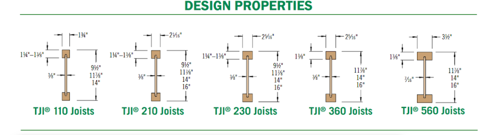
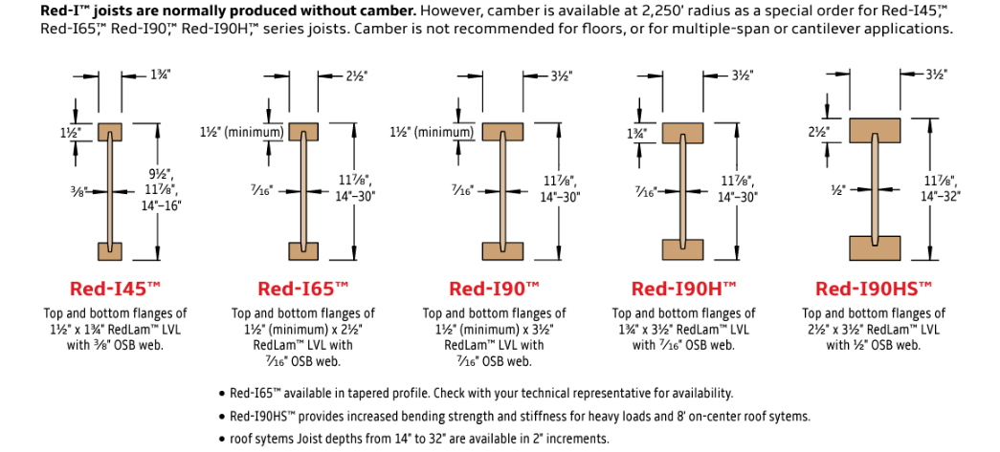
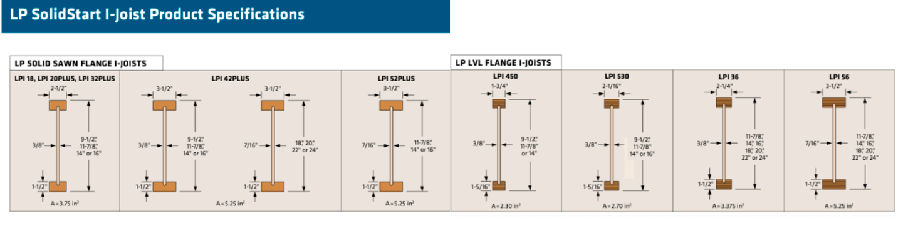
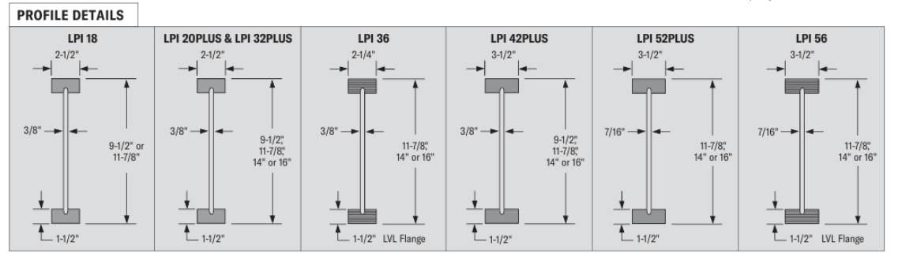
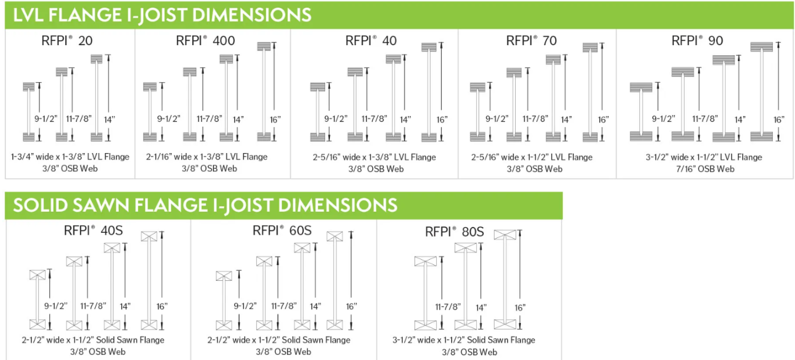
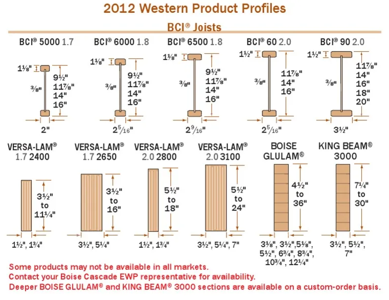
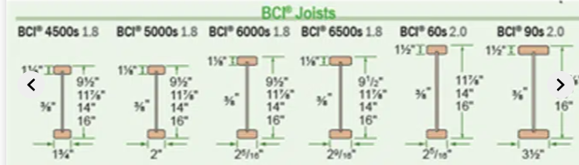
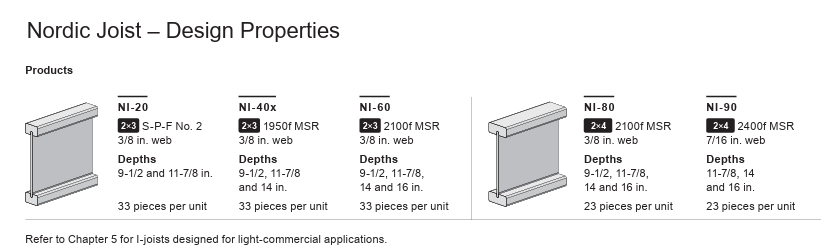
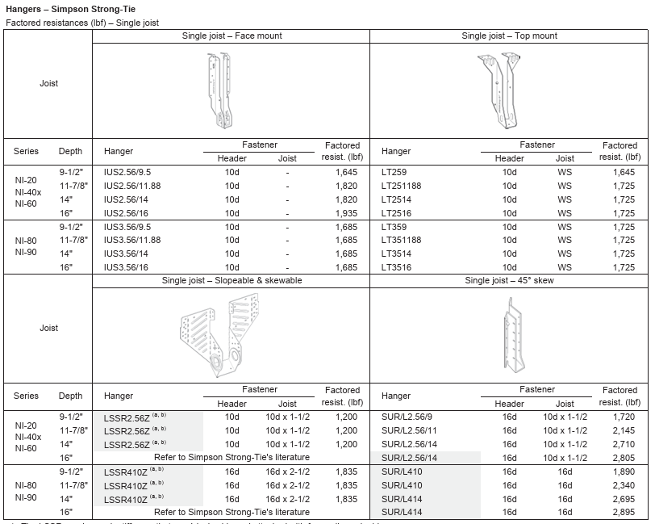
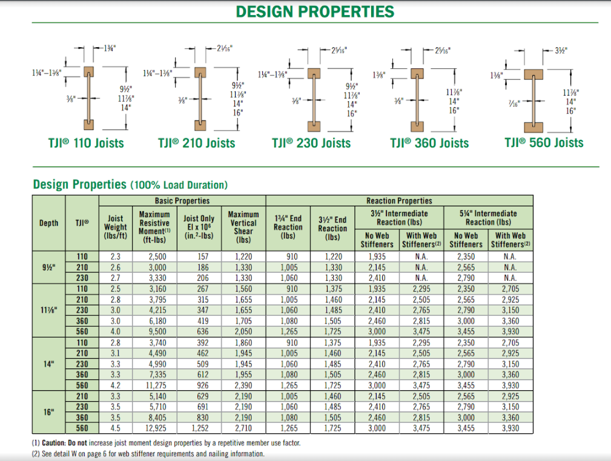

# Joist

## Картинки Joist типов

Это реальные картинки из Confluence. Используй их, когда на плане или в
schedule указан конкретный product family для `Joist`.

  <a class="kb-rule-card" href="../../../../assets/images/confluence/confluence-007.png">
    
    

      
TJI series

      
Сохраняй точную серию: 110 / 210 / 230 / 360 / 560.

      
В строке пиши <code>11-7/8 TJI 230</code>, а не просто общий <code>TJI</code>.

    

  </a>
  <a class="kb-rule-card" href="../../../../assets/images/confluence/confluence-009.png">
    
    

      
RED / Red-I series

      
Не переписывай RED в TJI.

      
Оставляй Red-I mark, depth и series так, как они указаны в schedule.

    

  </a>
  <a class="kb-rule-card" href="../../../../assets/images/confluence/confluence-006.png">
    
    

      
LP SolidStart

      
LP / LPI profiles — отдельный product family.

      
Используй, если schedule показывает LP, LPI, LPI 20Plus, 32Plus, 36, 42Plus, 52Plus или 56.

    

  </a>
  <a class="kb-rule-card" href="../../../../assets/images/confluence/confluence-005.png">
    
    

      
LPI profile details

      
Перед выбором hanger family проверь flange/web profile.

      
Depth и flange width могут изменить hanger и название в output.

    

  </a>
  <a class="kb-rule-card" href="../../../../assets/images/confluence/confluence-008.png">
    
    

      
RFPI dimensions

      
У RFPI есть LVL-flange и solid-sawn-flange варианты.

      
Оставляй RFPI series и depth видимыми; не превращай в общий I-joist.

    

  </a>
  <a class="kb-rule-card" href="../../../../assets/images/confluence/confluence-004.png">
    
    

      
BCI / Boise profiles

      
BCI — не TJI; сохраняй Boise / BCI naming.

      
На картинке также есть Boise LVL / glulam profiles для проверки.

    

  </a>
  <a class="kb-rule-card" href="../../../../assets/images/confluence/confluence-003.png">
    
    

      
BCI + s chart

      
Если mark содержит <code>+ s</code>, оставляй его.

      
Не теряй suffix при cleanup или Excel output.

    

  </a>
  <a class="kb-rule-card" href="../../../../assets/images/confluence/confluence-002.png">
    
    

      
Nordic Joist NI series

      
Оставляй NI series видимой: NI-20 / NI-40x / NI-60 / NI-80 / NI-90.

      
Nordic schedule names влияют и на строку joist, и на проверку hangers.

    

  </a>
  <a class="kb-rule-card" href="../../../../assets/images/confluence/confluence-001.png">
    
    

      
Nordic hanger reference

      
Используй, когда Nordic joists требуют hanger cross-check.

      
Hanger type зависит от depth, mount condition, skew и header/support.

    

  </a>
  <a class="kb-rule-card" href="../../../../assets/images/confluence/confluence-010.png">
    
    

      
TJI design properties table

      
Только reference; takeoff всё равно идёт по plan/schedule labels.

      
Полезно, когда нужно понять, почему важны series/depth.

    

  </a>
  <a class="kb-rule-card" href="../../../../assets/images/confluence/confluence-075.png">
    
    

      
O.C. spacing diagram

      
Spacing считается center-to-center.

      
12 / 16 / 19.2 / 24 o.c. используй только если это показано на plan или notes.

    

  </a>

## Официальные product references

Эти ссылки нужны только для проверки product family / series names. Takeoff
output всё равно должен идти по framing plan, joist schedule и structural notes
конкретного проекта.

| Product family | Official reference | Как использовать в takeoff |
| --- | --- | --- |
| TJI | [Weyerhaeuser TJI 110/210/230/360/560 Specifier's Guide](https://www.weyerhaeuser.com/woodproducts/document-library/document_library_detail/tj-4000/) | Проверить точную TJI series и depth. |
| LP / LPI / SolidStart | [Pacific Woodtech SolidStart I-Joist Technical Guide](https://www.pwtewp.com/wp-content/uploads/2022/09/SolidStart-IJ-Residential-Technical-Guide-US.pdf) | Оставить LPI / Plus / SolidStart naming, если он показан. |
| BCI | [Boise Cascade BCI Joists](https://www.bc.com/ewp/bci-joists/) | Сохранить BCI / Boise naming; не превращать в TJI. |
| RFPI | [Roseburg RFPI Joist](https://www.roseburg.com/Product/rfpi-joist/) | Оставить RFPI series и flange/profile note видимыми. |
| Nordic NI | [Nordic I-Joists](https://www.nordic.ca/en/products/nordic-i-joist) | Оставить NI series видимой и сверить Nordic hanger notes. |
| General I-joist reports | [APA I-Joist product reports](https://www.apawood.org/i-joist) | Использовать только как reference, если важен manufacturer/product report. |

## Что считать

- I-joists: TJI, LPI, RED, BCI, RFPI, Nordic.
- Joist hangers.
- Rim и blocking, которые относятся к joist runs.
- Web stiffeners, squash blocks или special blocking — только если они прямо
  указаны в details/general notes.

## Spacing

| Spacing | Фактор |
| --- | ---: |
| 12" o.c. | 1.4667 |
| 16" o.c. | 1.1 |
| 24" o.c. | 0.625 |

## Правила

- Продолжай spacing внутри run сверху вниз / слева направо.
- Не начинай spacing заново от внутреннего beam.
- Убирай joist только когда он реально попадает прямо на beam, примерно
  плюс-минус 2".
- Для 18"/20"/22"/24" joists используй HIT hangers, не ITS.
- ITS — только для light floor applications до 16".
- В row name оставляй joist depth/product: `11-7/8 TJI 230` проверять проще,
  чем общий `TJI joist`.
- Top chord bearing conditions проверяй отдельно: они могут менять ribbon/rim и
  blocking requirements.

## Где смотреть

| Где на чертежах | Что проверить |
| --- | --- |
| Framing plan | Direction, spacing, depth, product family, repeated areas |
| Beam schedule | Support condition и hanger family |
| General notes | Web stiffeners, blocking rows, rim material, squash blocks |
| Details | Top chord bearing, skewed hangers, firewall conditions |

## Проверить

- Добавляй note, если нестандартные lengths сделаны намеренно.
- Если joists are top chord bearing, ribbon board может не применяться.
- Проверь, что rim всё ещё посчитан при roof TJI conditions.
- Не разбивай rim на 16' pieces, если output format прямо не просит pieces.
- Не меняй местами joist count и joist length в Excel/output.
- Если house примерно 28' wide и beam dropped, проверь joist span labels:
  joists могут быть длиннее 14'.
- `TJI 9 1/2` does not use 360 / 560 series.
- Long 2x ceiling joists могут быть split и подразумевать supporting vertical
  joists; перед one continuous member проверь notes/details.

## EWP Joist Materials

Для **EWP** считаем только engineered joists. Обычные деревянные `2x`
joists не превращаем в EWP material line, если scope/schedule прямо этого не
требует.

- **I-Joists**: самый частый EWP joist. OSB web + LVL/OSB flanges.
- **LVL Joists**: laminated veneer lumber; обычно для больших пролетов.
- **PSL / LSL Joists**: engineered strand/parallel lumber; считать только
  когда так показано в schedule/details.
- **GL / Glulam Joists**: laminated timber; чаще architectural / exposed
  условия, не путать с обычным I-joist.

### Частые I-Joist series

`TJI` · `RED` · `LP` / `LPI` · `RFPI` · `BCI` (+ `s`) · `Nordic Joist`
(`NI-20` / `NI-40x` / `NI-60` / `NI-80` / `NI-90`).

## Стандартный O.C. spacing

Spacing измеряется **on center (O.C.)**: от центра одного joist до центра
следующего. Типовые шаги:

- `12" O.C.`
- `16" O.C.`
- `19.2" O.C.`
- `24" O.C.`

## Пример вывода

| Description | Size | Qty | Units |
| --- | --- | ---: | --- |
| Joists `16" o.c.` | `11 7/8 TJI 230` | 3 | 12 |
| Joists `16" o.c.` | `11 7/8 TJI 230` | 36 | 20 |
| Joists `16" o.c.` | `11 7/8 TJI 230` | 2 | 10 |
| Hangers | `ITS2.37/11.88` | `=ЧЁТН(lft * 12/16)` | pcs |

Формула для hangers по joists 16" O.C.: `=ЧЁТН(lft * 12 / spacing)` -
округление вверх до четного.

## Trello QA formulas

| Item | Формула / note |
| --- | --- |
| I-joist cross bridging / `TB27` | `length * 2 * 12 / 16` pcs |
| Attic `EWP by others` | Добавить note: `LVLs by others` |
| `EWP by others` with steel-beam blocking | Blocking может быть `LVL` / `LSL`; scale и note обязательны |
| `EWP by others` with one `LVL` in floor | Добавить видимую note, а не прятать условие |
