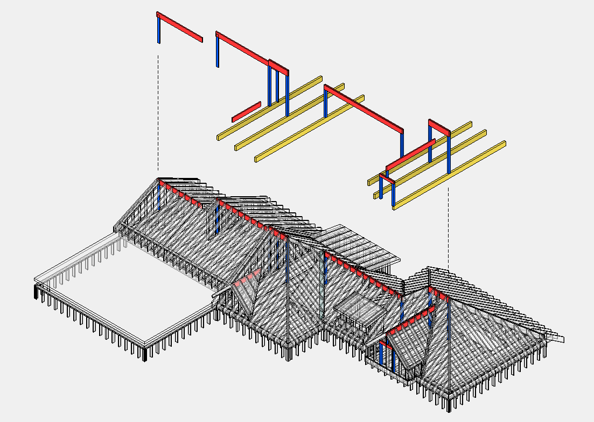

# Post

## Count

- Wood posts, steel posts, bearing posts, and built-up post groups when in scope.
- Post caps/bases only when specifically called out.
- Posts в крыше — опора для [Ridge](../roof-framing/ridge.md) и [Header](../roof-framing/header.md).

## Critical Rules

- Posts могут быть **цельные** (`5 1/4 x 5 1/4 PSL`, `6x6`, `4x4`) или **сборные** из нескольких досок (`(2) 2x6`, `(4) 2x4`).
- **Длина Posts очень важна** — может идти от фундамента сквозь несколько этажей. Проверяй elevation/section.
- Post в крыше опирается **либо на балку, либо на несущую стену**.
- Указывать кол-во и длину **в футах с округлением до 2'**.

## Check

- Material can differ by location: dimensional, LVL, PSL, GL, steel.
- Posts in panelized wall systems may be by others unless shown as loose
  structural material.
- Verify load path details before assuming a post is included in wall panels.

## Connectors

Снизу — **Post Base** к фундаменту/балке. Сверху — **Post Cap** к балке. Примеры: `ABU66`, `PC46`, `CCQ66`.

## Output Tables

| Name | Size | Count | Length |
| --- | --- | --- | --- |
| Posts | `5 1/4 x 5 1/4 PSL` | `2` | `8` |
| Posts | `6x6` | `5` | `10` |
| Posts `(3)` | `2x4` | `3` | `12` |

| Connector | Size | Count | Unit |
| --- | --- | --- | --- |
| Posts Base | `ABU66` | `5` | pcs |
| Posts Caps | `CCQ66` | `3` | pcs |

<!-- confluence-gallery:start -->
## Confluence Images

Изображения из Confluence размещены на этой странице по исходной теме.
Подпись сохраняет группу-источник, чтобы можно было быстро проверить контекст.

| Source group | Images | Confluence |
| --- | ---: | --- |
| Post (колоны) | 1 | [source](https://ewood.atlassian.net/wiki/spaces/work/pages/65831004/Post) |

  <a class="kb-gallery__item" href="../../../../assets/images/confluence/confluence-134.png" title="image-20250608-021518.png">
    
    
post/column reference 01 (image, 222 KB raw)

  </a>

<!-- confluence-gallery:end -->
