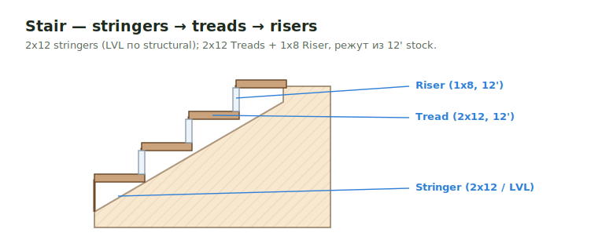

# Stair

<figure markdown>
  
  <figcaption>Stair-блок: stringers → treads → risers. Hangers под stair — в этой же секции.</figcaption>
</figure>

## Что считать

- Stair stringers, stair platform framing, treads, risers, hangers, and ledgers.

## Правила

- List `2x12 Tread` and add `1x8 Riser` for big-job stair tread output.
- Stair platform ledgers at ground level can be PT attached to CMU.
- Joist hangers for stair framing belong inside the stair takeoff section.

## Проверить

- DHU/DGU can apply at stair firewall hanger conditions; mark separately.
- Stair/elevator/shaft hangers не смешивай с regular demising hangers.

## Типовые спеки { .kb-section-title .kb-st--cyan }

Stair-блок почти всегда тройка `Stringers → Treads → Risers`:

| Строка | Типовой материал | Длина |
| --- | --- | --- |
| `Stringers (4)` | `2x12`, на больших пролётах `1¾x14 LVL` | med `10'` [10–14] |
| `Treads` | `2x12 Treads`, либо `1" wood` / `5/4x11` / plywood | **`12'`** (стабильно) |
| `Risers` | `1x8` | **`12'`** (стабильно) |

- `2x12` stringers — дефолт; LVL только когда structural требует.
- Treads/Risers режутся из `12'` stock — это и есть sanity-check длины.
- Hangers под stair — внутри этой же секции (см. [Hardware catalog](../../../reference/hardware-catalog.md)).

## See also

- [Post](post.md) · [Beam](beam.md) · [Hangers](../../../reference/hangers.md)
