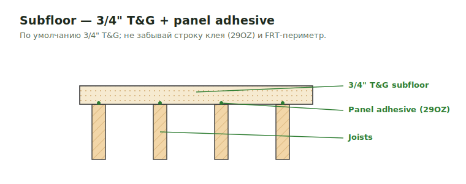

# Subfloor Sheathing

<figure markdown>
  
  <figcaption>Subfloor по умолчанию 3/4" T&G + panel adhesive; FRT-периметр и over-slab — отдельно.</figcaption>
</figure>

## Что считать

- Subfloor sheathing by assembly.
- Plywood underlayment.
- FRT perimeter strips.
- Sound membrane/gypcrete-related layers, когда in scope.

## Common Miss

Floor assembly underlayment can be huge. Always check assemblies, not only plan
views.

## Дефолт { .kb-section-title .kb-st--green }

- Subfloor по умолчанию **`3/4" T&G`** (tongue-&-groove). Меняется только по assembly/spec.
- Часто идёт в паре с **Panel Adhesive** (`29OZ`) — не забывай строку клея.
- Над FRT-периметром / over slab — отдельные underlayment-строки (см. ниже).

## Проверить

- 2' or 4' FRT perimeter notes.
- Underlayment over slab.
- Deck and balcony underlayment assemblies.
- Blocking below FRT perimeter sheathing where details show it.
- Panel Adhesive (`29OZ`) под subfloor — частая забытая строка.

## See also

- [Joist](joist.md) · [Floor SQFT](../../sqfts/1st2nd.md) · [Floor-height Sheathing](../../vertical/sheathing/floor.md)
