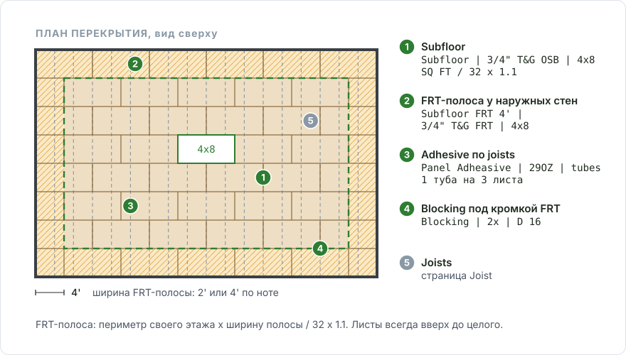
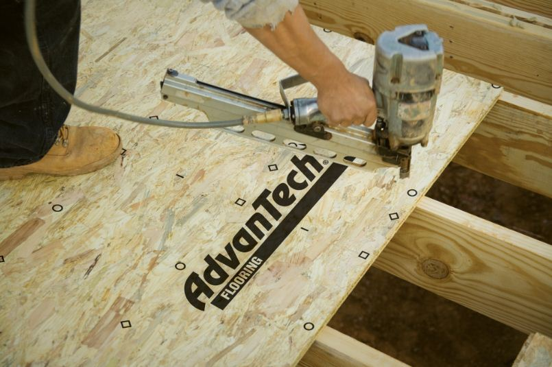

# Subfloor Sheathing (настил перекрытия)

<figure markdown>
  
  <figcaption markdown="span">Subfloor по умолчанию 3/4" T&G на клею по joists. FRT-полоса у наружной стены, underlayment и настил поверх существующего пола - отдельные строки.</figcaption>
</figure>

## Что это

Subfloor - листовой настил по joists: `3/4" T&G OSB` или `AdvanTech`, на panel adhesive. Отдельно считаются FRT-полоса по периметру, underlayment под отделку, настил под ваннами и настил поверх существующего пола. Вертикальная полоса обшивки стены на уровне перекрытия - это [Box Sheathing](../../vertical/sheathing/box-sheathing.md), не subfloor.

## Где искать на чертежах

| Лист | Что взять |
| --- | --- |
| Floor assembly (A5xx, A6xx), general notes | толщина и продукт, T&G, adhesive, слои сверху |
| S general notes, FRT-нота | полоса FRT 2' или 4' от наружной стены; blocking под её кромкой |
| Finish schedule, bath details | underlayment 1/2", 3/4" ply под ваннами |
| Reconstruction details | новый subfloor поверх существующего пола, если деталь требует |
| Deck и balcony sections | structural subfloor балконов, отдельный материал |

## Как мерить в OurPlanCore

Площадь берётся из `sqfts/<этаж>` (Area этажа), отдельный замер не нужен. Для FRT-полосы нужна длина наружного периметра своего этажа: Line по наружным стенам или сумма `ext` стен этажа.

- Листы = SQ FT / 32 x 1.1, округление вверх до листа (`4x8`).
- FRT-полоса: периметр этажа x ширину полосы (2' или 4'), своим этажом. Полоса 4' на 10 листов вместо 54 - типичный недосчёт.
- Основная строка `Subfloor` считается от полной площади этажа, как в шаблоне DFL: площадь FRT-полосы из неё не вычитаем.
- Panel adhesive: строка `Panel Adheasive` `29OZ`, одна туба на 3 листа строки `Subfloor`. Эта строка уже покрывает всю площадь этажа вместе с полосой, поэтому листы FRT-полосы в клей второй раз не идут. Строка часто забывается. `Adheasive` - написание шаблона, не исправляй.

## Как назвать в дереве и строка DFL

Замеров в `framing` обычно нет: строки берут площадь из листа SQFT. Кнопка SF полосы XL переносит площади в `A2_SQFT_calc`, субфлор считается в каждом `Floor Framing List`.

| A (Label) | B (материал) | C | D | E |
| --- | --- | --- | --- | --- |
| `Subfloor` | `3/4" T&G OSB` | `=ОКРВВЕРХ(G/32*1.1;1)` | `4x8` | лист assembly |
| `Subfloor FRT 4'` | `3/4" T&G FRT` | `=ОКРВВЕРХ(G*4/32*1.1;1)`, G - периметр этажа в LFT | `4x8` | нота FRT |
| `Panel Adheasive` | `29OZ` | `=ОКРВВЕРХ(C<subfloor>/3;1)` | `tubes` | |
| `Underlayment` | `1/2" Ply` | площадь / 32 x 1.1 | `4x8` | finish schedule |
| `Plywood at Tubs` | `3/4" Ply` | по числу ванн | `4x8` | `Addendum A` |
| `Blocking` | `2x` | `=ОКРВВЕРХ(G/D;1)`, G - длина кромки FRT-полосы в LFT | `16` | под кромкой FRT |

`C<subfloor>` - ячейка C строки `Subfloor` (только она, без строки FRT-полосы).

## Частые ошибки

- FRT-полоса посчитана не по периметру своего этажа или вовсе пропущена.
- Underlayment по всей площади, хотя деталь даёт 3/4" ply только под ваннами, а не под душевыми.
- Новый subfloor поверх существующего пола не включён, хотя деталь реконструкции его требует.
- Panel adhesive нет в строках или посчитан по одной тубе на лист: норма одна туба на 3 листа.
- Настил балкона и terrace посчитан как subfloor дома: там свой материал по разрезу.
- [Все ошибки по перекрытиям](../../../start/common-mistakes.md#floor)

## Пример

| A | B | C | D | E | G |
| --- | --- | --- | --- | --- | --- |
| `Subfloor` | `3/4" T&G OSB` | 60 | 4x8 | `A501` | 1740 |
| `Subfloor FRT 4'` | `3/4" T&G FRT` | 24 | 4x8 | `S001 note 12` | 174 |
| `Panel Adheasive` | `29OZ` | 20 | tubes | | |

Проверка: 1740 SQ FT / 32 x 1.1 = 59.8, значит 60 листов. Периметр 174 LFT x 4' / 32 x 1.1 = 23.9, значит 24 листа FRT. Клей: 60 / 3 = 20 туб, по строке `Subfloor`.

<figure markdown>
  
  <figcaption markdown="span">Архивное фото: лист AdvanTech прибивают к joists. Продукт пишется как в спецификации (`AdvanTech`, `3/4" T&G OSB`), не обобщённо.</figcaption>
</figure>

## См. также

- [Joist](joist.md), [Floor SQFT](../../sqfts/1st2nd.md), [Floor Sheathing](../../vertical/sheathing/floor.md), [Box Sheathing](../../vertical/sheathing/box-sheathing.md)
- [Blocking](details/blocking.md), [Reconstruction](../../../work-types/reconstruction.md)
