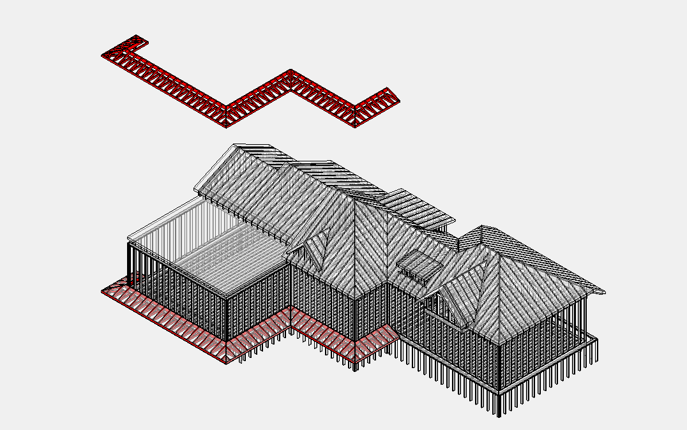

# Canopy

**Canopy** — небольшой навес/козырёк (над входом, у фасада). Отдельный scope:
свой framing, soffit и attachment — не теряй его внутри main roof.

## Что считать

- Canopy framing, soffit sheathing, exterior-grade gypsum/Denseglas, posts,
  beams, and attachments.

## Проверить

- Canopies и porch soffits могут требовать 5/8" exterior-grade gypsum soffit sheathing.
- RCP and architectural sheets often show canopy soffit framing.
- Metal stud joists могут требоваться at gazebo/canopy conditions.

## See also

- [Porch SQFT](../../sqfts/porch.md) · [Eve / Eave](../../sheathing-and-misc/eve.md) · [Soffit & Fascia](../../exterior-trims/soffit-fascia.md)

<!-- confluence-gallery:start -->
## Визуальная проверка

Эти картинки уже привязаны к правилам страницы. Используй их как быстрые
checkpoint-ы перед output: сначала прочитай правило выше, потом открой нужную
карточку и проверь похожий condition на плане/schedule.

??? info "Источник картинок"
    - Canopy (маленький навес): [1 карт. Confluence](https://redacted.atlassian.net/wiki/spaces/work/pages/66125825/Canopy)

  
Скрыть 1 правил с иллюстрациями

  <figure class="kb-figure-row">
    <figcaption class="kb-figure-row__text">
      
Canopy - визуальная проверка

      
Проверь small roof/canopy frame, attachment и sheathing/trim scope.

      
Canopy часто отдельный scope: не теряй его внутри main roof.

    </figcaption>
    
  </figure>

<!-- confluence-gallery:end -->
