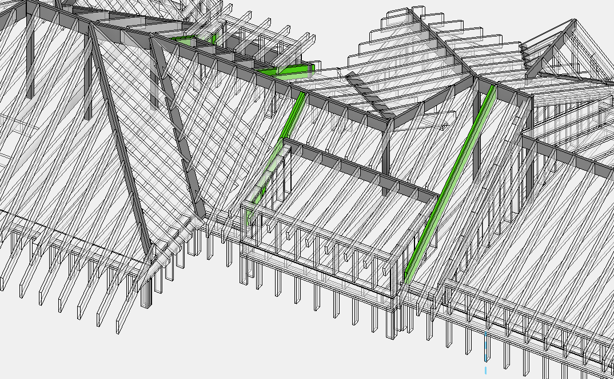
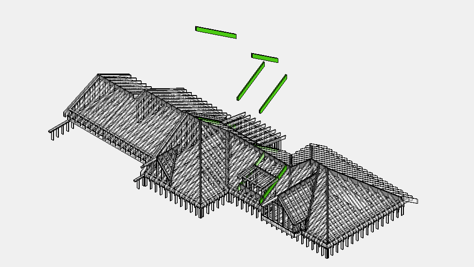

# Dbl Trpl Rafters

## Что считать

- Double/triple rafters и built-up roof members.

## Критические правила

- **Dbl/Trpl Rafters** работают **параллельно Rafters**, как внутренняя усиленная балка крыши.
- Сечения и материалы — любые: `1 3/4 x 11 7/8 LVL`, `2x12`, `(2) 2x10` и т.д.
- Опирание — на **Ridge**, **перекрытие** или **стену**.
- **Длина** как у обычных Rafters — **всегда сверять по разрезам и фасадам**, не брать с плана.
- Указывать кол-во и длину **в футах с округлением до 2'**.
- Hangers нужны только если Dbl/Trpl Rafters **опираются на несущий [Ridge](ridge.md)**, либо это явно указано на плане. См. [Hangers](../../../reference/hangers.md).

## Проверить

- Product может быть dimensional lumber, LVL, PSL или GL.
- Built-up member length и ply count должны быть видимы в output.
- Используй hangers/connectors, которые соответствуют реальной built-up width.

## Таблицы вывода

| Name | Size | Qty | Length / pcs |
| --- | --- | --- | --- |
| Dbl Rafters | `2x12` | `2` | `18` |
| Trpl Rafters | `1 3/4 x 11 7/8 LVL` | `3` | `28` |

| Connector | Size | Qty | Unit |
| --- | --- | --- | --- |
| Hangers | `LSSR2.56Z` | `2` | pcs |
| Hangers | `LRU212Z` | `1` | pcs |

<!-- confluence-gallery:start -->
## Визуальная проверка

Эти картинки уже привязаны к правилам страницы. Используй их как быстрые
checkpoint-ы перед output: сначала прочитай правило выше, потом открой нужную
карточку и проверь похожий condition на плане/schedule.

??? info "Источник картинок"
    - Dbl Trpl Rafters (двойные тройные стропила): [2 карт. Confluence](https://redacted.atlassian.net/wiki/spaces/work/pages/66093077/Dbl+Trpl+Rafters)

  
Скрыть 2 правил с иллюстрациями

  <figure class="kb-figure-row">
    <figcaption class="kb-figure-row__text">
      
Double/Triple Rafters - визуальная проверка 01

      
Проверь где rafters doubled/tripled, длину и support/hanger condition.

      
Не считай как обычные rafters, если detail/schedule показывает built-up condition.

    </figcaption>
    
  </figure>
  <figure class="kb-figure-row">
    <figcaption class="kb-figure-row__text">
      
Double/Triple Rafters - визуальная проверка 02

      
Проверь где rafters doubled/tripled, длину и support/hanger condition.

      
Не считай как обычные rafters, если detail/schedule показывает built-up condition.

    </figcaption>
    
  </figure>

<!-- confluence-gallery:end -->
