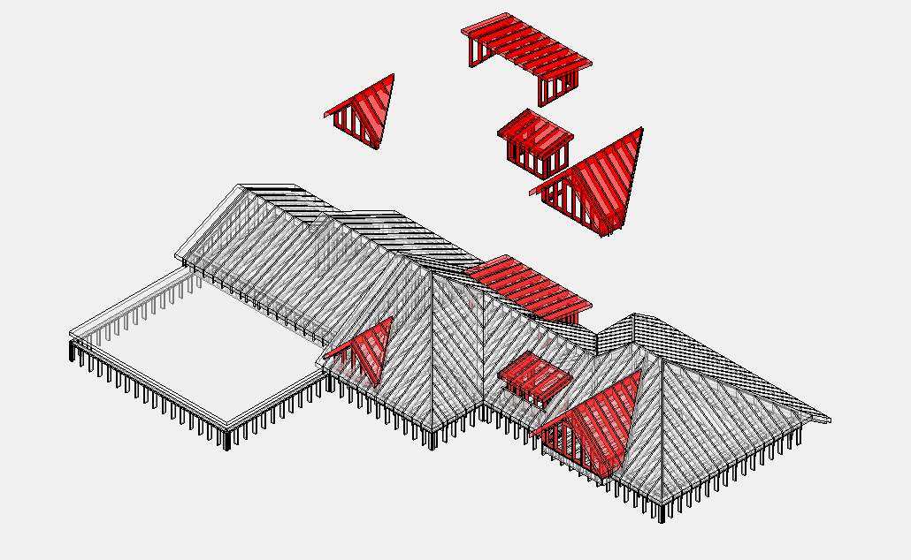

# Dormer

## Что считать

- Dormer walls, roof framing, sheathing, trims и openings как separate scope,
  когда shown.

## Проверить

- Dormers часто объединяют wall, roof, opening и trim rules.
- Проверь exterior sheathing/WRB и FRT rules.
- Не прячь dormer materials внутри generic roof lines, если pricing требует их
  separate.

<!-- confluence-gallery:start -->
## Визуальная проверка

Эти картинки уже привязаны к правилам страницы. Используй их как быстрые
checkpoint-ы перед output: сначала прочитай правило выше, потом открой нужную
карточку и проверь похожий condition на плане/schedule.

??? info "Источник картинок"
    - Dormer, Shed Dormer (надстроенная крыша): [1 карт. Confluence](https://ewood.atlassian.net/wiki/spaces/work/pages/66125835/Dormer+Shed+Dormer)

  <a class="kb-rule-card" href="../../../../assets/images/confluence/confluence-148.png" title="image-20250608-051026.png">
    
    

      
Dormer - визуальная проверка

      
Проверь dormer walls, roof framing, headers и sheathing scope.

      
Dormer обычно затрагивает и walls, и roof, поэтому не прячь всё в один item.

    

  </a>

<!-- confluence-gallery:end -->
