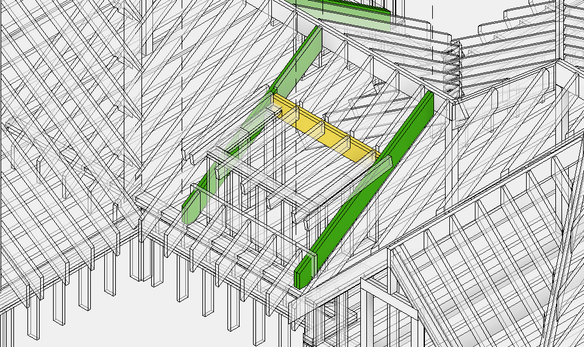
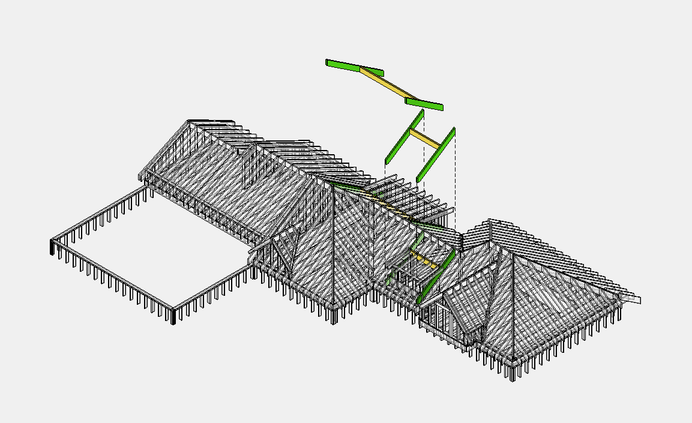

# Roof Header

## Что считать

- Roof opening headers, dormer/canopy headers, and support beams.

## Критические правила

- **Header (в крыше)** — горизонтальная балка в горизонтальных стыках крыши или внутренняя балка. **Не путать** с оконной перемычкой (window header).
- Может быть **одинарной**, двойной или тройной балкой: `1 3/4 x 11 7/8 LVL`, `2x12`, `(2) 2x10`.
- Опирание Header — на [Dbl/Trpl Rafters](dbl-trpl-rafters.md) или на [Posts](../floor-framing/post.md).
- **Длина Header** определяется **между Dbl/Trpl Rafters**.
- Указывать кол-во и длину **в футах с округлением до 2'**.
- Header требует [Hangers](../../../reference/hangers.md) — крепления подбираются по ширине и высоте built-up.

## Проверить

- Header sizes могут отличаться by roof area или floor.
- Если wall panels include headers, избегай double-counting.
- Hanger type depends on face/top/skewed condition.

## Вывод Tables

| Name | Size | Qty | Length / pcs |
| --- | --- | --- | --- |
| Header `(2)` | `2x12` | `2` | `10` |
| Header `(3)` | `1 3/4 x 11 7/8 LVL` | `3` | `12` |

| Connector | Size | Qty | Unit |
| --- | --- | --- | --- |
| Hangers | `LUS210-2` | `1` | pcs |
| Hangers | `HU5.50/10` | `1` | pcs |

<!-- confluence-gallery:start -->
## Картинки из Confluence

Изображения из Confluence размещены на этой странице по исходной теме.
Подпись сохраняет группу-источник, чтобы можно было быстро проверить контекст.

| Группа источника | Картинки | Confluence |
| --- | ---: | --- |
| Header (горизонтальная балка в крыше) | 2 | [source](https://ewood.atlassian.net/wiki/spaces/work/pages/66093067/Header) |

  <a class="kb-gallery__item" href="../../../../assets/images/confluence/confluence-138.png" title="image-20250608-030154.png">
    
    
roof header reference 01

  </a>
  <a class="kb-gallery__item" href="../../../../assets/images/confluence/confluence-139.png" title="image-20250608-025101.png">
    
    
roof header reference 02

  </a>

<!-- confluence-gallery:end -->
