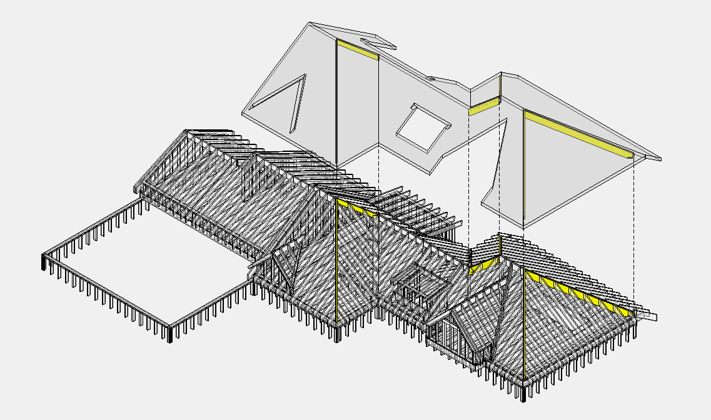

# Hip

## Count

- Hip rafters/beams and related connectors when the scope includes roof framing.

## Check

- Confirm whether hips are stick-framed or truss by others.
- Engineered hip beams need exact product and length.
- Keep hip material separate from roof trim if output pricing differs.

<!-- confluence-gallery:start -->
## Confluence Images

Изображения из Confluence размещены на этой странице по исходной теме.
Подпись сохраняет группу-источник, чтобы можно было быстро проверить контекст.

| Source group | Images | Confluence |
| --- | ---: | --- |
| Hip (балка примыкания крыши наружу) | 1 | [source](https://ewood.atlassian.net/wiki/spaces/work/pages/66093087/Hip) |

  <a class="kb-gallery__item" href="../../../../assets/images/confluence/confluence-142.png" title="image-20250608-030055.png">
    
    
hip rafter/reference 01 (image, 201 KB raw)

  </a>

<!-- confluence-gallery:end -->
