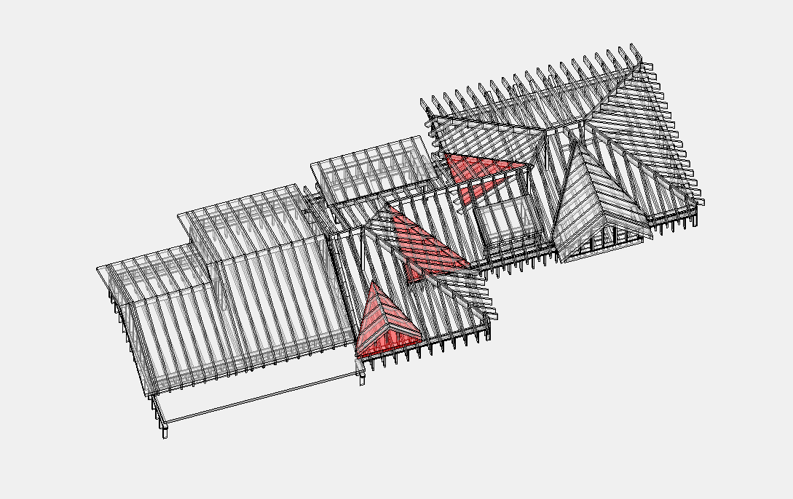
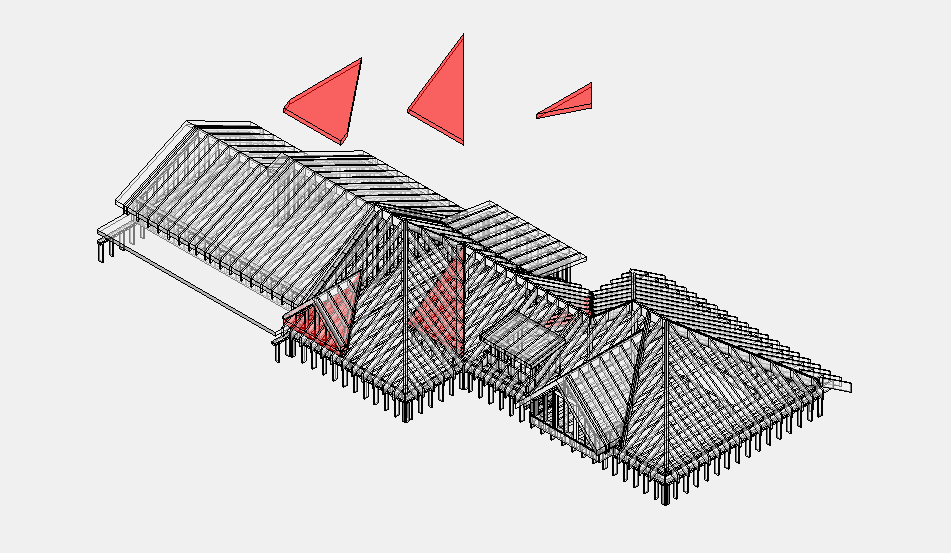
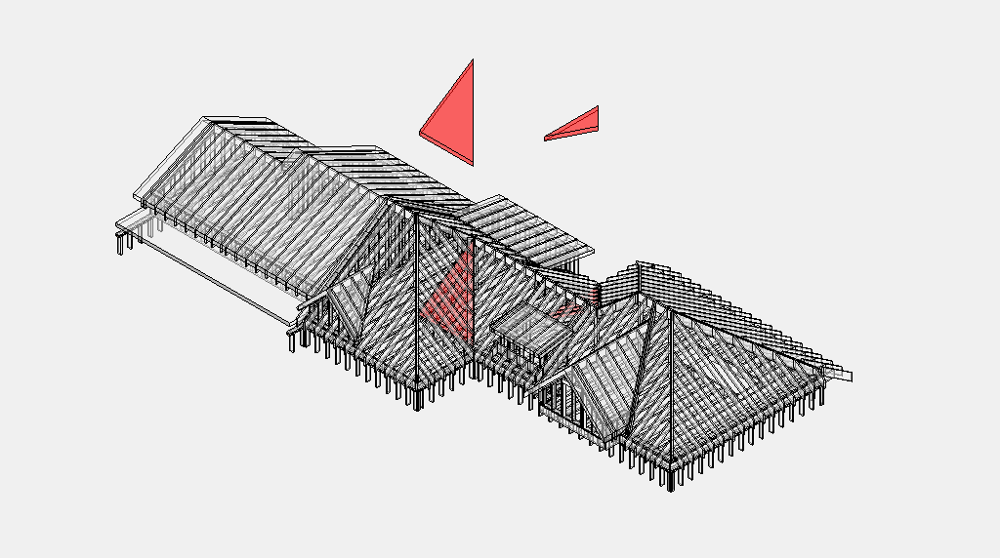

# Overframes

## Count

- Overframing members, sleepers, sheathing, and attachment details.

## Rules

- Piggy trusses are split upper trusses; count 2x6 sleepers between parts when
  shown.
- Overframes can hide a lot of material in details, not plan view.

## Check

- Roof too tall / split truss conditions.
- Sleeper spacing and length.
- Cover board and roof layers above overframed areas.

<!-- confluence-context:start -->
## Confluence Context

Эта секция показывает, какие Confluence-страницы питают эту wiki-страницу и какие соседние темы связаны с ней через исходники.

| Source | Role here | Images | Raw MD |
| --- | --- | ---: | --- |
| [Overframes (скрытая части крыши)](https://ewood.atlassian.net/wiki/spaces/work/pages/66093107/Overframes) | content + images | 3 | `imports/live-sources/confluence-work/pages/01-66093107-overframes-скрытая-части-крыши.md` `imports/live-sources/confluence-work-images/pages/01-66093107-overframes-скрытая-части-крыши.md` |

### Related Wiki Pages

| Wiki page | Why it is connected |
| --- | --- |
| [work/horizontal/floor-framing/post.md](../floor-framing/post.md) | linked from `Overframes (скрытая части крыши)` |
| [work/horizontal/roof-framing/header.md](header.md) | linked from `Overframes (скрытая части крыши)` |
| [work/horizontal/roof-framing/ridge.md](ridge.md) | linked from `Overframes (скрытая части крыши)` |
| [work/vertical/walls/parapet.md](../../vertical/walls/parapet.md) | linked from `Overframes (скрытая части крыши)` |
| [work/vertical/walls/unit.md](../../vertical/walls/unit.md) | linked from `Overframes (скрытая части крыши)` |

### Source Notes

??? note "Overframes (скрытая части крыши)"
    Source: `https://ewood.atlassian.net/wiki/spaces/work/pages/66093107/Overframes`
    Updated in Confluence: `июн. 08, 2025`

    - No reusable text notes were detected in the raw export.

<!-- confluence-context:end -->

<!-- confluence-gallery:start -->
## Confluence Images

Изображения из Confluence размещены на этой странице по исходной теме.
Подпись сохраняет группу-источник, чтобы можно было быстро проверить контекст.

| Source group | Images | Confluence |
| --- | ---: | --- |
| Overframes (скрытая части крыши) | 3 | [source](https://ewood.atlassian.net/wiki/spaces/work/pages/66093107/Overframes) |

  <a class="kb-gallery__item" href="../../../../assets/images/confluence/confluence-144.png" title="image-20250608-053326.png">
    
    
overframe reference 01 (image, 180 KB raw)

  </a>
  <a class="kb-gallery__item" href="../../../../assets/images/confluence/confluence-145.png" title="image-20250608-053236.png">
    
    
overframe reference 02 (image, 143 KB raw)

  </a>
  <a class="kb-gallery__item" href="../../../../assets/images/confluence/confluence-146.png" title="image-20250608-052839.png">
    
    
overframe reference 03 (image, 143 KB raw)

  </a>

<!-- confluence-gallery:end -->
