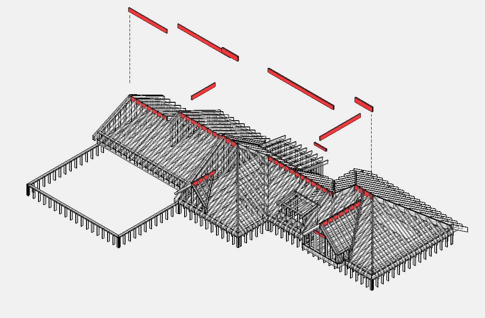

# Ridge

## Count

- Ridge beams/boards when in scope.
- Hangers or connectors tied to ridge framing.

## Critical Rules

- **Ridge** — самый верхний элемент крыши.
- Может быть **одинарной**, двойной или тройной балкой разного материала и сечения: `1 3/4 x 11 7/8 LVL`, `2x12`, `(2) 2x10`.
- Опирание Ridge — на стены **Gable** или на [Posts](../floor-framing/post.md).
- **Длина Ridge** определяется **от внешней грани экстерьерной стены** (не от грани wall framing внутри).
- Указывать кол-во и длину **в футах с округлением до 2'**.

## Check

- Determine whether ridge is engineered wood, dimensional lumber, or truss by
  others.
- Roof framing can include TJI rim/blocking just like floor framing.

## Output Table

| Name | Size | Count | Length |
| --- | --- | --- | --- |
| Ridge | `2x12` | `1` | `10` |
| Ridge `(2)` | `1 3/4 x 11 7/8 LVL` | `2` | `12` |

<!-- confluence-gallery:start -->
## Confluence Images

Изображения из Confluence размещены на этой странице по исходной теме.
Подпись сохраняет группу-источник, чтобы можно было быстро проверить контекст.

| Source group | Images | Confluence |
| --- | ---: | --- |
| Ridge (конек) | 1 | [source](https://ewood.atlassian.net/wiki/spaces/work/pages/66093057/Ridge) |

  <a class="kb-gallery__item" href="../../../../assets/images/confluence/confluence-137.png" title="image-20250608-022309.png">
    
    
ridge reference 01 (image, 189 KB raw)

  </a>

<!-- confluence-gallery:end -->
